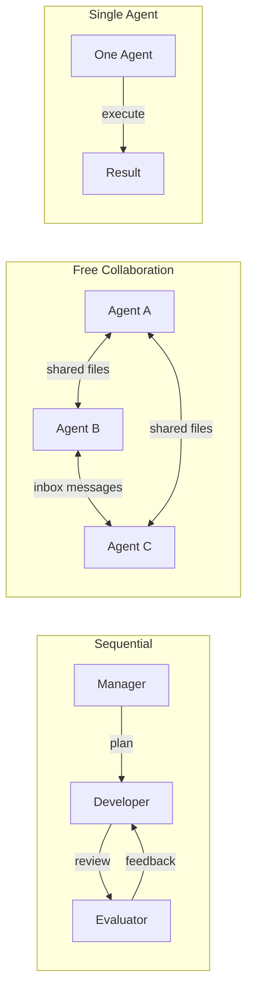
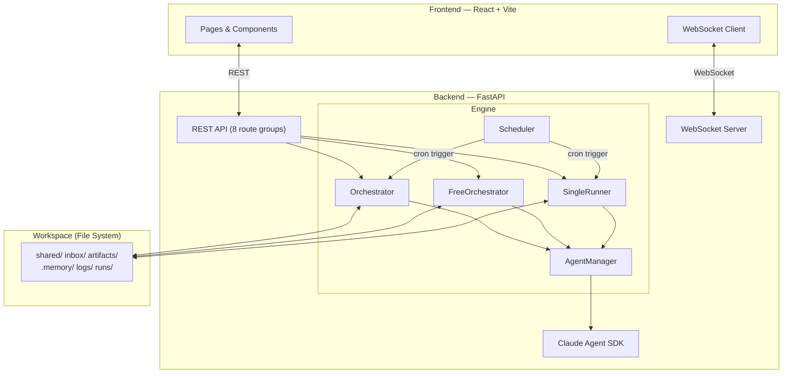

<div align="center">

# Polygents

**Give AI an organizational structure.**

A multi-agent collaboration framework where AI agents take on real roles — Manager, Developer, Evaluator — and work together through file-based communication to complete complex tasks autonomously.

[](https://python.org)
[](https://react.dev)
[](https://docs.anthropic.com)
[](LICENSE)

</div>

---

## Why Polygents?

Most AI agent frameworks treat agents as function calls. **Polygents treats them like a team.**

Each agent has a role, a personality, and tools. They communicate through the file system — just like humans share documents. Every message, every decision, every artifact is a real file you can read, audit, and version-control.

```
Manager writes sprint plan  ──>  shared/sprint.md
Developer reads plan, codes  ──>  artifacts/dev/
Evaluator reviews output     ──>  inbox/dev/feedback.md
Developer reads feedback     ──>  iterates until approved
```

**No magic. No hidden state. Full traceability.**

## Key Features

### Run Workflows with One Click

Create a workflow once, run it forever. Daily reports, code reviews, research — set it and forget it.

- **Quick Task** — Type a prompt, hit Run, get results instantly
- **Scheduled Execution** — Cron-based automation (e.g., daily at 9:00 AM)
- **Agent Memory** — Agents remember what they did last time, avoiding duplicate work

### Three Execution Modes



| Mode | Best For |
|------|----------|
| **Sequential** | Structured tasks — coding, report writing |
| **Free Collaboration** | Creative tasks — brainstorming, research |
| **Single Agent** | Simple tasks — translation, summarization |

### Real-Time Visualization

- **React Flow Canvas** — Watch agents collaborate in real time
- **Kanban Board** — Track tasks: pending → in progress → review → done
- **Activity Feed** — Live stream of agent thinking, decisions, and outputs
- **Workspace Browser** — Browse generated files without leaving the UI

### Built for Reliability

- **Auto-Retry** — Failed tasks retry automatically (configurable max attempts)
- **User Intervention** — Pause, modify, skip, or inject messages mid-run
- **Goal Validation** — Evaluator checks if the goal was actually met
- **Failure Diagnosis** — Clear error panels with actionable suggestions
- **Single Task Retry** — Retry just the failed task, not the whole workflow

### Extensible

- **Team Templates** — Preset teams (Dev Team, Research Team, Content Team) or create your own
- **Skills** — Attach Claude Code skills to agents for specialized behavior
- **Plugins** — Integrate Claude Code plugins (Playwright, Context7, etc.)
- **Meta-Agent Chat** — Describe your team in natural language, and an AI creates it for you

---

## Quick Start

### Prerequisites

- **Python** >= 3.10
- **Node.js** >= 18
- **Claude Code** CLI installed ([docs](https://docs.anthropic.com/en/docs/claude-code))

### Install & Run

```bash
# Clone
git clone https://github.com/lchaoer/Polygents.git
cd Polygents

# Backend
cd backend
pip install -e ".[dev]"
python -m uvicorn app.main:app --host 0.0.0.0 --port 8001

# Frontend (new terminal)
cd frontend
npm install
npm run dev
```

Open **http://localhost:5173** and you're in.

### Your First Workflow

1. Click **"+ New Workflow"**
2. Give it a name (e.g., "Daily News Summary")
3. Write a system prompt for the agent
4. Set the default task description
5. (Optional) Enable **Schedule** for daily runs or **Agent Memory** for context continuity
6. Click **Save**, then hit **Run**

---

## Architecture



### Tech Stack

| Layer | Technology |
|-------|-----------|
| Backend | Python, FastAPI, Uvicorn |
| Agent Runtime | Claude Agent SDK |
| Frontend | React 18, TypeScript, Vite |
| Visualization | React Flow |
| State | Zustand |
| Real-Time | WebSocket |
| Persistence | YAML (workflows) + JSON (runs) |
| Agent IPC | File system (Markdown + YAML frontmatter) |

---

## API Overview

| Endpoint Group | Key Operations |
|---------------|----------------|
| `/api/workflows` | CRUD, Run, Clone, Schedule |
| `/api/runs` | History, Cancel, Retry Task |
| `/api/teams/templates` | CRUD, Import/Export YAML |
| `/api/agents` | List, Create, Update at Runtime |
| `/api/workspace` | File Tree, Read File |
| `/api/skills` | List, CRUD Skill Files |
| `/api/plugins` | List Installed Plugins |
| `ws://` | Real-time status, activity, tasks |

Full reference: [docs/api-reference.md](docs/api-reference.md)

---

## Workspace Structure

Agents communicate exclusively through the file system. Everything is auditable.

```
workspace/
├── workflows/          # Workflow definitions (YAML)
├── runs/               # Run history (JSON)
├── shared/             # Shared state (sprint.md, goal.md)
├── inbox/{agent}/      # Agent-to-agent messages
├── artifacts/{agent}/  # Agent outputs
├── .memory/{agent}.md  # Persistent agent memory
└── logs/               # Daily communication logs
```

---

## Documentation

| Document | Description |
|----------|-------------|
| [Design v2](docs/design-v2.md) | Full system design with Mermaid diagrams |
| [Architecture](docs/architecture.md) | System architecture overview |
| [API Reference](docs/api-reference.md) | REST API & WebSocket protocol |
| [Phase 3 Plan](docs/plans/2026-04-06-phase3-features.md) | Feature planning example |

---

## Roadmap

- [x] **Phase 1** — Core pipeline: sequential orchestration, file IPC, Web UI
- [x] **Phase 2** — Free collaboration, parallel execution, user intervention, meta-agent chat
- [x] **Phase 3** — Quick task, scheduling, agent memory, failure diagnosis, output summary
- [ ] **Phase 4** — Multi-provider support, cost tracking, template marketplace

---

## Contributing

Contributions welcome! Please open an issue first to discuss what you'd like to change.

## License

MIT
