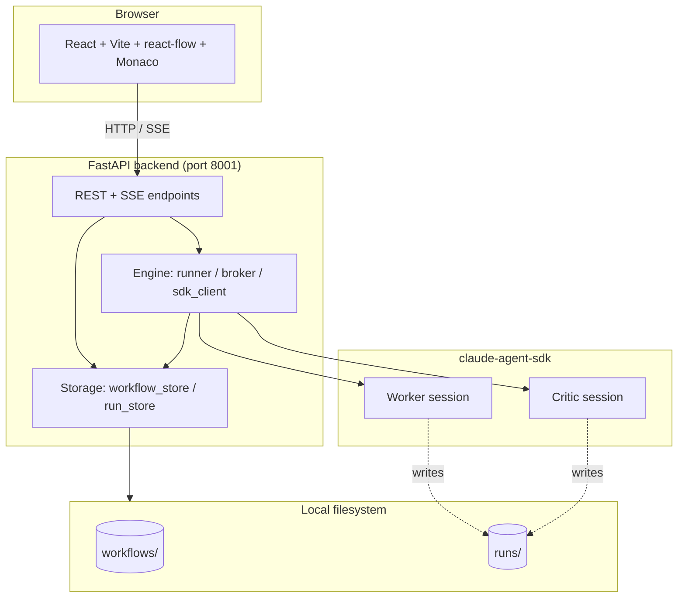
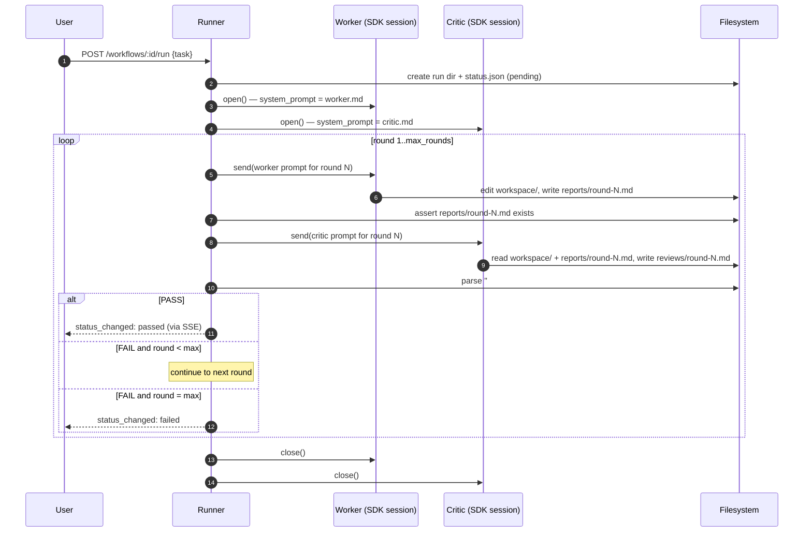
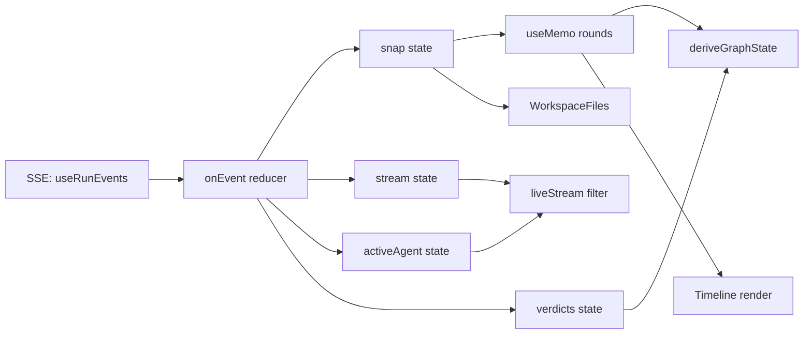

# 02 — Architecture

> How Polygents is wired: layers, data flow, file protocol, event stream, and where each responsibility lives.

## System layers



- **Frontend** is a single-page React app talking to the backend over plain `fetch` and a single SSE connection per open run.
- **Backend** is FastAPI with one event loop. No database — all state is files in `workflows/` and `runs/`.
- **claude-agent-sdk** spawns subprocess agents on demand, one persistent `ClaudeSDKClient` per role per run.

## Repo layout

```
Polygents/
├── backend/
│   └── app/
│       ├── api/                # workflows.py, runs.py — REST + SSE
│       ├── engine/             # runner.py, broker.py, sdk_client.py, registry.py, prompts.py, verdict.py, workspace_watcher.py
│       ├── storage/            # workflow_store.py, run_store.py
│       ├── settings.py
│       └── main.py
├── frontend/
│   └── src/
│       ├── api/                # client.ts (fetch wrapper), sse.ts (useRunEvents hook)
│       ├── components/         # WorkflowGraph, LiveAgentPanel, WorkspaceFiles, Toast
│       ├── lib/                # runDerive.ts (pure derivation, fully unit-tested)
│       ├── pages/              # WorkflowList / WorkflowEdit / RunDetail / RunsList / Settings
│       └── types.ts
├── workflows/                  # user-created (gitignored) — see file protocol below
├── runs/                       # run instances (gitignored)
├── scripts/dev.sh
└── docs/                       # you are here
```

## File protocol — the single source of truth

Polygents has no database. Everything that survives a process restart is a file. This is intentional: every agent decision is grep-able, diff-able, and replayable from disk alone.

### Workflow on disk

```
workflows/{workflow_id}/
├── config.yaml      # name, max_rounds, worker_model, critic_model
├── worker.md        # Worker system prompt (the user-authored part)
├── critic.md        # Critic system prompt
└── checklist.md     # Acceptance criteria — Critic only
```

`{workflow_id}` is `<slug-of-name>-<8-hex>`, generated once on create.

### Run on disk

```
runs/{run_id}/
├── status.json          # state, current_round, workflow_id, timestamps, last error
├── task.md              # the task the user typed
├── checklist.md         # snapshot of workflow's checklist at run-start time
├── workspace/           # Worker's cwd — agents both `cd` into here
├── reports/round-N.md   # Worker writes
└── reviews/round-N.md   # Critic writes
```

`{run_id}` is `<UTC-timestamp>-<6-hex>`, sortable by creation time.

### Why snapshot the checklist

The checklist is **copied** into the run at start time, not referenced live. This makes runs reproducible: if you edit `checklist.md` in the workflow afterward, old runs still show the rules they were judged by.

## Agent communication protocol

Worker and Critic never share memory. They communicate exclusively through files in the run folder.



Key invariants:

- Worker tools: `Read / Write / Edit / Bash / Glob / Grep` (full coding suite).
- Critic tools: `Read / Glob / Grep / Write`, plus `disallowed_tools=["Bash", "Edit"]` so it cannot mutate the workspace. Critic's `Write` access exists only so it can produce the review file.
- Worker never sees `checklist.md`. Critic always reads it.
- Both agents have the same `cwd` — the run's `workspace/` — so paths like `../task.md` and `../reports/round-N.md` resolve identically for both.
- **One `ClaudeSDKClient` per role per run, kept open across rounds.** This preserves the in-session conversation context, so round 2's Worker remembers what round 1's Worker did.

## Verdict parsing

Critic must end its review with this exact pattern:

```markdown
## Verdict
PASS
```

(or `FAIL`). The runner regex-greps for `## Verdict\n(PASS|FAIL)` — case-sensitive, anchored at line start. Anything else is a `VerdictParseError` and fails the run.

This rigidity is the point: vague verdicts produce vague iteration. Forcing the Critic to commit to one literal token keeps the loop honest.

## Backend modules

| Module | Responsibility |
|---|---|
| `app.api.workflows` | CRUD on workflows + `POST /:id/run` + `POST /:id/duplicate` |
| `app.api.runs` | Run snapshot + workspace listing + file read + `GET /:id/diff/:kind/:round` + cancel + SSE event stream |
| `app.engine.runner` | The Worker + Critic loop. Owns the per-round state machine and verdict parsing. |
| `app.engine.sdk_client` | Wraps `ClaudeSDKClient`. Translates SDK message blocks (`TextBlock`, `ToolUseBlock`, `ToolResultBlock`, `ThinkingBlock`) into a stream of small dicts the runner forwards as SSE events. |
| `app.engine.broker` | Per-run pub/sub. Subscribers get a queue + a replay of recent history. Stream events bypass history (`historical=False`) so they don't crowd out structural events on late-subscriber reconnect. |
| `app.engine.registry` | Process-wide registry of running runners. Owns the asyncio task that drives each run + the workspace watcher. |
| `app.engine.prompts` | The system-prompt templates and per-round prompts. The user-authored `worker.md` / `critic.md` is *appended* to a fixed Operating Environment template that defines the file protocol. |
| `app.engine.verdict` | `parse_verdict()` — strict parser that returns `"PASS"` / `"FAIL"` or raises. |
| `app.engine.workspace_watcher` | Polls the workspace and emits `workspace_changed` events when files appear / change / are deleted. |
| `app.storage.workflow_store` | Read/write workflow folders. |
| `app.storage.run_store` | Read/write run folders. Owns `RunSnapshot` (the API DTO), workspace listing, file reads with path-traversal protection, and the unified-diff helper. |

## Event stream (SSE)

A run page subscribes to `GET /api/runs/:id/events` and receives a stream of JSON events. Two classes:

### Structural events (replayed on late connect)

| Type | Fields | Meaning |
|---|---|---|
| `status_changed` | `state` | `pending` → `running` → `passed` / `failed` / `cancelled` |
| `round_start` | `round`, `role` | A round just started for this role |
| `report_written` | `round` | Worker just produced `reports/round-N.md` |
| `review_written` | `round`, `verdict` | Critic just produced `reviews/round-N.md` with this verdict |
| `workspace_changed` | `path`, `kind` | A file appeared / was modified / was deleted in `workspace/` |
| `agent_started` | `round`, `role` | An SDK session is about to begin sending |
| `agent_finished` | `round`, `role` | An SDK session just finished (final ResultMessage) |

These events are kept in a per-run ring buffer (default 200) and replayed when a new subscriber connects, so a refreshed page reconstructs the timeline.

### Stream events (live-only)

| Type | Fields | Meaning |
|---|---|---|
| `agent_stream` | `round`, `role`, `kind`, plus payload | Granular agent activity |

`kind` is one of:

- `text` — assistant TextBlock content (token-ish granularity, batched by SDK)
- `thinking` — extended thinking block content
- `tool_use` — agent invoked a tool. `name` is the tool, `input` is a one-line summary (e.g. `Read → src/foo.py`, `Bash → pytest tests/` truncated to ~120 chars). Full payloads are intentionally not sent.
- `tool_result` — tool returned. `is_error` indicates failure.

Stream events are **not** replayed on reconnect — they'd flood the buffer and push out structural events. The frontend treats stream as ephemeral: refresh the page mid-run and you'll get the timeline back but lose the in-progress narration.

The frontend keeps a 500-item rolling buffer of stream events to back the [history-replay dropdown](03-features.md#history-replay) — so prior rounds in the *same session* stay viewable.

## Frontend data flow



The whole RunDetailPage is a single source of truth: SSE updates four pieces of state, and three `useMemo`s derive everything visible. All derivation lives in [`src/lib/runDerive.ts`](../frontend/src/lib/runDerive.ts) and is unit-tested in `runDerive.test.ts`.

## Concurrency model

- One `asyncio.Task` per running run, registered in `app.engine.registry`. Process-wide singleton dict.
- Backend is single-process, single-event-loop — no thread pool, no multi-process. Two simultaneous runs share the same loop; the SDK subprocess work is naturally I/O bound so this scales fine for local single-user use.
- `AgentSession.close()` runs the SDK's disconnect on a worker thread to isolate Windows-specific anyio cancel-scope leaks. See the comment in `sdk_client.py:close()`.

## Persistence and recovery

- Every state change writes `status.json` immediately. If the backend dies mid-run, that run's status reflects the last write — typically `running`. There is no auto-recovery: on next start, those runs are stale; the user must `Cancel` them from the UI to reset.
- This is acceptable because Polygents is single-user local. A production multi-user deployment would need transactional state and crash recovery; we explicitly chose not to build that.

## Security model

There is none beyond filesystem boundaries. Polygents runs locally, gives the Worker `Bash` and `Edit`, and trusts the user not to ask it to format the disk. The SDK's `permission_mode="bypassPermissions"` is set deliberately so runs don't pause for approval.

The one defensive measure is `_safe_join` in `run_store.py`: file-read endpoints reject any path that resolves outside the run's directory (blocks `../../../etc/passwd` style traversal from a malicious workflow id or path param).

## Next

- Want to see what each piece looks like to a user? → [03 — Features](03-features.md)
- Want to run, test, or extend it? → [04 — Development](04-development.md)
