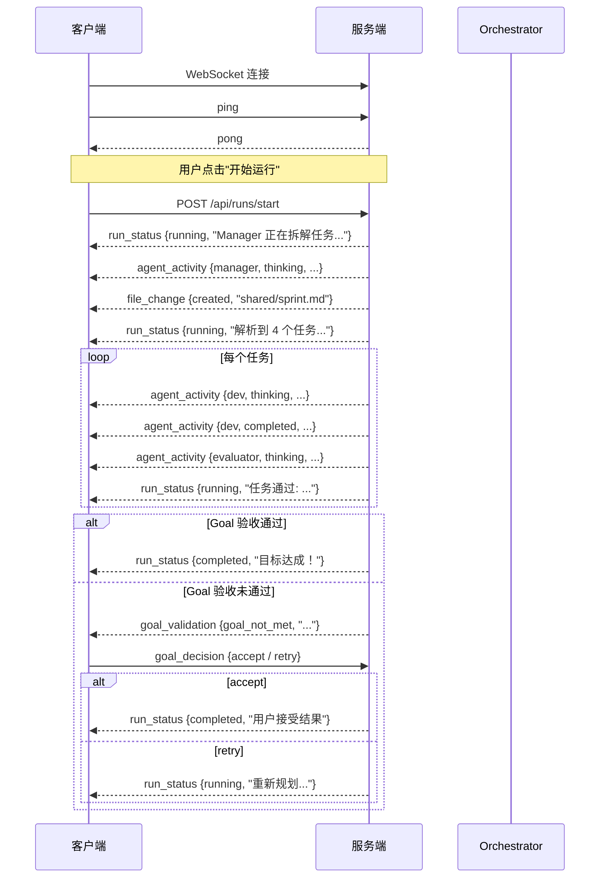

# API & WebSocket 协议参考

## REST API

所有 REST 端点前缀为 `/api`。

---

### GET `/api/teams/templates`

列出所有预设团队模板。

**响应示例:**

```json
[
  {
    "id": "dev-team",
    "name": "开发团队",
    "description": "项目经理 + 高级开发 + 质量评审",
    "agents": ["项目经理", "高级开发工程师", "质量评审员"]
  }
]
```

---

### GET `/api/teams/templates/{template_id}`

获取指定模板的完整配置。

**路径参数:**
- `template_id` (string): 模板 ID，如 `dev-team`

**响应示例:**

```json
{
  "name": "开发团队",
  "description": "...",
  "agents": [
    {
      "id": "manager",
      "role": "项目经理",
      "system_prompt": "你是项目经理...",
      "tools": ["Read", "Write"],
      "provider": "claude"
    }
  ]
}
```

**错误:**
- `404`: 模板不存在

---

### POST `/api/runs/start`

启动一次运行（后台异步执行）。

**请求体:**

```json
{
  "prompt": "做一个 TODO App",
  "template_id": "dev-team",
  "goal": "能增删改查、有测试覆盖"
}
```

| 字段 | 类型 | 必填 | 说明 |
|------|------|------|------|
| `prompt` | string | 是 | 任务描述 |
| `template_id` | string | 否 | 团队模板 ID，不填则使用已创建的 Agent |
| `goal` | string | 否 | 验收目标，不填则由 Manager 自动生成 |

**响应:**

```json
{
  "status": "started",
  "prompt": "做一个 TODO App",
  "goal": "能增删改查、有测试覆盖"
}
```

---

### GET `/api/runs/status`

获取当前运行状态。

**响应:**

```json
{
  "agents": ["manager", "dev", "evaluator"]
}
```

---

## WebSocket 协议

**端点:** `ws://{host}:{port}/ws`

连接后可双向通信，使用 JSON 格式。

### 客户端 → 服务端

#### `ping` — 心跳

```json
{ "type": "ping" }
```

#### `goal_decision` — 用户对总验收结果的决定

```json
{
  "type": "goal_decision",
  "decision": "accept"
}
```

| decision | 说明 |
|----------|------|
| `accept` | 接受当前结果，运行结束 |
| `retry` | 继续优化，重新规划 |

---

### 服务端 → 客户端

#### `pong` — 心跳回复

```json
{ "type": "pong" }
```

#### `run_status` — 运行状态变更

```json
{
  "type": "run_status",
  "data": {
    "status": "running",
    "detail": "Manager 正在拆解任务..."
  }
}
```

| status | 说明 |
|--------|------|
| `running` | 运行中（detail 描述当前步骤） |
| `completed` | 运行完成 |
| `failed` | 运行失败 |

#### `goal_validation` — Goal 总验收结果

当所有任务完成后，Evaluator 对照目标做总验收。如果未通过，发送此消息等待用户决定。

```json
{
  "type": "goal_validation",
  "data": {
    "status": "goal_not_met",
    "detail": "目标未达成：缺少删除功能的测试覆盖..."
  }
}
```

#### `agent_activity` — Agent 活动通知

```json
{
  "type": "agent_activity",
  "data": {
    "agent_id": "dev",
    "action": "thinking",
    "detail": "正在处理: 实现 CRUD 逻辑..."
  }
}
```

| action | 说明 |
|--------|------|
| `thinking` | Agent 正在思考/处理 |
| `completed` | Agent 完成当前任务 |

#### `file_change` — 文件变更通知

```json
{
  "type": "file_change",
  "change": "created",
  "path": "shared/sprint.md"
}
```

#### `system` — 系统消息

```json
{
  "type": "system",
  "data": {
    "message": "运行已触发"
  }
}
```

---

## 消息流程图


