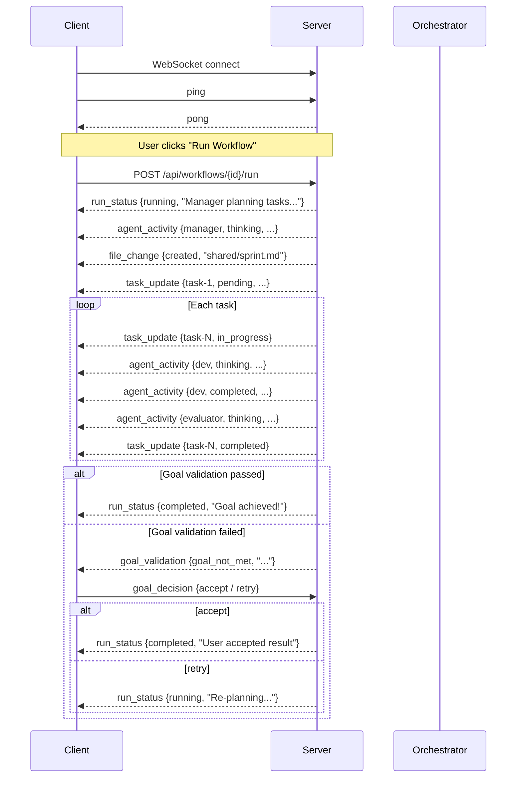
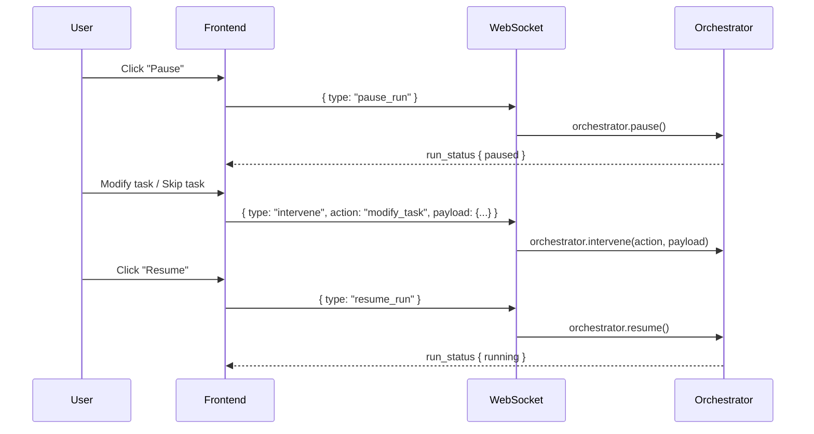

# API & WebSocket Reference

## REST API

All REST endpoints are prefixed with `/api`.

---

## Workflows

### GET `/api/workflows`

List all saved workflows.

**Response:**

```json
[
  {
    "id": "my-workflow",
    "name": "My Workflow",
    "description": "...",
    "type": "single",
    "template_id": null,
    "agent_config": { "id": "...", "role": "...", "system_prompt": "...", "tools": [...], "model": "..." },
    "default_prompt": "...",
    "default_goal": "",
    "created_at": "2026-04-04T11:06:29.620384+00:00",
    "last_run_at": "2026-04-05T05:07:39.165555+00:00",
    "last_run_status": "completed"
  }
]
```

---

### GET `/api/workflows/{wf_id}`

Get a specific workflow by ID.

**Path params:**
- `wf_id` (string): Workflow ID

**Errors:** `404` Workflow not found

---

### POST `/api/workflows`

Create a new workflow.

**Request body:**

```json
{
  "name": "Space News",
  "description": "Fetch space-related news",
  "type": "single",
  "template_id": null,
  "agent_config": {
    "id": "wf-space-news",
    "role": "Fetch",
    "system_prompt": "You are a media worker...",
    "tools": ["Read", "Write", "Edit", "Bash", "Glob", "Grep"],
    "model": "claude-sonnet-4-6"
  },
  "default_prompt": "Find today's space news",
  "default_goal": ""
}
```

| Field | Type | Required | Description |
|-------|------|----------|-------------|
| `name` | string | Yes | Workflow name |
| `description` | string | No | Description |
| `type` | string | No | `"single"` (one agent) or `"team"` (multi-agent). Default: `"team"` |
| `template_id` | string | No | Team template ID (for `type: "team"`) |
| `agent_config` | object | No | Agent configuration (for `type: "single"`) |
| `default_prompt` | string | No | Preset task prompt |
| `default_goal` | string | No | Preset goal for validation |

---

### PUT `/api/workflows/{wf_id}`

Update an existing workflow. All fields are optional.

---

### DELETE `/api/workflows/{wf_id}`

Delete a workflow.

**Response:** `{ "status": "deleted" }`

---

### POST `/api/workflows/{wf_id}/run`

One-click workflow execution. Starts the workflow with its preset prompt and goal.

- For `type: "single"`: Uses `SingleRunner` for standalone agent execution
- For `type: "team"`: Loads team template agents and uses `Orchestrator`

**Response:**

```json
{ "status": "started", "run_id": "a1b2c3d4", "workflow_id": "my-workflow" }
```

**Errors:** `400` Workflow has no preset task description

---

## Teams

### GET `/api/teams/templates`

List all preset team templates.

**Response:**

```json
[
  {
    "id": "dev-team",
    "name": "Development Team",
    "description": "PM + Senior Dev + QA Reviewer",
    "agents": ["Project Manager", "Senior Developer", "QA Reviewer"]
  }
]
```

---

### GET `/api/teams/templates/{template_id}`

Get full template configuration including agent definitions.

**Path params:**
- `template_id` (string): Template ID, e.g. `dev-team`

**Response:**

```json
{
  "name": "Development Team",
  "description": "...",
  "agents": [
    {
      "id": "manager",
      "role": "Project Manager",
      "role_type": "planner",
      "system_prompt": "You are a project manager...",
      "tools": ["Read", "Write"],
      "model": "claude-sonnet-4-6"
    }
  ]
}
```

**Errors:** `404` Template not found

---

### POST `/api/teams/templates`

Create a new team template.

**Request body:**

```json
{
  "name": "My Team",
  "description": "Custom team",
  "agents": [
    {
      "id": "dev",
      "role": "Developer",
      "role_type": "executor",
      "system_prompt": "...",
      "tools": ["Read", "Write", "Edit", "Bash"]
    }
  ]
}
```

**Response:** `{ "id": "my-team", "status": "created", "warnings": [] }`

Warnings are returned if required role types (`planner`, `executor`, `reviewer`) are missing.

---

### PUT `/api/teams/templates/{template_id}`

Update an existing template. Same body format as POST.

---

### DELETE `/api/teams/templates/{template_id}`

Delete a template.

---

### GET `/api/teams/templates/{template_id}/export`

Export template as raw YAML text. Returns `text/plain`.

---

### POST `/api/teams/templates/import`

Import a template from YAML text.

**Request body:**

```json
{ "yaml_text": "name: My Team\ndescription: ...\nagents:\n  - id: dev\n    ..." }
```

**Response:** `{ "id": "my-team", "status": "imported" }`

---

## Runs

### POST `/api/runs/start`

Start a run (async background execution).

**Request body:**

```json
{
  "prompt": "Build a TODO app",
  "template_id": "dev-team",
  "goal": "CRUD with test coverage"
}
```

| Field | Type | Required | Description |
|-------|------|----------|-------------|
| `prompt` | string | Yes | Task description |
| `template_id` | string | No | Team template ID; loads agents from YAML |
| `goal` | string | No | Acceptance goal for final validation |

**Response:**

```json
{ "status": "started", "prompt": "Build a TODO app", "goal": "CRUD with test coverage", "run_id": "a1b2c3d4" }
```

---

### GET `/api/runs/status`

Get current run status with list of active agents.

**Response:**

```json
{ "agents": ["manager", "dev", "evaluator"] }
```

---

### GET `/api/runs/history`

List all run history records.

**Response:**

```json
[
  {
    "id": "a1b2c3d4",
    "template_id": "dev-team",
    "prompt": "Build a TODO app",
    "goal": "CRUD with test coverage",
    "status": "completed",
    "start_time": "2026-04-04T10:00:00",
    "end_time": "2026-04-04T10:30:00",
    "tasks_summary": [...],
    "detail": "..."
  }
]
```

---

### GET `/api/runs/history/{run_id}`

Get details of a single run.

**Errors:** `404` Run not found

---

### POST `/api/runs/{run_id}/cancel`

Cancel a running task.

**Response:** `{ "status": "cancelled", "run_id": "a1b2c3d4" }`

**Errors:** `404` Run not found or already finished

---

## Agents

### GET `/api/agents`

List all active agents.

**Response:**

```json
[
  {
    "id": "dev",
    "role": "Developer",
    "role_type": "executor",
    "model": "claude-sonnet-4-6",
    "tools": ["Read", "Write", "Edit", "Bash", "Glob", "Grep"]
  }
]
```

---

### GET `/api/agents/{agent_id}`

Get agent details including config, communication history, and artifacts.

**Response:**

```json
{
  "id": "dev",
  "role": "Developer",
  "role_type": "executor",
  "model": "claude-sonnet-4-6",
  "tools": ["Read", "Write", "Edit", "Bash", "Glob", "Grep"],
  "system_prompt": "You are a senior developer...",
  "messages": [
    { "from": "manager", "to": "dev", "type": "task", "timestamp": "...", "content": "..." }
  ],
  "artifacts": ["output.py", "tests/test_main.py"]
}
```

---

### POST `/api/agents`

Register a new agent at runtime.

**Request body:**

```json
{
  "id": "writer",
  "role": "Content Writer",
  "role_type": "executor",
  "system_prompt": "You are a content writer...",
  "tools": ["Read", "Write", "Edit", "Bash", "Glob", "Grep"],
  "model": "claude-sonnet-4-6"
}
```

**Errors:** `409` Agent already exists

---

### PUT `/api/agents/{agent_id}`

Modify agent config at runtime. All fields optional.

```json
{ "system_prompt": "Updated prompt...", "tools": ["Read", "Write"], "model": "claude-opus-4-6" }
```

---

### DELETE `/api/agents/{agent_id}`

Remove an agent.

---

## Meta-Agent

### POST `/api/meta-agent/chat`

SSE streaming chat endpoint for conversational team creation. The meta-agent guides users through describing their needs and automatically creates a team template.

**Request body:**

```json
{ "session_id": "abc123", "message": "I need a team to build a web app" }
```

- `session_id` is optional on first call (auto-generated)

**Response:** Server-Sent Events (SSE) stream:

```
data: {"type": "session", "session_id": "abc123"}

data: {"type": "text", "content": "I understand you need..."}

data: {"type": "team_created", "template_id": "web-dev-team", "name": "Web Dev Team"}
```

---

### POST `/api/meta-agent/finalize`

Manual finalize fallback. In normal flow, the chat endpoint auto-creates the template.

**Request body:** `{ "session_id": "abc123" }`

**Response:** `{ "template_id": "web-dev-team", "status": "created", "name": "Web Dev Team" }`

---

## Workspace

### GET `/api/workspace/tree`

Get workspace directory tree (excludes hidden dirs, `__pycache__`, `runs`).

**Response:**

```json
[
  {
    "name": "shared",
    "path": "shared",
    "type": "directory",
    "children": [
      { "name": "sprint.md", "path": "shared/sprint.md", "type": "file", "size": 1234 }
    ]
  }
]
```

---

### GET `/api/workspace/file?path={relative_path}`

Read file content from workspace.

**Query params:**
- `path` (string, required): Relative file path within workspace

**Response:** `{ "path": "shared/sprint.md", "content": "..." }`

**Errors:**
- `403` Path traversal detected
- `404` File not found
- `413` File too large (>1MB)

---

## Communication Logs

### GET `/api/logs`

List communication log entries with optional filters.

**Query params:**

| Param | Description |
|-------|-------------|
| `date` | Filter by date (YYYY-MM-DD) |
| `from` | Filter by sender agent ID |
| `to` | Filter by receiver agent ID |
| `type` | Filter by message type |

**Response:**

```json
[
  {
    "date": "2026-04-04",
    "timestamp": "14:30:22",
    "from": "manager",
    "to": "dev",
    "type": "task",
    "content": "Implement the login page..."
  }
]
```

---

### GET `/api/logs/{date}`

Get all log entries for a specific date (YYYY-MM-DD).

---

## Skills

### GET `/api/skills/available`

List all available skills from both project-level and user-level directories.

**Response:**

```json
[
  { "name": "code-review", "description": "Review code quality", "source": "project", "file": "code-review.md" },
  { "name": "tdd", "description": "Test-driven dev", "source": "user", "file": "tdd.md" }
]
```

---

### GET `/api/skills`

List project-level skills only.

---

### GET `/api/skills/{name}`

Read a skill's full content.

**Response:** `{ "name": "code-review", "description": "...", "content": "---\nname: ...\n---\n..." }`

---

### POST `/api/skills`

Create a new skill file. Auto-adds YAML frontmatter if missing.

**Request body:**

```json
{ "name": "my-skill", "description": "Does something", "content": "Skill content here..." }
```

**Errors:** `409` Skill already exists

---

### PUT `/api/skills/{name}`

Update a skill's content.

```json
{ "description": "Updated desc", "content": "Updated content..." }
```

---

### DELETE `/api/skills/{name}`

Delete a skill file.

---

## Plugins

### GET `/api/plugins/available`

List installed Claude Code plugins (reads from `~/.claude/plugins/installed_plugins.json`).

**Response:**

```json
[
  { "name": "playwright", "scope": "user", "install_path": "...", "version": "1.0.0" }
]
```

---

## WebSocket Protocol

**Endpoint:** `ws://{host}:{port}/ws`

Bidirectional JSON messaging over WebSocket.

### Client -> Server

#### `ping` — Heartbeat

```json
{ "type": "ping" }
```

#### `start_run` — Trigger run notification

```json
{ "type": "start_run" }
```

#### `goal_decision` — User decision on final validation

```json
{ "type": "goal_decision", "decision": "accept" }
```

| decision | Description |
|----------|-------------|
| `accept` | Accept current output, end run |
| `retry` | Continue optimizing, re-plan |

#### `pause_run` — Pause orchestration

```json
{ "type": "pause_run" }
```

#### `resume_run` — Resume orchestration

```json
{ "type": "resume_run" }
```

#### `intervene` — Runtime intervention

```json
{ "type": "intervene", "action": "modify_task", "payload": { ... } }
```

| action | Description |
|--------|-------------|
| `modify_task` | Modify a task's description or assignee |
| `skip_task` | Skip a task entirely |
| `inject_message` | Send a message to an agent |
| `modify_agent` | Update agent config at runtime |

---

### Server -> Client

#### `pong` — Heartbeat reply

```json
{ "type": "pong" }
```

#### `run_status` — Run state change

```json
{
  "type": "run_status",
  "data": {
    "status": "running",
    "detail": "Manager is breaking down tasks..."
  }
}
```

| status | Description |
|--------|-------------|
| `running` | In progress (detail describes current step) |
| `completed` | Run finished successfully |
| `failed` | Run failed |
| `paused` | Run paused by user |
| `cancelled` | Run cancelled by user |

#### `agent_activity` — Agent activity notification

```json
{
  "type": "agent_activity",
  "data": {
    "agent_id": "dev",
    "action": "thinking",
    "detail": "Processing: Implement CRUD logic..."
  }
}
```

| action | Description |
|--------|-------------|
| `thinking` | Agent is thinking/processing (may include streaming content) |
| `completed` | Agent finished current task |

#### `task_update` — Task status change

```json
{
  "type": "task_update",
  "data": {
    "task_id": "task-1",
    "status": "in_progress",
    "assignee": "dev",
    "description": "Implement login page"
  }
}
```

#### `goal_validation` — Goal validation result

When all tasks complete, the evaluator validates against the goal. Sent when validation fails, awaiting user decision.

```json
{
  "type": "goal_validation",
  "data": {
    "status": "goal_not_met",
    "detail": "Goal not met: missing test coverage for delete feature..."
  }
}
```

#### `file_change` — File change notification

```json
{ "type": "file_change", "change": "created", "path": "shared/sprint.md" }
```

#### `system` — System message

```json
{ "type": "system", "data": { "message": "Run triggered" } }
```

---

## Message Flow



### Intervention Flow


