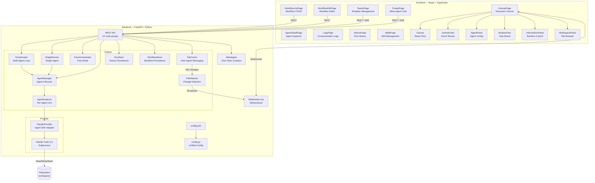
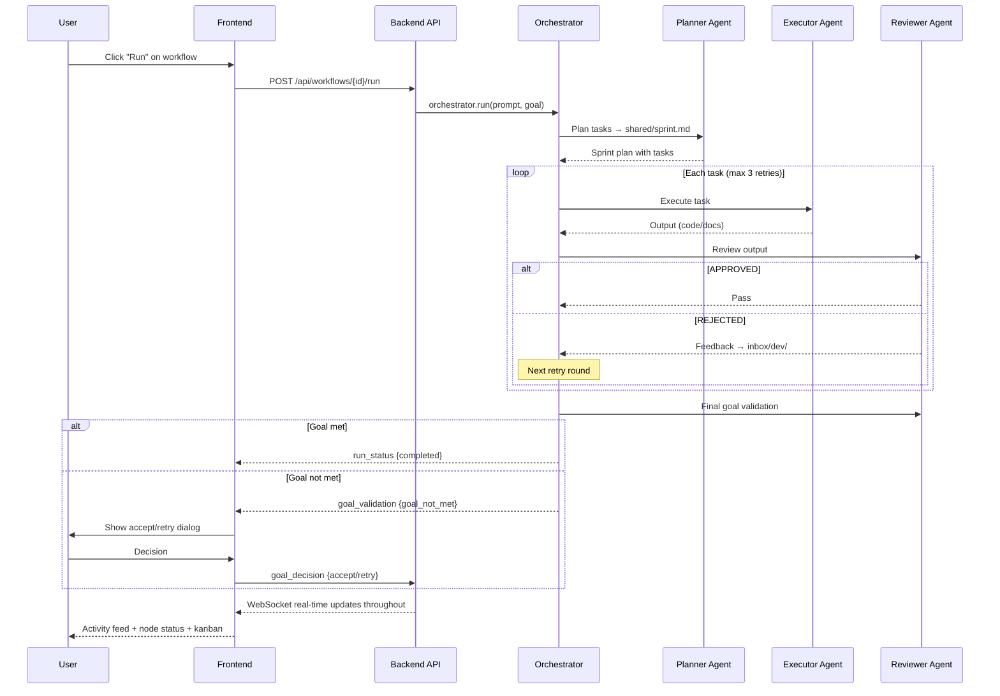
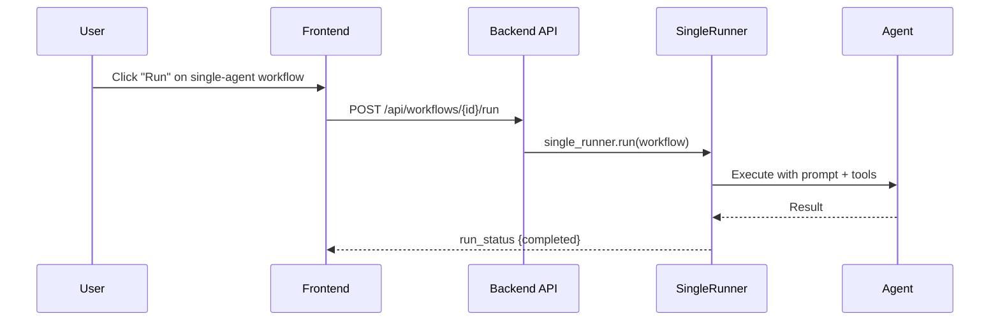
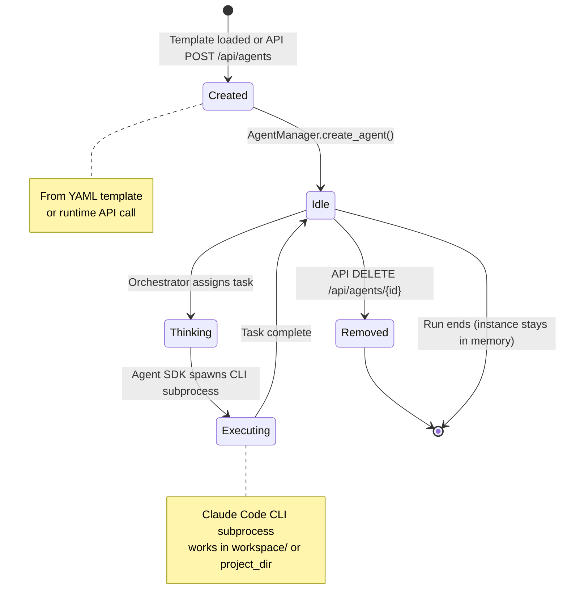
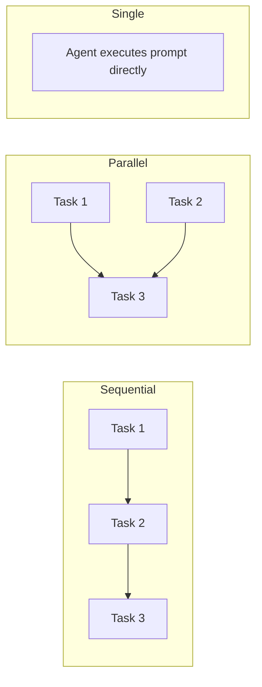
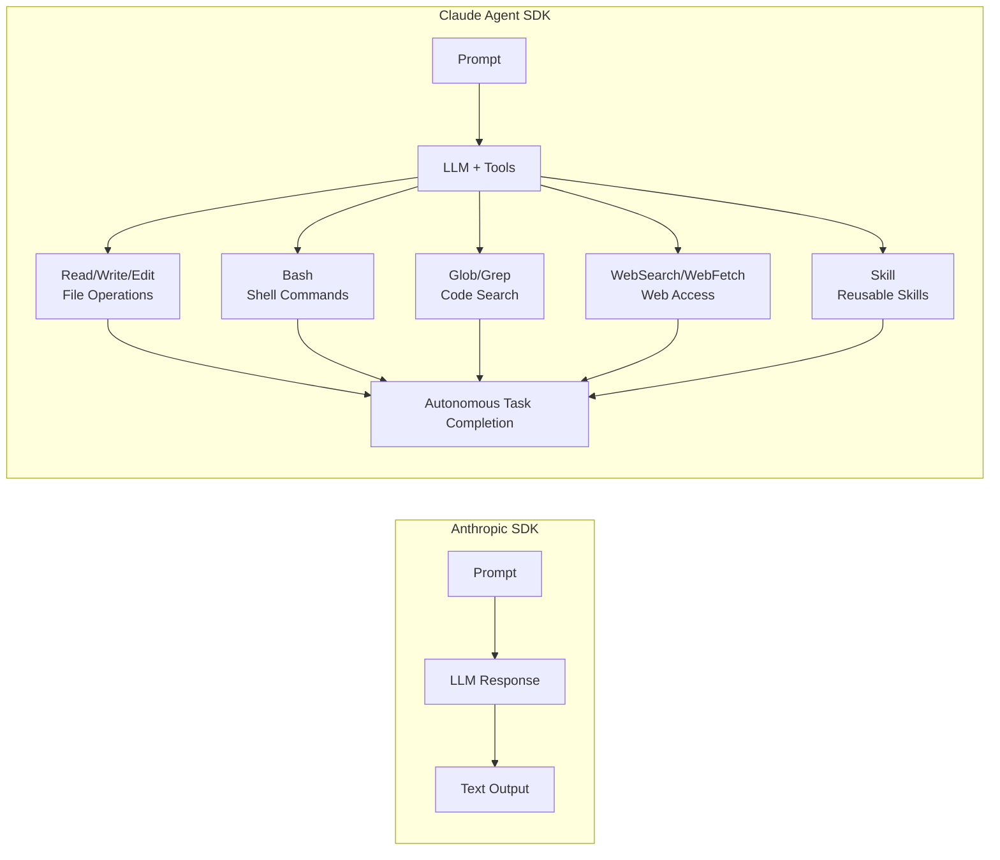
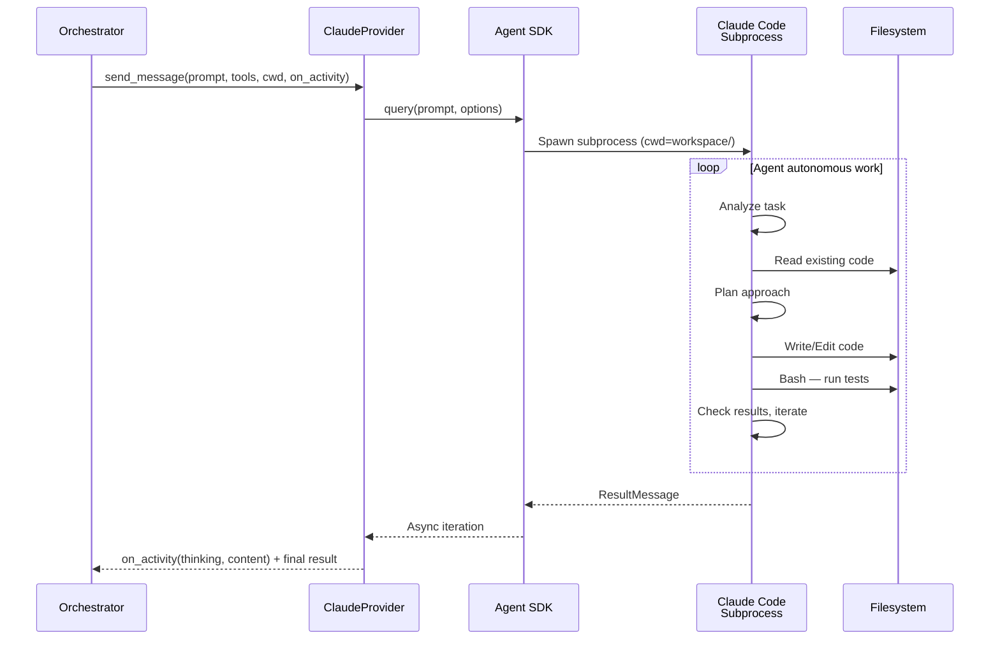
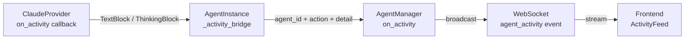

# Architecture Overview

## System Architecture



## Execution Flow

### Multi-Agent Team Run



### Single-Agent Workflow Run



## Project Structure

```
Polygents/
├── .gitignore
├── backend/
│   ├── pyproject.toml               # Python dependencies & project config
│   ├── config.json.example          # Config template (copy to config.json)
│   ├── app/
│   │   ├── main.py                  # FastAPI entry point, dependency wiring
│   │   ├── config.py                # Unified config (config.json + defaults + Windows setup)
│   │   ├── models/
│   │   │   └── schemas.py           # Pydantic models (AgentConfig, TaskItem, RunRecord, etc.)
│   │   ├── engine/
│   │   │   ├── orchestrator.py      # Multi-agent orchestration (sequential + parallel)
│   │   │   ├── single_runner.py     # Single-agent workflow execution
│   │   │   ├── free_orchestrator.py # Free-form orchestration mode
│   │   │   ├── agent_manager.py     # Agent instance lifecycle management
│   │   │   ├── meta_agent.py        # Conversational team creation via LLM
│   │   │   ├── file_comm.py         # Inter-agent file communication (inbox/shared/artifacts/logs)
│   │   │   ├── file_watcher.py      # Workspace file change monitoring
│   │   │   ├── run_store.py         # Run history persistence (workspace/runs/*.json)
│   │   │   └── workflow_store.py    # Workflow persistence (workspace/workflows/*.yaml)
│   │   ├── providers/
│   │   │   ├── base.py              # Abstract LLM provider interface
│   │   │   └── claude_provider.py   # Claude Agent SDK adapter (send_message + stream_message)
│   │   ├── api/
│   │   │   ├── router.py            # Central router aggregation
│   │   │   ├── workflows.py         # Workflow CRUD + run
│   │   │   ├── teams.py             # Team template CRUD + import/export
│   │   │   ├── runs.py              # Run start/status/history/cancel
│   │   │   ├── agents.py            # Agent CRUD at runtime
│   │   │   ├── meta_agent.py        # Meta-agent SSE chat endpoint
│   │   │   ├── workspace.py         # Workspace file browser
│   │   │   ├── logs.py              # Communication log viewer
│   │   │   ├── skills.py            # Skill file management
│   │   │   └── plugins.py           # Installed plugin discovery
│   │   ├── ws/
│   │   │   ├── handler.py           # WebSocket endpoint + message routing
│   │   │   └── manager.py           # Multi-connection broadcast manager
│   │   └── templates/               # Preset team YAML templates
│   ├── tests/                       # pytest test suite
│   └── workspace/                   # Runtime workspace (gitignored)
│       ├── inbox/                   # Per-agent message inboxes
│       ├── shared/                  # Shared files (sprint.md, etc.)
│       ├── artifacts/               # Per-agent output artifacts
│       ├── logs/                    # Communication logs (YYYY-MM-DD.md)
│       ├── runs/                    # Run history records (*.json)
│       └── workflows/               # Saved workflow configs (*.yaml)
├── frontend/
│   ├── package.json
│   ├── .env                         # VITE_API_URL config
│   └── src/
│       ├── App.tsx                   # Route definitions
│       ├── config.ts                 # API_BASE + WS_URL from env
│       ├── store/flowStore.ts        # Zustand state management
│       ├── hooks/useWebSocket.ts     # WebSocket auto-connect + reconnect
│       ├── components/
│       │   ├── AppLayout.tsx         # Sidebar navigation layout
│       │   ├── Canvas.tsx            # React Flow visual canvas
│       │   ├── nodes/AgentNode.tsx   # Custom agent node (status indicators)
│       │   ├── AgentPanel.tsx        # Selected agent detail + controls
│       │   ├── AgentPalette.tsx      # Draggable agent palette
│       │   ├── ActivityFeed.tsx      # Scrolling event log with thinking display
│       │   ├── KanbanView.tsx        # Task board (pending → completed)
│       │   ├── InterventionPanel.tsx # Pause/resume/intervene controls
│       │   ├── WorkspacePanel.tsx    # Workspace file browser
│       │   ├── HistoryPanel.tsx      # Run history viewer
│       │   ├── MetaAgentChat.tsx     # SSE streaming chat for team creation
│       │   ├── TeamPreview.tsx       # Team config preview
│       │   ├── ThemeToggle.tsx       # Dark/light theme switch
│       │   └── Toast.tsx             # Toast notification system
│       ├── pages/
│       │   ├── WorkflowListPage.tsx  # Workflow list with CRUD + run
│       │   ├── WorkflowEditPage.tsx  # Workflow create/edit form
│       │   ├── CanvasPage.tsx        # Execution workspace
│       │   ├── TeamsPage.tsx         # Team template management
│       │   ├── CreatePage.tsx        # Form + meta-agent team creation
│       │   ├── AgentDetailPage.tsx   # Agent config/messages/artifacts
│       │   ├── LogsPage.tsx          # Communication log browser
│       │   ├── HistoryPage.tsx       # Run history list
│       │   ├── SkillsPage.tsx        # Skill CRUD page
│       │   └── HomePage.tsx          # (Legacy, unused)
│       ├── types/index.ts            # TypeScript type definitions
│       └── styles/index.css          # Global styles + dark theme
└── docs/
    ├── design.md                     # Design document
    ├── architecture.md               # This document
    ├── api-reference.md              # API & WebSocket reference
    └── plans/                        # Implementation plans
```

## Frontend Routes

| Route | Page | Description |
|-------|------|-------------|
| `/` | WorkflowListPage | Workflow list with create/edit/delete/run |
| `/workflows/new` | WorkflowEditPage | Create new workflow |
| `/workflows/:id/edit` | WorkflowEditPage | Edit existing workflow |
| `/teams` | TeamsPage | Team template management |
| `/create` | CreatePage | Create team via form or meta-agent chat |
| `/canvas` | CanvasPage | Execution workspace with visual canvas |
| `/agent/:id` | AgentDetailPage | Agent inspector (config, messages, artifacts) |
| `/logs` | LogsPage | Communication log browser |
| `/history` | HistoryPage | Run history list |
| `/skills` | SkillsPage | Skill file management |

## Preset Team Templates

| Template | File | Roles | Mode |
|----------|------|-------|------|
| Development Team | `dev-team.yaml` | PM → Senior Dev → QA Reviewer | Sequential |
| Research Team | `research-team.yaml` | Research Lead → Researcher → Review Expert | Sequential |
| Content Team | `content-team.yaml` | Editor → Creator → Reviewer | Sequential |
| FastAPI Dev Team | `fastapi-用户系统开发团队.yaml` | Custom FastAPI roles | Sequential |
| Market Research | `三线并行市场调研团队.yaml` | 3-line parallel research | Parallel |

## API Endpoint Summary

| Method | Path | Description |
|--------|------|-------------|
| GET | `/api/workflows` | List workflows |
| GET | `/api/workflows/{id}` | Get workflow |
| POST | `/api/workflows` | Create workflow |
| PUT | `/api/workflows/{id}` | Update workflow |
| DELETE | `/api/workflows/{id}` | Delete workflow |
| POST | `/api/workflows/{id}/run` | Run workflow |
| GET | `/api/teams/templates` | List templates |
| GET | `/api/teams/templates/{id}` | Get template |
| POST | `/api/teams/templates` | Create template |
| PUT | `/api/teams/templates/{id}` | Update template |
| DELETE | `/api/teams/templates/{id}` | Delete template |
| GET | `/api/teams/templates/{id}/export` | Export YAML |
| POST | `/api/teams/templates/import` | Import YAML |
| POST | `/api/runs/start` | Start run |
| GET | `/api/runs/status` | Run status |
| GET | `/api/runs/history` | Run history |
| GET | `/api/runs/history/{id}` | Run details |
| POST | `/api/runs/{id}/cancel` | Cancel run |
| GET | `/api/agents` | List agents |
| GET | `/api/agents/{id}` | Agent details |
| POST | `/api/agents` | Create agent |
| PUT | `/api/agents/{id}` | Update agent |
| DELETE | `/api/agents/{id}` | Delete agent |
| POST | `/api/meta-agent/chat` | Meta-agent SSE chat |
| POST | `/api/meta-agent/finalize` | Finalize team (fallback) |
| GET | `/api/workspace/tree` | Directory tree |
| GET | `/api/workspace/file` | Read file |
| GET | `/api/logs` | List logs |
| GET | `/api/logs/{date}` | Logs by date |
| GET | `/api/skills/available` | All skills (project + user) |
| GET | `/api/skills` | Project skills |
| GET | `/api/skills/{name}` | Read skill |
| POST | `/api/skills` | Create skill |
| PUT | `/api/skills/{name}` | Update skill |
| DELETE | `/api/skills/{name}` | Delete skill |
| GET | `/api/plugins/available` | List plugins |
| WS | `/ws` | WebSocket real-time |

## Agent Lifecycle

Agents are managed by `AgentManager` and follow this lifecycle:



**Key behaviors:**

| Phase | Description |
|-------|-------------|
| **Creation** | From team templates (YAML) on run start, or via `POST /api/agents` at runtime |
| **Reuse** | Same agent instance is reused across task retries within a run |
| **Lookup** | By ID or by `role_type` (planner/executor/reviewer) with fallback mapping |
| **No autodestroy** | Instances remain in `AgentManager.agents` after run ends; overwritten on next run with same ID |
| **Stateless** | Each `execute()` call is an independent Agent SDK query — no memory between tasks |
| **Runtime config** | System prompt, tools, and model can be modified via `PUT /api/agents/{id}` |

## Execution Modes

The orchestrator supports multiple execution strategies:



| Mode | Runner | Description |
|------|--------|-------------|
| `sequential` | Orchestrator | Tasks executed one-by-one with executor→reviewer loop |
| `parallel` | Orchestrator | Dependency-aware parallel execution with deadlock detection |
| `free` | FreeOrchestrator | Free-form orchestration |
| `single` | SingleRunner | Single agent, no orchestration loop |

## Core Design: Agent SDK — Every Agent Works Like Claude Code

Polygents uses the **Claude Agent SDK** (not Anthropic SDK) as its LLM provider. This is the key architectural decision.

### Why Agent SDK?

The Anthropic SDK only enables text conversations. Agent SDK gives each agent **full Claude Code capabilities**:



### Built-in Tools

| Tool | Capability | Example Use |
|------|-----------|-------------|
| `Read` | Read files | Agent reads existing code to understand architecture |
| `Write` | Create files | Agent writes complete code files |
| `Edit` | Precise edits | Agent modifies specific lines in existing files |
| `Bash` | Shell commands | Agent runs tests, installs deps, git operations |
| `Glob` | File search | Agent finds files matching patterns |
| `Grep` | Content search | Agent searches for function definitions, references |
| `WebSearch` | Web search | Agent finds latest technical solutions |
| `WebFetch` | Fetch URLs | Agent retrieves API docs, references |
| `Skill` | Reusable skills | Agent uses predefined skill workflows |

### Provider Architecture



### Activity Streaming

The provider reports agent thinking process in real-time:



### Agent Configuration

Each agent is configured with:

```python
AgentConfig(
    id="dev",                          # Unique identifier
    role="Senior Developer",           # Display name
    role_type="executor",              # planner | executor | reviewer
    system_prompt="You are a ...",     # Agent personality & instructions
    tools=["Read", "Write", "Bash"],   # Allowed Claude Code tools
    skills=["tdd"],                    # Skill files to load
    plugins=["playwright"],            # Claude Code plugins
    model="claude-sonnet-4-6",         # LLM model
    provider="claude",                 # Provider type
)
```

## Configuration

Server configuration via `backend/config.json`:

```json
{
  "server": {
    "host": "127.0.0.1",
    "port": 8001
  },
  "agent": {
    "workspace_dir": "./workspace",
    "project_dir": null,
    "max_retries": 3,
    "timeout": 300,
    "max_turns": null
  },
  "git_bash": {
    "path": null
  }
}
```

| Setting | Default | Description |
|---------|---------|-------------|
| `server.host` | `127.0.0.1` | Server bind address |
| `server.port` | `8001` | Server port |
| `agent.workspace_dir` | `./workspace` | Inter-agent communication directory |
| `agent.project_dir` | `null` | Agent SDK cwd (user project directory) |
| `agent.max_retries` | `3` | Max retry rounds per task |
| `agent.timeout` | `300` | Agent execution timeout (seconds) |
| `agent.max_turns` | `null` | Max Agent SDK turns per execution |
| `git_bash.path` | Auto-detect | Git Bash path (Windows only) |

Frontend configuration via `frontend/.env`:

```
VITE_API_URL=http://127.0.0.1:8001
```

## Windows Compatibility

Claude Agent SDK (Claude Code CLI) requires special setup on Windows:

1. **ProactorEventLoop**: Must set `asyncio.WindowsProactorEventLoopPolicy()` at module level before any async operations
2. **Git Bash**: `CLAUDE_CODE_GIT_BASH_PATH` environment variable must point to `bash.exe` — auto-detected from common paths if not configured
3. **No hot-reload**: uvicorn's `--reload` resets event loop policy on Windows — disabled automatically
4. **UTF-8 encoding**: `PYTHONIOENCODING=utf-8` set to handle emoji and non-ASCII in agent output

These are handled in `config.py:setup_windows_env()`, called at module level in `main.py`.

## Tech Stack

**Backend:** Python 3.10+ / FastAPI / Pydantic v2 / watchfiles / Claude Agent SDK / anyio

**Frontend:** React 19 / TypeScript / Vite 8 / React Flow (@xyflow/react) / Zustand / React Router v7

**Testing:** pytest + pytest-asyncio (backend) / Playwright (frontend E2E)
