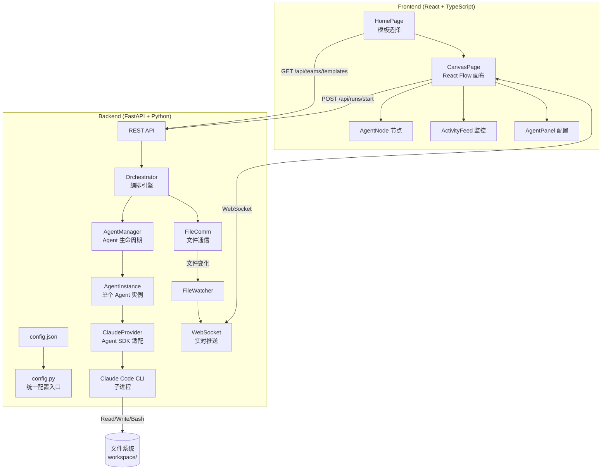
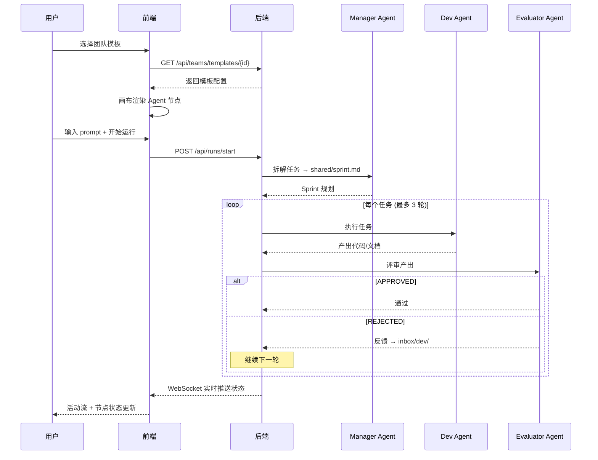
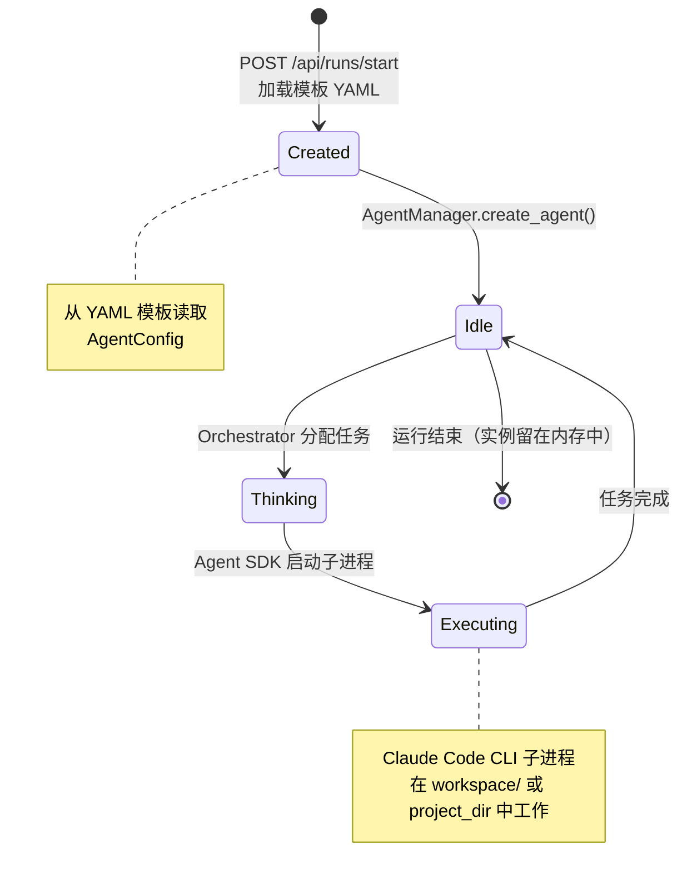
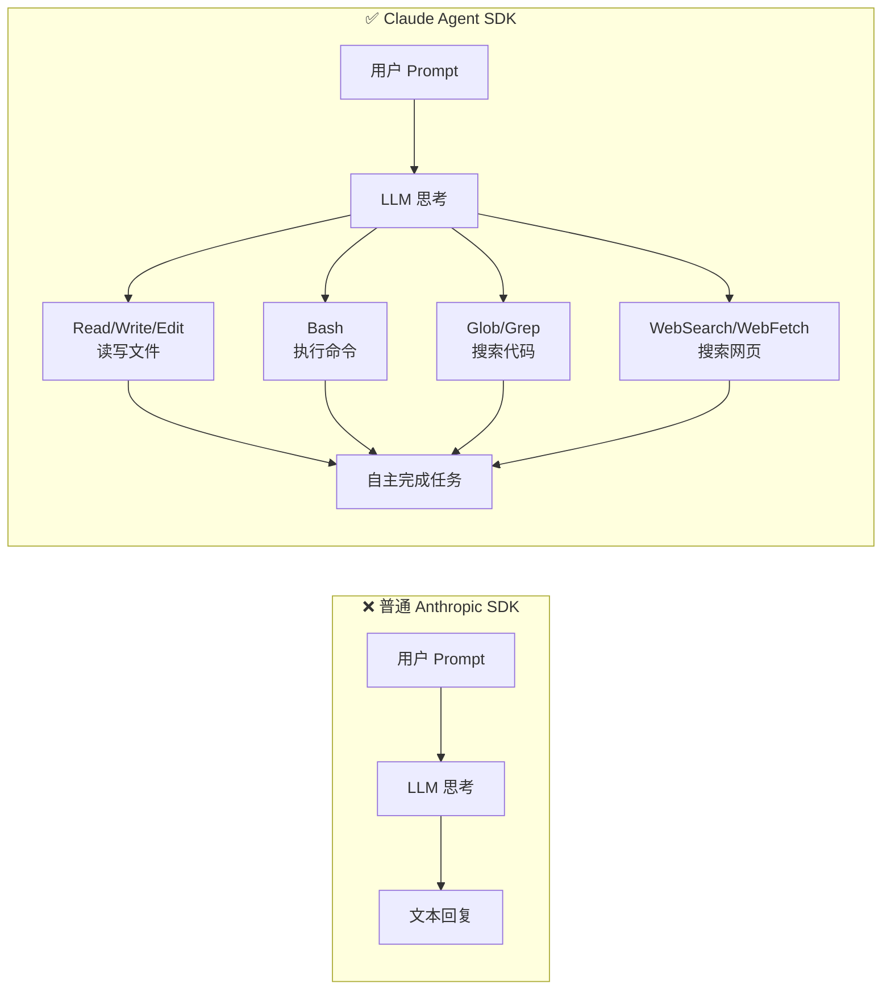
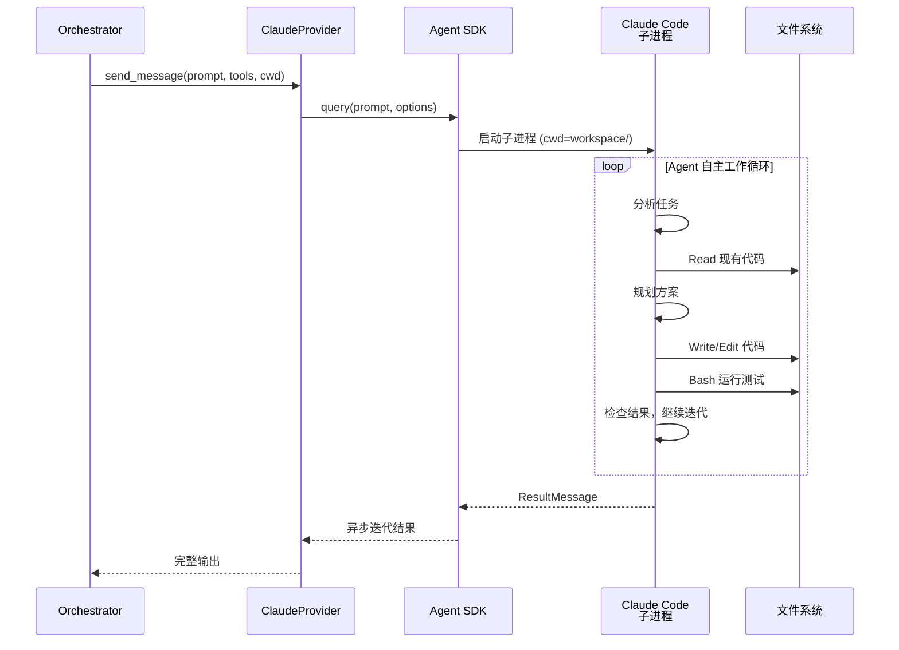

# 架构概览

## 系统架构



## 运行流程



## 项目结构

```
Polygents/
├── .gitignore                      # Git 忽略规则
├── backend/
│   ├── pyproject.toml              # Python 依赖 & 项目配置
│   ├── config.json.example         # 配置模板（复制为 config.json 使用）
│   ├── app/
│   │   ├── main.py                 # FastAPI 入口
│   │   ├── config.py               # 统一配置（读 config.json + 默认值）
│   │   ├── models/schemas.py       # Pydantic 数据模型
│   │   ├── engine/
│   │   │   ├── file_comm.py        # 文件通信（inbox/shared/artifacts/logs）
│   │   │   ├── agent_manager.py    # Agent 实例管理
│   │   │   ├── orchestrator.py     # 三角色闭环编排 + Goal 总验收
│   │   │   └── file_watcher.py     # 文件变化监控
│   │   ├── providers/
│   │   │   ├── base.py             # LLM Provider 抽象接口
│   │   │   └── claude_provider.py  # Claude Agent SDK 适配
│   │   ├── ws/                     # WebSocket 连接 & 广播
│   │   ├── api/                    # REST API (teams + runs)
│   │   └── templates/              # 预设团队模板 YAML
│   ├── tests/                      # pytest 测试
│   └── workspace/                  # 运行时通信目录
├── frontend/
│   └── src/
│       ├── App.tsx                 # 路由 (/, /create, /canvas)
│       ├── store/flowStore.ts      # Zustand 状态管理
│       ├── hooks/useWebSocket.ts   # WebSocket 自动连接 & 重连
│       ├── components/             # Canvas, AgentNode, AgentPanel, ActivityFeed
│       ├── pages/                  # HomePage, CanvasPage, CreatePage (Phase 2)
│       └── styles/index.css        # 暗色主题
└── docs/
    ├── design.md                   # 设计文档
    ├── architecture.md             # 本文档
    ├── api-reference.md            # API & WebSocket 协议参考
    └── plans/                      # 实施计划
```

## 预设团队模板

| 模板 | 文件 | 角色组成 |
|------|------|---------|
| 开发团队 | `dev-team.yaml` | 项目经理 → 高级开发工程师 → 质量评审员 |
| 研究团队 | `research-team.yaml` | 研究主管 → 研究员 → 评审专家 |
| 内容团队 | `content-team.yaml` | 内容主编 → 内容创作者 → 内容审核 |

## Agent 生命周期

Agent 实例由 `AgentManager` 管理，遵循以下生命周期：



**关键行为:**

| 阶段 | 说明 |
|------|------|
| **创建** | `POST /api/runs/start` 时，按 template_id 加载 YAML，为每个角色创建 `AgentInstance` |
| **复用** | 同一运行内的多轮任务（Dev→Evaluator 闭环）复用同一个 Agent 实例 |
| **不自动销毁** | 运行结束后实例留在 `AgentManager.agents` 字典中，下次运行时若 ID 相同会被覆盖 |
| **无状态** | Agent 实例本身无状态记忆，每次 `execute()` 都是独立的 Agent SDK 调用 |
| **并发** | 当前 MVP 为顺序执行（一次只有一个 Agent 在工作），Phase 2 支持并行 |

## API 端点

| 方法 | 路径 | 说明 |
|------|------|------|
| GET | `/api/teams/templates` | 列出所有团队模板 |
| GET | `/api/teams/templates/{id}` | 获取模板详情 |
| POST | `/api/runs/start` | 启动一次运行 |
| GET | `/api/runs/status` | 获取运行状态 |
| WS | `/ws` | WebSocket 实时通信 |

## 核心设计：Agent SDK — 让每个 Agent 像 Claude Code 一样工作

Polygents 使用 **Claude Agent SDK**（而非 Anthropic SDK）作为 LLM 提供者，这是整个项目的关键设计决策。

### 为什么选择 Agent SDK？

普通的 Anthropic SDK 只能让 Agent **思考和回复**（纯文本对话）。而 Agent SDK 让每个 Agent 拥有 **Claude Code 的全部能力**：



### Agent SDK 提供的内置工具

| 工具 | 能力 | 场景示例 |
|------|------|---------|
| `Read` | 读取文件 | Agent 阅读现有代码理解架构 |
| `Write` | 创建文件 | Agent 写出完整代码文件 |
| `Edit` | 精确编辑 | Agent 修改已有文件特定行 |
| `Bash` | 执行命令 | Agent 运行测试、安装依赖、git 操作 |
| `Glob` | 文件搜索 | Agent 找到特定模式的文件 |
| `Grep` | 内容搜索 | Agent 搜索函数定义、引用等 |
| `WebSearch` | 搜索网页 | Agent 查找最新技术方案 |
| `WebFetch` | 抓取网页 | Agent 获取 API 文档等 |

### 工作方式

Agent SDK 在底层**启动 Claude Code CLI 子进程**，让每个 Agent 在指定的工作目录内自主操作：



### Windows 兼容性注意事项

Agent SDK（Claude Code CLI）在 Windows 上需要特殊配置：

1. **ProactorEventLoop**: 必须在模块顶层设置 `asyncio.WindowsProactorEventLoopPolicy()`
2. **Git Bash**: 需要设置 `CLAUDE_CODE_GIT_BASH_PATH` 环境变量
3. **禁用热重载**: uvicorn 的 reload 模式会重置 event loop policy，必须在 Windows 上禁用

这些配置已在 `app/main.py` 的模块顶层处理。

## 技术栈

**后端:** Python 3.10+ / FastAPI / Pydantic v2 / watchfiles / **Claude Agent SDK** / anyio

**前端:** React 19 / TypeScript / Vite 8 / React Flow (@xyflow/react) / Zustand / React Router
