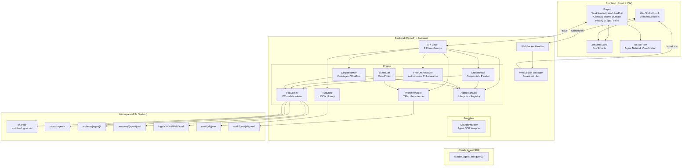
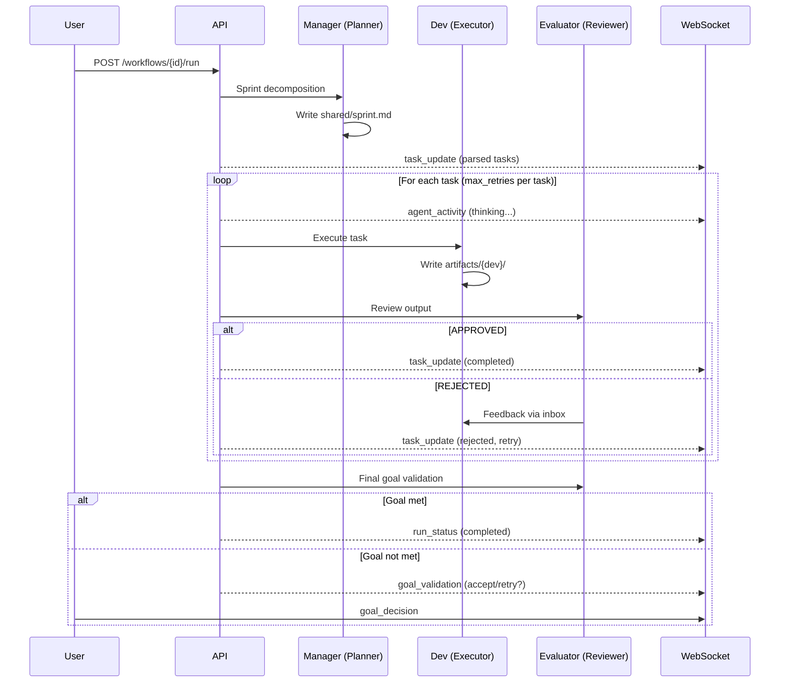
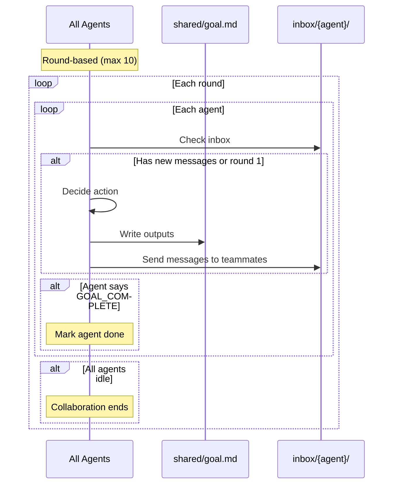
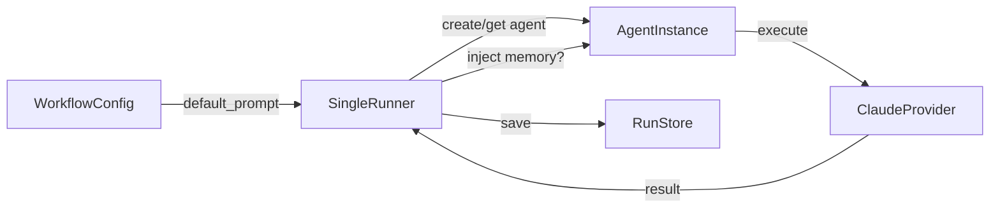
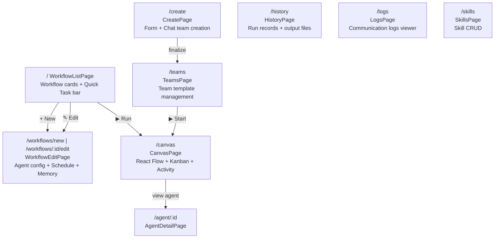
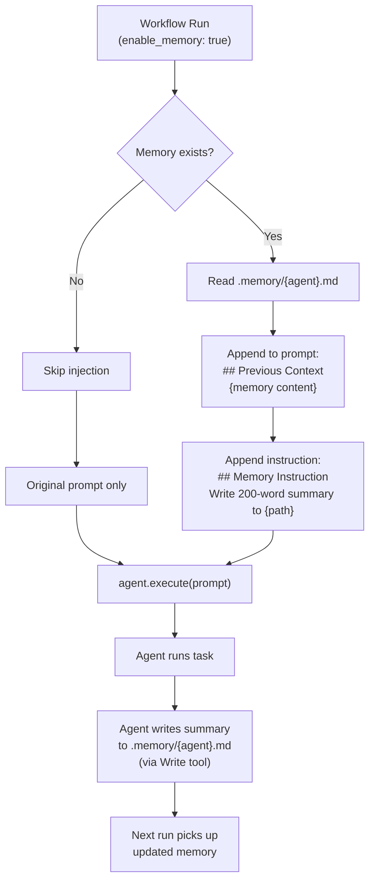
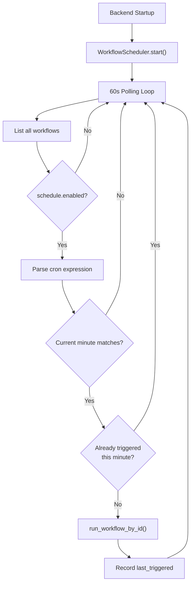

# Polygents — Design Document v2

> **Version**: v2.0
> **Date**: 2026-04-06
> **Status**: Phase 1 + 2 + 3 Implemented

---

## 1. Project Vision

Polygents is a **role-orchestrated multi-agent collaboration framework**. Core idea: "give AI an organizational structure" — different Agents take on different roles, responsibilities, and skills, collaborating through the file system to complete complex tasks.

### 1.1 Core Differentiation

| Feature | Polygents | CrewAI | OpenAI Agents SDK |
|---------|-----------|--------|-------------------|
| Communication | **File system (Markdown)** | In-memory passing | Function calls |
| Team Creation | **Conversational + Templates + Workflow** | YAML static | Code definition |
| User Interface | **Web UI first** | CLI/Code | Code |
| Backend Model | Claude first, extensible | Model-agnostic | OpenAI-biased |
| Traceability | Native (files are records) | Requires extra | Not supported |
| Scheduling | **Built-in cron scheduler** | Not built-in | Not built-in |
| Agent Memory | **Persistent memory files** | Not built-in | Not built-in |

### 1.2 Target Users

- **Personal Productivity** — Daily reports, news aggregation, code review automation
- **Software Dev Teams** — Architect + Developer + Tester + Reviewer collaboration
- **Research & Analysis** — Researcher + Analyst + Writer pipelines
- **General Task Orchestration** — Any multi-role complex task

---

## 2. System Architecture



---

## 3. Data Models

### 3.1 AgentConfig

```python
class AgentConfig(BaseModel):
    id: str                          # Unique identifier
    role: str                        # Display name (e.g., "Developer")
    system_prompt: str               # Agent personality & instructions
    tools: list[str] = []            # ["Read", "Write", "Edit", "Bash", "Glob", "Grep", "Skill"]
    skills: list[str] = []           # Skill names (e.g., ["code-review"])
    plugins: list[str] = []          # Plugin names (e.g., ["playwright"])
    provider: str = "claude"         # LLM provider
    model: Optional[str] = None      # Model override (e.g., "claude-sonnet-4-6")
    role_type: Optional[str] = None  # "planner" | "executor" | "reviewer"
```

### 3.2 WorkflowConfig

```python
class WorkflowConfig(BaseModel):
    id: str
    name: str
    description: str = ""
    type: str = "team"               # "single" | "team"
    template_id: Optional[str]       # Team template reference
    agent_config: Optional[dict]     # Single-agent config
    default_prompt: str = ""         # Task description
    default_goal: str = ""           # Acceptance criteria
    schedule: Optional[dict] = None  # {"cron": "0 9 * * *", "enabled": True}
    enable_memory: bool = False      # Persistent agent memory
    created_at: str
    last_run_at: Optional[str]
    last_run_status: Optional[str]   # "completed" | "running" | "failed" | "cancelled"
```

### 3.3 RunRecord

```python
class RunRecord(BaseModel):
    id: str
    template_id: Optional[str]
    prompt: str
    goal: Optional[str]
    status: str                      # "running" | "completed" | "failed" | "cancelled"
    start_time: str
    end_time: Optional[str]
    tasks_summary: Optional[str]
    output_files: list[dict] = []    # [{"path": "...", "action": "created|modified"}]
```

### 3.4 TaskItem

```python
class TaskStatus(str, Enum):
    pending = "pending"
    in_progress = "in_progress"
    review = "review"
    completed = "completed"
    rejected = "rejected"

class TaskItem(BaseModel):
    id: str
    description: str
    assignee: Optional[str]          # Agent ID
    depends_on: list[str] = []       # Task IDs
    output: Optional[str]
    status: TaskStatus
```

---

## 4. Execution Modes

### 4.1 Sequential Orchestration (default)



### 4.2 Free Collaboration



### 4.3 Single Agent Workflow



---

## 5. Workspace File Structure

```
workspace/
├── workflows/                 # Workflow definitions (YAML)
│   ├── {workflow-id}.yaml
│   └── ...
├── runs/                      # Run history (JSON)
│   ├── {run-id}.json
│   └── ...
├── shared/                    # Shared state between agents
│   ├── sprint.md              # Task decomposition plan
│   ├── goal.md                # Project goal definition
│   └── ...
├── inbox/                     # Agent-to-agent messages
│   ├── {agent-id}/
│   │   └── 001-feedback.md    # YAML frontmatter + body
│   └── ...
├── artifacts/                 # Agent output files
│   ├── {agent-id}/
│   │   └── ...
│   └── ...
├── logs/                      # Daily communication logs
│   └── 2026-04-06.md
├── .memory/                   # Persistent agent memory
│   └── {agent-id}.md
└── .polygents/
    └── agents/                # Agent registry
```

### Message Format (inbox)

```yaml
---
id: msg-001
from: evaluator
to: dev
type: feedback
priority: normal
timestamp: 2026-04-06T09:00:00
---

Your implementation of the login page is missing error handling.
Please add try-catch blocks around the API calls.
```

---

## 6. API Reference

### 6.1 Workflows

| Method | Endpoint | Description |
|--------|----------|-------------|
| GET | `/api/workflows` | List all workflows |
| GET | `/api/workflows/{id}` | Get workflow details |
| POST | `/api/workflows` | Create workflow |
| PUT | `/api/workflows/{id}` | Update workflow |
| DELETE | `/api/workflows/{id}` | Delete workflow |
| POST | `/api/workflows/{id}/run` | Execute workflow |
| POST | `/api/workflows/{id}/clone` | Clone workflow |
| POST | `/api/workflows/{id}/schedule` | Set cron schedule |
| DELETE | `/api/workflows/{id}/schedule` | Disable schedule |
| POST | `/api/workflows/quick-task` | SSE quick task execution |

### 6.2 Runs

| Method | Endpoint | Description |
|--------|----------|-------------|
| POST | `/api/runs/start` | Start team run from template |
| GET | `/api/runs/history` | List run history |
| GET | `/api/runs/history/{id}` | Get run details |
| POST | `/api/runs/{id}/cancel` | Cancel active run |
| POST | `/api/runs/{id}/retry-task` | Retry failed task |

### 6.3 Teams

| Method | Endpoint | Description |
|--------|----------|-------------|
| GET | `/api/teams/templates` | List team templates |
| GET | `/api/teams/templates/{id}` | Get template details |
| POST | `/api/teams/templates` | Create template |
| PUT | `/api/teams/templates/{id}` | Update template |
| DELETE | `/api/teams/templates/{id}` | Delete template |
| POST | `/api/teams/templates/import` | Import YAML template |
| GET | `/api/teams/templates/{id}/export` | Export YAML template |

### 6.4 Agents

| Method | Endpoint | Description |
|--------|----------|-------------|
| GET | `/api/agents` | List active agents |
| GET | `/api/agents/{id}` | Agent detail + inbox + artifacts |
| POST | `/api/agents` | Create agent |
| PUT | `/api/agents/{id}` | Update agent config at runtime |
| DELETE | `/api/agents/{id}` | Remove agent |

### 6.5 Other

| Method | Endpoint | Description |
|--------|----------|-------------|
| GET | `/api/workspace/tree` | Workspace directory tree |
| GET | `/api/workspace/file?path=` | Read workspace file |
| GET | `/api/logs` | Query communication logs |
| GET | `/api/skills/available` | List available skills |
| GET | `/api/plugins/available` | List installed plugins |
| POST | `/api/meta-agent/chat` | SSE meta-agent conversation |
| POST | `/api/meta-agent/finalize` | Save chat-created team |

### 6.6 WebSocket

**Endpoint**: `ws://host:port/ws`

**Client → Server**:

| Type | Description |
|------|-------------|
| `ping` | Heartbeat |
| `start_run` | Start run with template_id + prompt |
| `goal_decision` | Accept/retry after goal validation |
| `pause_run` | Pause orchestrator |
| `resume_run` | Resume orchestrator |
| `intervene` | Modify/skip task or inject message |

**Server → Client**:

| Type | Description |
|------|-------------|
| `run_status` | Run state changes (running/paused/completed/failed) |
| `agent_activity` | Agent thinking/completed events |
| `task_update` | Task status changes (Kanban updates) |
| `goal_validation` | Goal not met, user decision needed |
| `file_change` | Workspace file create/modify/delete |

---

## 7. Frontend Pages



### Key UI Components

| Component | Location | Role |
|-----------|----------|------|
| **QuickTaskBar** | WorkflowListPage top | Instant single-agent task execution |
| **Canvas** | CanvasPage | React Flow agent network visualization |
| **KanbanView** | CanvasPage | Task board (pending → in_progress → review → done) |
| **ActivityFeed** | CanvasPage | Real-time event stream |
| **InterventionPanel** | CanvasPage | Pause/Resume/Modify/Skip/Inject |
| **RunResultPanel** | CanvasPage | Post-run output summary with file preview |
| **ErrorPanel** | CanvasPage | Persistent failure diagnosis |
| **WorkspacePanel** | CanvasPage | Browse workspace files |
| **MetaAgentChat** | CreatePage | Conversational team builder (SSE) |

---

## 8. Feature Summary (Phase 1-3)

### Phase 1 — Core Pipeline

| Feature | Description |
|---------|-------------|
| Agent SDK Integration | Claude Agent SDK wrapper with tools/plugins/skills |
| Sequential Orchestration | Manager → Dev → Evaluator loop with retry |
| File-Based IPC | Inbox messages, shared state, artifacts |
| Web UI Canvas | React Flow visualization + Kanban board |
| WebSocket Real-Time | Live status, activity, task updates |
| Team Templates | Preset YAML team configurations |

### Phase 2 — Extended Capabilities

| Feature | Description |
|---------|-------------|
| Free Collaboration | Round-based autonomous agent coordination |
| Parallel Execution | DAG-based concurrent task execution |
| User Intervention | Pause/Resume/Modify/Skip during run |
| Goal Validation | Post-run goal check with accept/retry |
| Meta-Agent Chat | Conversational team creation via SSE |
| Skills System | Project/user-level Claude Code skill management |
| Plugin System | Claude Code plugin integration |
| Run History | Persistent run records with output file tracking |
| Workspace Browser | File tree + content viewer |

### Phase 3 — Personal Productivity

| Feature | Description |
|---------|-------------|
| Quick Task | One-click instant single-agent execution |
| Config Simplification | Basic/Advanced mode, role_type presets |
| Workflow Clone | One-click workflow duplication |
| Output Summary | Post-run file diff, preview panel |
| Failure Diagnosis | Persistent error panel + retry single task |
| Prompt Suggestions | Auto-suggestions for common failures |
| Scheduled Execution | Cron-based workflow scheduling (60s polling) |
| Agent Memory | Persistent `.memory/` files, auto-injected into prompts |

---

## 9. Agent Memory System



**Key Design Decisions**:

1. **Inject into prompt, not system_prompt** — `system_prompt` is a shared reference across runs, mutating it would accumulate
2. **Agent self-writes memory** — Agent has `Write` tool access, more flexible than programmatic extraction
3. **Per-agent scope** — Each agent has its own memory file, independent of other agents
4. **Only executors get memory** — In team mode, evaluators don't need accumulated context
5. **Opt-in** — `enable_memory: false` by default, backward compatible

---

## 10. Scheduler System



**Cron Format**: Standard 5-field `M H DoM Mon DoW` (e.g., `0 9 * * 1-5` = weekdays 9:00 UTC)

---

## 11. Technology Stack

| Layer | Technology |
|-------|-----------|
| **Backend** | Python 3.11+, FastAPI, Uvicorn |
| **Agent Runtime** | Claude Agent SDK (subprocess-based) |
| **LLM** | Claude Opus 4.6 / Sonnet 4.6 / Haiku 4.5 |
| **Frontend** | React 18, TypeScript, Vite |
| **Visualization** | React Flow |
| **State Management** | Zustand |
| **Real-Time** | WebSocket (FastAPI built-in) |
| **Data Persistence** | YAML (workflows, templates) + JSON (runs) |
| **Agent IPC** | File system (Markdown with YAML frontmatter) |
| **Scheduling** | asyncio cron poller |
| **Platform** | Windows 11 (with Git Bash compatibility) |

---

## 12. Configuration

### Backend (`backend/config.json`)

```json
{
  "host": "0.0.0.0",
  "port": 8001,
  "workspace": "./workspace",
  "agent_timeout": 300,
  "max_retries": 3,
  "max_turns": 30
}
```

### Frontend (`frontend/.env`)

```
VITE_API_URL=http://127.0.0.1:8001
```

### Startup

```bash
# Backend
cd backend && python -m uvicorn app.main:app --host 0.0.0.0 --port 8001

# Frontend
cd frontend && npm run dev -- --host 0.0.0.0 --port 5173
```

---

## 13. Project Directory Structure

```
Polygents/
├── backend/
│   ├── app/
│   │   ├── main.py                 # FastAPI entry + lifespan
│   │   ├── config.py               # JSON config loader
│   │   ├── models/
│   │   │   └── schemas.py          # Pydantic data models
│   │   ├── engine/
│   │   │   ├── agent_manager.py    # Agent lifecycle + registry
│   │   │   ├── orchestrator.py     # Sequential/parallel orchestration
│   │   │   ├── free_orchestrator.py # Autonomous collaboration
│   │   │   ├── single_runner.py    # Single-agent workflow
│   │   │   ├── file_comm.py        # File-based IPC
│   │   │   ├── run_store.py        # Run history persistence
│   │   │   ├── workflow_store.py   # Workflow YAML persistence
│   │   │   └── scheduler.py        # Cron scheduler
│   │   ├── providers/
│   │   │   └── claude_provider.py  # Claude Agent SDK wrapper
│   │   ├── api/
│   │   │   ├── router.py           # Route aggregation
│   │   │   ├── workflows.py        # Workflow CRUD + run
│   │   │   ├── runs.py             # Run history + cancel/retry
│   │   │   ├── teams.py            # Team template management
│   │   │   ├── agents.py           # Agent runtime management
│   │   │   ├── workspace.py        # File browser
│   │   │   ├── logs.py             # Communication log query
│   │   │   ├── skills.py           # Skill CRUD
│   │   │   ├── plugins.py          # Plugin listing
│   │   │   └── meta_agent.py       # Chat-based team creation
│   │   └── ws/
│   │       ├── manager.py          # WebSocket broadcast hub
│   │       └── handler.py          # WebSocket message routing
│   ├── templates/                  # Preset team YAML files
│   └── workspace/                  # Runtime workspace
├── frontend/
│   ├── src/
│   │   ├── App.tsx                 # React Router setup
│   │   ├── config.ts               # API_BASE + WS_URL
│   │   ├── pages/
│   │   │   ├── WorkflowListPage.tsx
│   │   │   ├── WorkflowEditPage.tsx
│   │   │   ├── CanvasPage.tsx
│   │   │   ├── TeamsPage.tsx
│   │   │   ├── CreatePage.tsx
│   │   │   ├── HistoryPage.tsx
│   │   │   ├── LogsPage.tsx
│   │   │   ├── SkillsPage.tsx
│   │   │   └── AgentDetailPage.tsx
│   │   ├── components/
│   │   │   ├── QuickTaskBar.tsx
│   │   │   ├── Canvas.tsx
│   │   │   ├── KanbanView.tsx
│   │   │   ├── ActivityFeed.tsx
│   │   │   ├── InterventionPanel.tsx
│   │   │   ├── RunResultPanel.tsx
│   │   │   ├── ErrorPanel.tsx
│   │   │   ├── WorkspacePanel.tsx
│   │   │   └── MetaAgentChat.tsx
│   │   ├── store/
│   │   │   └── flowStore.ts        # Zustand global state
│   │   ├── hooks/
│   │   │   └── useWebSocket.ts     # WebSocket connection
│   │   └── styles/
│   │       └── index.css           # Global styles
│   └── public/
└── docs/
    ├── design.md                   # Design v1
    ├── design-v2.md                # This document
    ├── architecture.md
    ├── api-reference.md
    └── plans/                      # Phase plans
```
