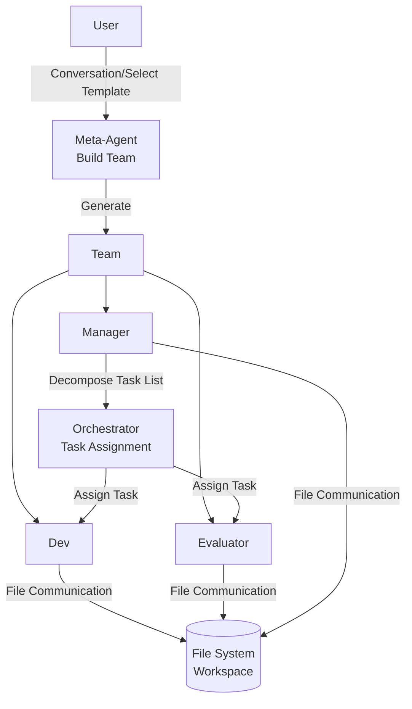
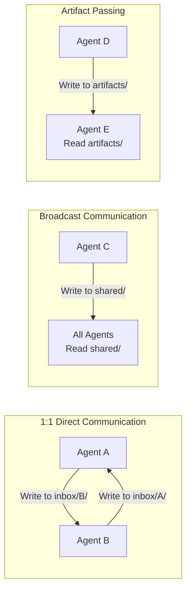
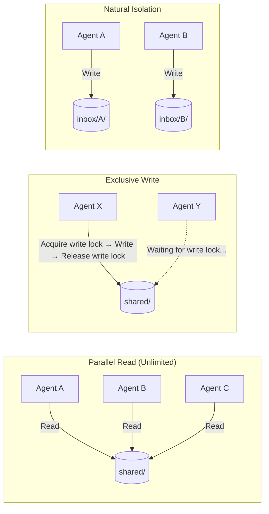
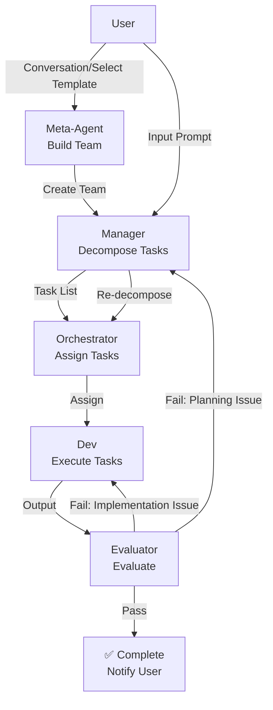
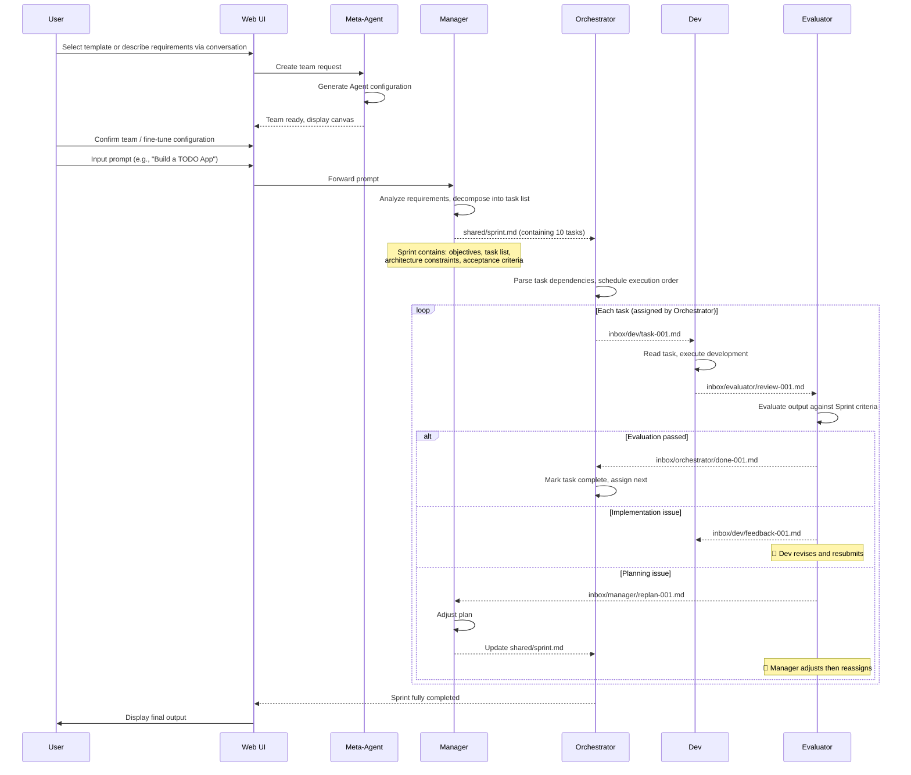
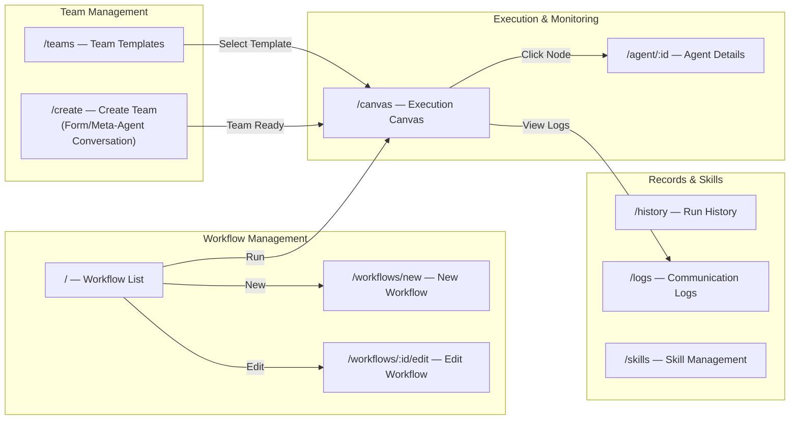
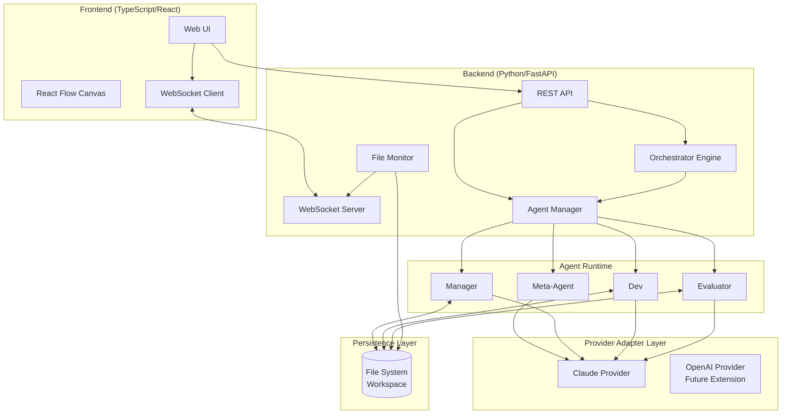
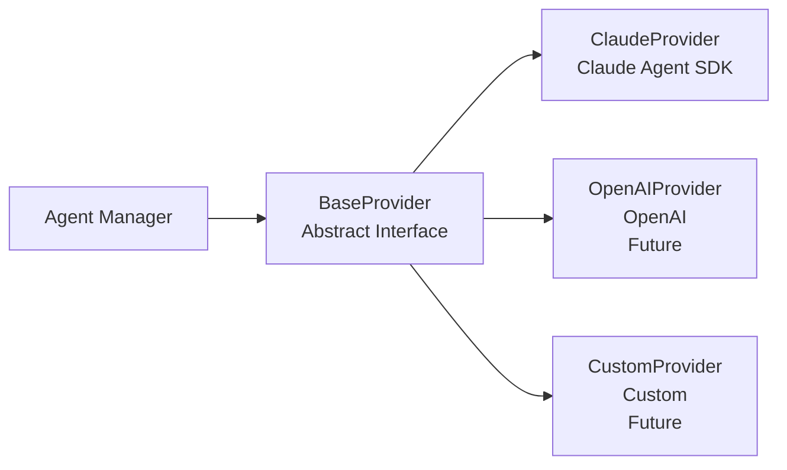
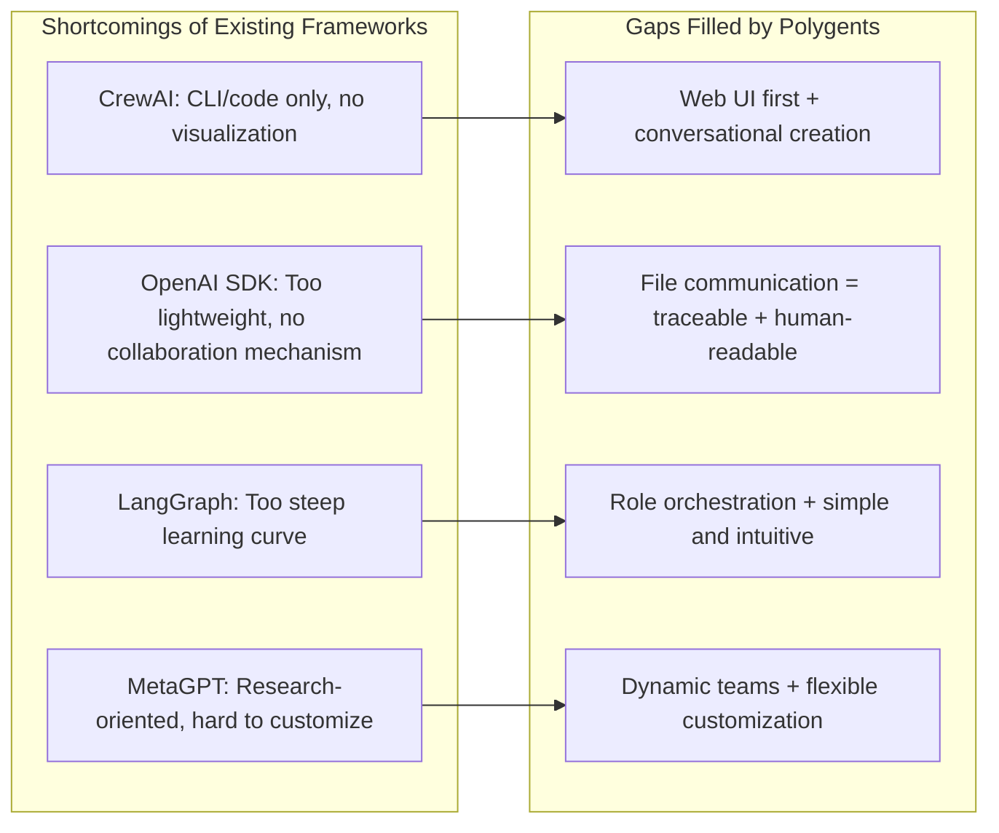
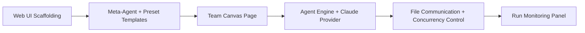

# Polygents - Multi-Agent Collaboration Framework Design Document

> **Version**: v0.2
> **Date**: 2026-04-05
> **Status**: Phase 1 & 2 Implemented

---

## 1. Project Vision

Polygents is a **role-orchestrated multi-agent collaboration framework**. The core idea is "give AI an organizational structure" — like a company, different Agents have different roles, responsibilities, and skills, collaborating through the file system to complete complex tasks.

### 1.1 Core Differentiation

| Feature | Polygents | CrewAI | OpenAI Agents SDK |
|---------|-----------|--------|-------------------|
| Communication | **File system (Markdown)** | In-memory passing | Function calls |
| Team Creation | **Conversational dynamic generation + preset templates** | YAML static config | Code definition |
| User Interface | **Web UI first (drag-and-drop + conversation)** | CLI/Code | Code |
| Backend Model | Claude first, extensible | Model-agnostic | OpenAI-biased |
| Communication Traceability | Native support (files are records) | Requires extra config | Not supported |

### 1.2 Target Users and Scenarios

- **Software Development Teams**: Architect + Developer + Tester + Code Reviewer collaboration
- **Research & Analysis Teams**: Researcher + Data Analyst + Report Writer collaboration
- **General Task Orchestration**: Any complex task requiring multi-role collaboration

---

## 2. Core Concepts

### 2.0 Concept Overview

The system consists of four levels of role collaboration, each with its own responsibilities:



**Key Division of Labor:**

| Role | Responsibility Scope | When to Engage |
|------|----------------------|----------------|
| **Meta-Agent** | Build team (create Agent instances and config) | Startup phase, exits after team is built |
| **Manager** | Understand requirements, decompose into task list | After receiving user prompt |
| **Orchestrator** | Assign tasks from the list to specific Agents, schedule execution | After Manager finishes task decomposition |
| **Dev** | Execute specific tasks, produce code/docs | After being assigned tasks by Orchestrator |
| **Evaluator** | Evaluate output quality, approve or reject | After Dev completes a task |

### 2.1 Agent

Agent is the basic working unit in the system.

**Attributes:**

| Attribute | Description | Example |
|-----------|-------------|---------|
| **id** | Unique identifier | "dev" |
| **role** | Role name | "Senior Backend Engineer" |
| **role_type** | Role type | "planner" / "executor" / "reviewer" |
| **system_prompt** | System prompt | "You are a senior development engineer..." |
| **tools** | Available Claude Code tools | ["Read", "Write", "Edit", "Bash", "Glob", "Grep"] |
| **skills** | Loaded Skill files | ["tdd", "code-review"] |
| **plugins** | Loaded Claude Code plugins | ["playwright"] |
| **model** | Model used | "claude-sonnet-4-6" / "claude-opus-4-6" |
| **provider** | Backend model | "claude" |

### 2.2 Team

A collection of Agents, created by Meta-Agent:

- **Member list**: Which Agents are in the team (MVP: Manager + Dev + Evaluator)
- **Collaboration mode**: Sequential / Parallel / Free collaboration
- **Shared context**: Team-level knowledge and goals (shared/ directory)
- **Workspace**: Working directory in the file system

### 2.3 Task

Specific work decomposed by Manager and assigned by Orchestrator:

- **Description**: Task content
- **Assignment**: Executor designated by Orchestrator
- **Dependencies**: Prerequisite tasks
- **Output**: Expected output (files/code/reports)
- **Status**: pending → in_progress → review → completed / rejected

### 2.4 Orchestrator

Orchestrator is an **internal system component** (not an Agent), responsible for:

- Receiving the task list decomposed by Manager
- Assigning tasks to corresponding Agents based on roles
- Managing execution order and dependencies
- Monitoring progress, handling timeouts and retries
- Coordinating the closed loop (Evaluator rejects → reassign)

### 2.5 Meta-Agent

Guides users through SSE streaming conversation to describe requirements and automatically generates team templates:

- Understands user needs through conversation, plans team role composition
- Can also quickly create from preset templates
- Automatically creates YAML template files and instantiates teams
- Exits after team is built, subsequent work is handled by Orchestrator
- **API**: `POST /api/meta-agent/chat` (SSE streaming), `POST /api/meta-agent/finalize` (manual fallback)

---

## 3. File Communication Mechanism

This is Polygents' most core design feature — **Agents communicate through Markdown files in the file system**.

### 3.1 Workspace Directory Structure

```
workspace/
├── .polygents/               # System configuration
│   ├── team.yaml             # Team configuration
│   └── agents/               # Agent configuration files
│       ├── manager.yaml
│       ├── dev.yaml
│       └── evaluator.yaml
├── inbox/                    # Inbox (direct Agent-to-Agent communication)
│   ├── manager/
│   │   └── 001-replan-request.md
│   ├── dev/
│   │   └── 001-task-assignment.md
│   └── evaluator/
│       └── 001-review-request.md
├── shared/                   # Shared space (team level)
│   ├── sprint.md             # Sprint plan generated by Manager
│   ├── context.md            # Project context
│   └── decisions.md          # Decision records
├── artifacts/                # Artifact outputs
│   ├── code/                 # Code outputs
│   ├── docs/                 # Documentation outputs
│   └── reports/              # Report outputs
└── logs/                     # Communication logs (auto-generated)
    └── 2026-03-30.md         # Communication records archived by date
```

### 3.2 Communication Message Format

Each message is a Markdown file with YAML frontmatter:

```markdown
---
id: msg-001
from: manager
to: dev
type: task_assignment    # task_assignment | question | review_request | reply | broadcast
priority: high
timestamp: 2026-03-30T10:23:00
related_to: null
---

## Task: Implement User Authentication API

### Requirements
- POST /api/auth/login endpoint
- JWT token authentication
- Support token refresh

### Constraints
- Use FastAPI
- Passwords must be bcrypt encrypted

### Expected Output
- `artifacts/code/auth.py`
- `artifacts/code/test_auth.py`
```

### 3.3 Communication Patterns



### 3.4 File Concurrent Read/Write Mechanism

When multiple Agents execute in parallel, file read/write conflicts must be avoided:



**Rules:**

| Directory | Read Permission | Write Permission | Description |
|-----------|-----------------|------------------|-------------|
| `inbox/{self}/` | Self | Other Agents | Others send me messages, I read them |
| `inbox/{others}/` | None | Self | I send messages to others |
| `shared/` | All Agents | **Exclusive write** (only one Agent can write at a time) | Acquire lock when writing, other Agents can continue reading or doing other work |
| `artifacts/{self}/` | All Agents | Self | My outputs, others can only view |

**Write Lock Mechanism (MVP Simple Implementation):**
- Use file locks (e.g., `shared/.write_lock`)
- Agent acquires lock before writing to shared/, releases after writing
- When lock cannot be acquired, Agent continues doing other work that doesn't require writing to shared/
- Auto-release on timeout (prevent deadlocks)

### 3.5 Advantages of File Communication

1. **Traceable**: All communications are automatically recorded, supports git version control
2. **Human-readable**: Users can read and edit any communication content at any time
3. **Fault-tolerant recovery**: Agent can recover state from files after crash
4. **Async-friendly**: Naturally supports asynchronous collaboration, no real-time connection needed
5. **Auditable**: All decision processes are transparent and inspectable

---

## 4. Core Roles and Execution Closed Loop

Polygents MVP has three built-in fixed roles: **Manager / Dev / Evaluator**, forming an automated "Plan-Execute-Evaluate" closed loop.

### 4.1 Three-Role Definition

| Role | Responsibility | Input | Output |
|------|----------------|-------|--------|
| **Manager** | Understand user requirements, decompose into Sprint (high-level planning) | User prompt | `shared/sprint.md` (task list + architecture plan) |
| **Dev** | Execute specific tasks according to Sprint plan | Sprint plan | Code/docs and other outputs under `artifacts/` |
| **Evaluator** | Evaluate whether Dev's output meets requirements | Dev output + Sprint criteria | Evaluation report in `inbox/manager/` or `inbox/dev/` |

### 4.2 Execution Closed Loop Flow



**Key Rules:**
- When Evaluator rejects, automatic retry without user intervention
- Who receives feedback depends on the issue type: implementation quality issues → back to Dev, requirement understanding/decomposition issues → back to Manager
- Maximum retry count is set (default 3 rounds), pauses and notifies user when exceeded

### 4.3 Complete Execution Sequence



### 4.4 Role Configuration Example

```yaml
roles:
  manager:
    role_type: planner
    system_prompt: |
      You are a project manager. Generate a clear Sprint plan based on user requirements.
      The plan should include: project objectives, task decomposition (numbered), architecture suggestions, acceptance criteria.
      Output to shared/sprint.md.
    tools: ["Read", "Write", "Glob", "Grep"]
    model: claude-sonnet-4-6

  dev:
    role_type: executor
    system_prompt: |
      You are a senior development engineer. Read the Sprint plan and complete assigned tasks one by one.
      Write high-quality, runnable code. Place outputs in the artifacts/ directory.
      Notify Evaluator for review after completion.
    tools: ["Read", "Write", "Edit", "Bash", "Glob", "Grep"]
    model: claude-sonnet-4-6

  evaluator:
    role_type: reviewer
    system_prompt: |
      You are a strict quality reviewer. Evaluate Dev's output against acceptance criteria in the Sprint.
      Evaluation dimensions: functional completeness, code quality, requirement satisfaction.
      Mark as complete if passed; if not, specify concrete issues and revision suggestions,
      and send back to Dev (implementation issues) or Manager (planning issues).
    tools: ["Read", "Write", "Bash", "Glob", "Grep"]
    model: claude-sonnet-4-6

execution:
  max_retries: 3
  mode: sequential        # sequential | parallel | free
  notify_on_complete: true
```

### 4.5 Sprint File Example

`shared/sprint.md` generated by Manager:

```markdown
# Sprint: TODO App

## Objectives
Build a command-line TODO application supporting CRUD operations

## Task List
1. [ ] Design data model (Task class, JSON persistence)
2. [ ] Implement core CRUD logic
3. [ ] Implement CLI interactive interface
4. [ ] Write unit tests

## Architecture Constraints
- Python 3.10+
- Use JSON file storage, no database
- Use click library for CLI

## Acceptance Criteria
- All CRUD operations work correctly
- Test coverage > 80%
- Code has reasonable error handling
```

### 4.6 Future Extension: Custom Roles

Custom roles can currently be created through Meta-Agent conversation or Web UI manual creation, not limited to Manager/Dev/Evaluator. Future extension directions:
- Role template marketplace (community sharing)
- More Provider adapters (OpenAI, etc.)

---

## 5. Web UI Design

### 5.1 Technology Stack

| Layer | Technology | Description |
|-------|------------|-------------|
| Frontend Framework | React 19 + TypeScript | Component-based, type-safe |
| Canvas Engine | React Flow (@xyflow/react) | Drag-and-drop node orchestration |
| UI Styling | Pure CSS custom | Dark theme, no third-party component library |
| State Management | Zustand | Lightweight and flexible |
| Routing | React Router v7 | Client-side routing |
| Communication Protocol | WebSocket | Real-time Agent activity push |
| Build Tool | Vite 8 | Fast development and building |
| Backend Framework | FastAPI (Python) | Same language as core engine |
| E2E Testing | Playwright | Browser automation testing |

### 5.2 Page Structure



### 5.3 Page Features

#### Workflow List Page (`/`)

Project entry point, displays all saved workflows.

- **Workflow cards**: Display name, description, type (single/team), last run status
- **One-click actions**: Run, Edit, Delete
- **New workflow**: Navigate to creation page
- **Empty state guidance**: Prompt to create when no workflows exist

#### Workflow Edit Page (`/workflows/new`, `/workflows/:id/edit`)

Create or edit workflow configuration.

- **Basic info**: Name, description
- **Type selection**: Single Agent (`single`) or Team (`team`)
- **Single Agent mode**: Configure Agent's system_prompt, tools, model
- **Team mode**: Select associated team template
- **Preset Prompt**: Default task description
- **Preset Goal**: Default acceptance goal

#### Team Templates Page (`/teams`)

Manage team templates.

- **Template list**: All preset and custom templates
- **Template actions**: Create, Edit, Delete
- **Import/Export**: YAML format import/export
- **Role preview**: Display role composition in templates

#### Create Team Page (`/create`)

Provides two ways to create teams:

- **Form mode**: Manually fill in team name, description, Agent configuration
- **Conversation mode**: SSE streaming conversation with Meta-Agent, auto-generate team after describing requirements
- Real-time team configuration preview on the right side

#### Team Canvas Page (`/canvas`)

Drag-and-drop visual orchestration interface + run monitoring.

- **Agent cards**: Display role, status indicator (thinking/completed), current task
- **Connections**: Communication relationships and data flows between Agents
- **Side panel toggle**: Activity feed / Agent config / Workspace files / Task board
- **Run controls**: Pause/Resume/Intervene panel
- **Prompt input box**: Enter task description to start a run
- **Progress indicator**: Total tasks, completed count, current task

#### Agent Details Page (`/agent/:id`)

Complete information for a single Agent.

- Basic info (role, role_type, model)
- System Prompt viewer
- Tool configuration list
- Historical communication records (inbox messages)
- List of produced artifact files

#### Run History Page (`/history`)

List of all run records.

- Run ID, associated template, status (running/completed/failed)
- Time range (start/end)
- Task summary

#### Communication Logs Page (`/logs`)

Timeline view of file communications.

- Browse logs by date
- Filter by sender/receiver/message type
- Log entries: timestamp, sender → receiver, type tag, content preview

#### Skill Management Page (`/skills`)

Manage Skill files available to Agents.

- List project-level and user-level Skills
- Create/Edit/Delete Skills (Markdown + YAML frontmatter format)
- After loading a Skill to an Agent, the Agent automatically gains the corresponding capability during execution

---

## 6. System Architecture

### 6.1 Overall Layered Architecture



### 6.2 Core Module Responsibilities

| Module | Language | Responsibility |
|--------|----------|----------------|
| **Web UI** | TypeScript | User interaction entry: homepage, create team, canvas, monitoring, logs |
| **REST API** | Python | Team CRUD, Agent management, run control |
| **WebSocket Server** | Python | Real-time push of Agent activities and file changes |
| **Orchestrator** | Python | Receive Manager's task list, assign to Agents, manage closed loop |
| **Agent Manager** | Python | Agent lifecycle management (create/start/stop) |
| **File Monitor** | Python | Monitor workspace file changes, trigger event notifications to frontend |
| **Provider Adapter Layer** | Python | Unified interface for connecting to different LLM SDKs |

### 6.3 Provider Adapter Layer Design



Core methods that BaseProvider needs to implement:
- `send_message(system_prompt, prompt, tools, cwd, model, max_turns, plugins, on_activity) → str` — Send message and get complete response
- `stream_message(system_prompt, prompt, tools, cwd, model, max_turns, plugins) → AsyncIterator[str]` — Streaming response

Tool execution is handled internally by the Agent SDK (Claude Code CLI subprocess autonomously invokes tools), the Provider layer does not need to implement `execute_tool`.

The `on_activity` callback is used to report Agent thinking process in real-time (TextBlock / ThinkingBlock), pushed to the frontend ActivityFeed via WebSocket.

---

## 7. Competitive Reference and Learning

### 7.1 Open Source Projects Worth Learning From

| Project | What to Learn | GitHub |
|---------|---------------|--------|
| **CrewAI** | Role definition, task assignment, YAML configuration | [crewAIInc/crewAI](https://github.com/crewAIInc/crewAI) |
| **OpenAI Agents SDK** | Handoff pattern, lightweight API design, Guardrails | [openai/openai-agents-python](https://github.com/openai/openai-agents-python) |
| **LangGraph** | Stateful graph orchestration, Human-in-loop | [langchain-ai/langgraph](https://github.com/langchain-ai/langgraph) |
| **Claude Agent SDK** | Claude integration, tool invocation, MCP | [anthropics/claude-code](https://github.com/anthropics/claude-code) |
| **smolagents** | Minimalist design, code-first | [huggingface/smolagents](https://github.com/huggingface/smolagents) |
| **MetaGPT** | Software company multi-role simulation | [geekan/MetaGPT](https://github.com/geekan/MetaGPT) |
| **React Flow** | Drag-and-drop canvas UI implementation | [xyflow/xyflow](https://github.com/xyflow/xyflow) |

### 7.2 Polygents' Differentiated Positioning



---

## 8. Development Roadmap

### Phase 1: MVP — UX-Driven, End-to-End Flow ✅

> Goal: User opens Web UI → Create team via conversation/template → Canvas editing → Input prompt → Watch Manager/Dev/Evaluator closed-loop collaboration → View output



**Frontend (TypeScript/React):**
- [x] Project scaffolding (Vite + React + TypeScript)
- [x] Homepage: Preset template cards + conversational creation entry
- [x] Create team page: Template mode / Conversation mode (Meta-Agent)
- [x] Team canvas page: React Flow displaying Agent cards and communication connections
- [x] Agent config panel: Click card to edit role, prompt, tools
- [x] Prompt input box: Enter task description on canvas page to start run
- [x] Run monitoring panel: Real-time display of Agent activity feed and file communications

**Backend (Python/FastAPI):**
- [x] FastAPI service + WebSocket endpoint
- [x] Meta-Agent: Conversational team creation + preset template quick creation
- [x] Agent definition and lifecycle management
- [x] ClaudeProvider adapter layer (Claude Agent SDK)
- [x] File communication mechanism (inbox / shared / artifacts + logging)
- [x] File Monitor: Monitor workspace file changes, push to frontend via WebSocket
- [x] Orchestrator: Receive Manager task list, assign execution, manage closed-loop retries

**MVP Built-in Roles:**

| Role | Responsibility | Communication Direction |
|------|----------------|------------------------|
| `Meta-Agent` | Build team (startup phase, exits after completion) | → Create Team |
| `Manager` | Receive user prompt, decompose Sprint task list | → Orchestrator |
| `Dev` | Execute development according to plan, produce code/docs | ← Orchestrator, → Evaluator |
| `Evaluator` | Evaluate output quality, approve or reject | ← Dev, → Orchestrator/Dev/Manager |

**Preset Team Templates (MVP Built-in):**

| Template | Role Composition | Scenario |
|----------|------------------|----------|
| `dev-team` | Manager + Dev + Evaluator | Software Development |
| `research-team` | Manager + Researcher + Evaluator | Research & Analysis |
| `content-team` | Manager + Writer + Evaluator | Content Creation |

### Phase 2: Enhanced Interaction ✅

- [x] Agent details page (full config + historical communications + output files)
- [x] Communication logs page (browse by date + filter by sender/type)
- [x] Drag-and-drop to add/remove Agents on canvas, custom teams
- [x] Parallel execution mode (dependency resolution + deadlock detection)
- [x] Human-in-the-loop: Pause, intervene, modify Agent behavior
- [x] Task board view (Kanban style)
- [x] Workflow management (Workflow CRUD + one-click run)
- [x] Run history records
- [x] Skill file management
- [x] Plugin discovery and loading
- [x] Real-time streaming display of Agent thinking process

### Phase 3: Ecosystem Extension

- [ ] OpenAI Provider adapter
- [ ] Custom Provider interface (let users connect any LLM)
- [ ] More tool support (MCP integration extension)
- [ ] Team template marketplace (community shared templates)
- [ ] Role template marketplace (community shared roles)

---

## Appendix: Glossary

| Term | Definition |
|------|------------|
| Agent | An AI agent instance with roles and skills |
| Team | A collection of collaborating Agents |
| Task | A specific unit of work assigned to an Agent |
| Orchestrator | Orchestration engine responsible for task scheduling |
| Meta-Agent | Special Agent responsible for dynamically generating teams |
| Workspace | Working directory in the file system |
| Inbox | Agent's inbox directory |
| Provider | LLM backend adapter |
| Artifact | Output produced by an Agent (code/docs/reports) |
