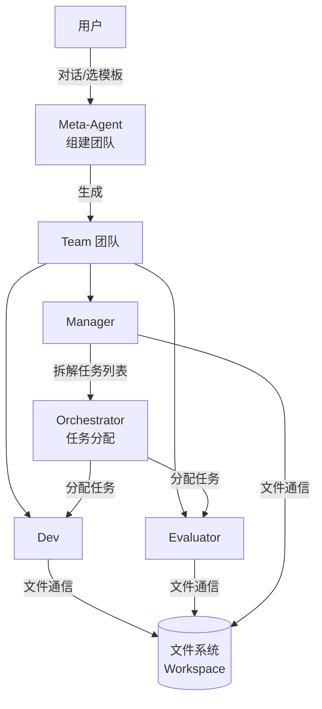
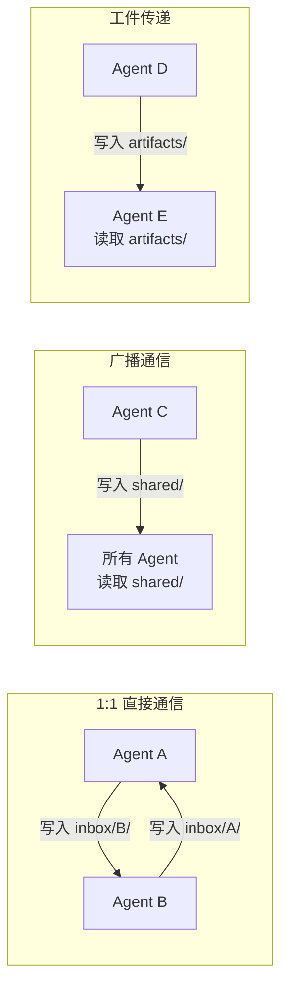
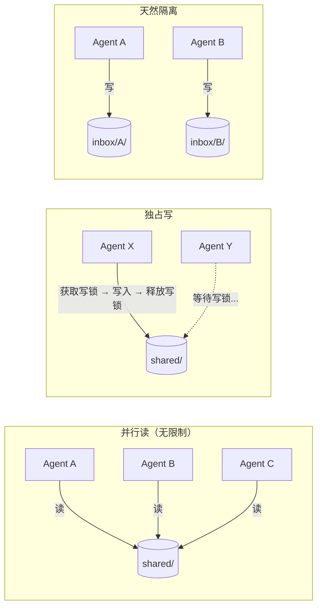
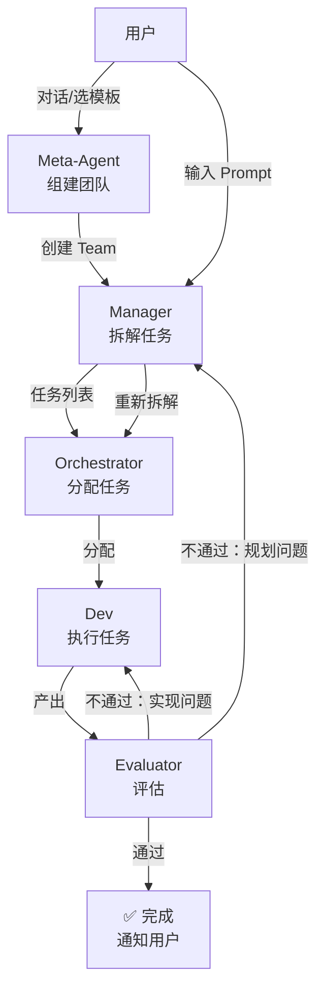
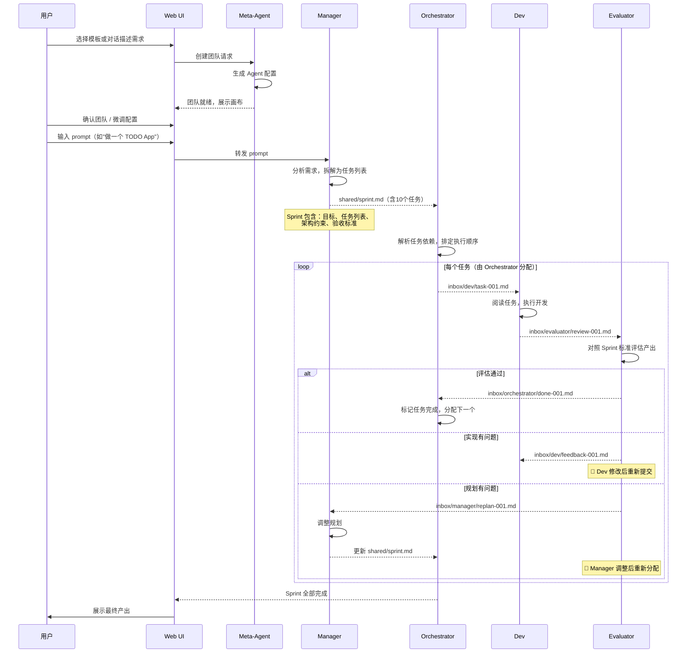
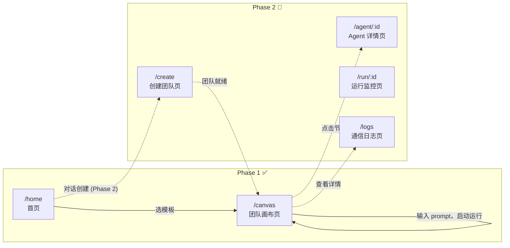
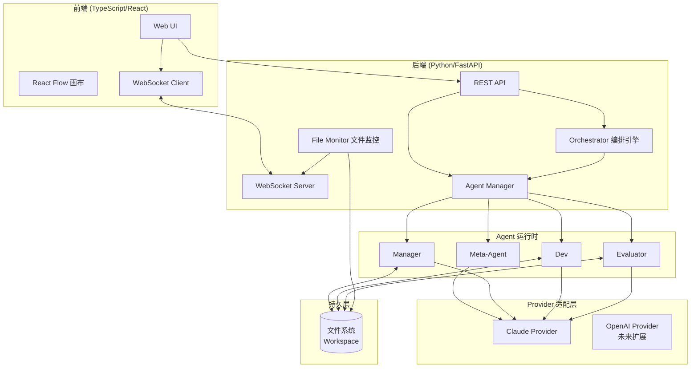
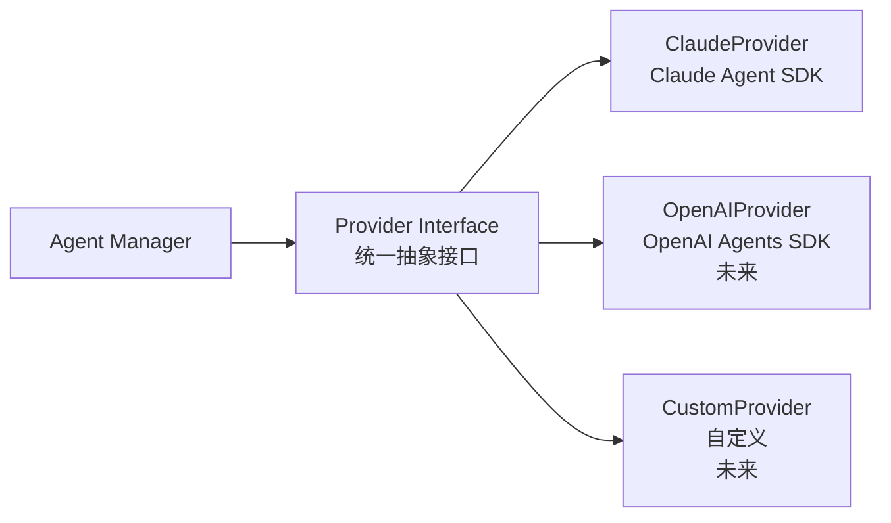
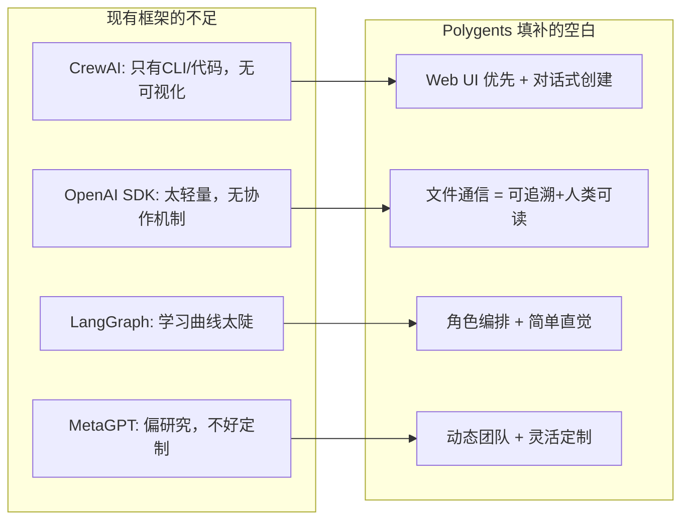
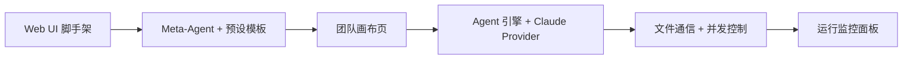

# Polygents - 多智能体协作框架设计文档

> **版本**: v0.1 (草案)
> **日期**: 2026-03-30
> **状态**: 讨论中

---

## 1. 项目愿景

Polygents 是一个**角色编排式多智能体协作框架**，核心理念是"给 AI 一个组织架构"——像一家公司一样，不同 Agent 拥有不同角色、职责和技能，通过文件系统协作完成复杂任务。

### 1.1 核心差异化

| 特性 | Polygents | CrewAI | OpenAI Agents SDK |
|------|-----------|--------|-------------------|
| 通信机制 | **文件系统（Markdown）** | 内存传递 | 函数调用 |
| 团队创建 | **对话式动态生成 + 预设模板** | YAML 静态配置 | 代码定义 |
| 用户界面 | **Web UI 优先（拖拽+对话）** | CLI/代码 | 代码 |
| 后端模型 | 先 Claude，可扩展 | 模型无关 | 偏 OpenAI |
| 通信可追溯 | 天然支持（文件即记录） | 需额外配置 | 不支持 |

### 1.2 目标用户与场景

- **软件开发团队**: 架构师 + 开发者 + 测试员 + Code Reviewer 协作
- **研究分析团队**: 研究员 + 数据分析师 + 报告撰写者 协作
- **通用任务编排**: 任何需要多角色协作的复杂任务

---

## 2. 核心概念

### 2.0 概念总览

系统由四个层级的角色协作，各司其职：



**关键分工：**

| 角色 | 职责边界 | 什么时候介入 |
|------|----------|------------|
| **Meta-Agent** | 组建团队（创建 Agent 实例和配置） | 启动阶段，团队建好后退出 |
| **Manager** | 理解需求，拆解为任务列表 | 收到用户 prompt 后 |
| **Orchestrator** | 把任务列表分配给具体 Agent，调度执行 | Manager 拆完任务后 |
| **Dev** | 执行具体任务，产出代码/文档 | 被 Orchestrator 分配任务后 |
| **Evaluator** | 评估产出质量，通过或打回 | Dev 完成任务后 |

### 2.1 Agent（智能体）

Agent 是系统中的基本工作单元。

**MVP 必需属性：**

| 属性 | 说明 | 示例 |
|------|------|------|
| **role** | 角色名称 | "高级后端工程师" |
| **system_prompt** | 系统提示词 | "你是高级开发工程师..." |
| **tools** | 可用工具 | ["read_file", "write_file", "run_tests"] |
| **provider** | 后端模型 | claude |

**后续扩展属性（Phase 2+）：**

| 属性 | 说明 | 示例 |
|------|------|------|
| **goal** | 工作目标 | "设计并实现高质量的 API 接口" |
| **backstory** | 背景设定 | "10年经验的 Python 专家" |
| **skills** | 技能列表 | ["python", "api-design"] |
| **constraints** | 约束条件 | "所有代码必须有单元测试" |

### 2.2 Team（团队）

一组 Agent 的集合，由 Meta-Agent 创建：

- **成员列表**: 哪些 Agent 在团队中（MVP：Manager + Dev + Evaluator）
- **协作模式**: 顺序执行 / 并行执行 / 自由协作
- **共享上下文**: 团队级别的知识和目标（shared/ 目录）
- **工作空间**: 文件系统中的工作目录

### 2.3 Task（任务）

由 Manager 拆解、Orchestrator 分配的具体工作：

- **描述**: 任务内容
- **分配**: 由 Orchestrator 指定执行者
- **依赖**: 前置任务
- **产出**: 期望的输出（文件/代码/报告）
- **状态**: pending → in_progress → review → completed / rejected

### 2.4 Orchestrator（编排引擎）

Orchestrator 是**系统内部组件**（不是 Agent），负责：

- 接收 Manager 拆解好的任务列表
- 根据角色将任务分配给对应 Agent
- 管理执行顺序和依赖关系
- 监控进度，处理超时和重试
- 协调闭环（Evaluator 打回 → 重新分配）

### 2.5 Meta-Agent（元代理）— Phase 2

> **注意**: Meta-Agent 在 MVP 中未实现。当前 MVP 使用预设模板（YAML）直接创建团队。

一个特殊的 Agent，**只在启动阶段工作**，负责"建团队"：

- 通过对话理解用户需求，规划团队角色组成
- 也可从预设模板快速创建
- 生成 Agent 配置（YAML），实例化团队
- 团队建好后退出，后续工作交给 Orchestrator

---

## 3. 文件通信机制

这是 Polygents 最核心的设计特色——**Agent 间通过文件系统中的 Markdown 文件通信**。

### 3.1 工作空间目录结构

```
workspace/
├── .polygents/               # 系统配置
│   ├── team.yaml             # 团队配置
│   └── agents/               # Agent 配置文件
│       ├── manager.yaml
│       ├── dev.yaml
│       └── evaluator.yaml
├── inbox/                    # 收件箱（Agent 间直接通信）
│   ├── manager/
│   │   └── 001-replan-request.md
│   ├── dev/
│   │   └── 001-task-assignment.md
│   └── evaluator/
│       └── 001-review-request.md
├── shared/                   # 共享空间（团队级别）
│   ├── sprint.md             # Manager 生成的任务规划
│   ├── context.md            # 项目上下文
│   └── decisions.md          # 决策记录
├── artifacts/                # 工件产出
│   ├── code/                 # 代码产出
│   ├── docs/                 # 文档产出
│   └── reports/              # 报告产出
└── logs/                     # 通信日志（自动生成）
    └── 2026-03-30.md         # 按日期归档的通信记录
```

### 3.2 通信消息格式

每条消息是一个 Markdown 文件，带有 YAML frontmatter：

```markdown
---
id: msg-001
from: manager
to: dev
type: task_assignment    # task_assignment | question | review_request | reply | broadcast
priority: high
timestamp: 2026-03-30T10:23:00
related_to: null
---

## 任务：实现用户认证 API

### 需求
- POST /api/auth/login 接口
- JWT token 方式认证
- 支持刷新 token

### 约束
- 使用 FastAPI
- 密码需 bcrypt 加密

### 期望产出
- `artifacts/code/auth.py`
- `artifacts/code/test_auth.py`
```

### 3.3 通信模式



### 3.4 文件并发读写机制

多 Agent 并行执行时，需要避免文件读写冲突：



**规则：**

| 目录 | 读权限 | 写权限 | 说明 |
|------|--------|--------|------|
| `inbox/{自己}/` | 本人 | 其他 Agent | 别人给我发消息，我来读 |
| `inbox/{别人}/` | 无 | 本人 | 我给别人发消息 |
| `shared/` | 所有 Agent | **独占写**（同时只允许一个 Agent 写） | 写时获取锁，其他 Agent 可继续读或做别的事 |
| `artifacts/{自己}/` | 所有 Agent | 本人 | 我的产出，别人只能看 |

**写锁机制（MVP 简单实现）：**
- 使用文件锁（如 `shared/.write_lock`）
- Agent 写 shared/ 前先获取锁，写完释放
- 获取不到锁时，Agent 继续做其他不需要写 shared/ 的工作
- 超时自动释放（防止死锁）

### 3.5 文件通信的优势

1. **可追溯**: 所有通信自动留痕，支持 git 版本控制
2. **人类可读**: 用户随时可以阅读和编辑任何通信内容
3. **容错恢复**: Agent 崩溃后可从文件恢复状态
4. **异步友好**: 天然支持异步协作，无需实时连接
5. **可审计**: 所有决策过程透明可查

---

## 4. 核心角色与执行闭环

Polygents MVP 内置三个固定角色：**Manager / Dev / Evaluator**，形成"计划-执行-评估"自动闭环。

### 4.1 三角色定义

| 角色 | 职责 | 输入 | 输出 |
|------|------|------|------|
| **Manager** | 理解用户需求，拆解为 Sprint（high-level 规划） | 用户 prompt | `shared/sprint.md`（任务列表+架构规划） |
| **Dev** | 根据 Sprint 规划，逐个执行具体任务 | Sprint 规划 | `artifacts/` 下的代码/文档等产出 |
| **Evaluator** | 评估 Dev 的产出是否符合要求 | Dev 产出 + Sprint 标准 | `inbox/manager/` 或 `inbox/dev/` 评估报告 |

### 4.2 执行闭环流程



**关键规则：**
- Evaluator 不通过时自动重试，不需要用户介入
- 反馈给谁取决于问题类型：实现质量问题 → 回 Dev，需求理解/拆解问题 → 回 Manager
- 设置最大重试次数（默认 3 轮），超过后暂停并通知用户

### 4.3 完整执行时序



### 4.4 角色配置示例

```yaml
roles:
  manager:
    system_prompt: |
      你是项目经理。根据用户需求，生成清晰的 Sprint 规划。
      规划应包含：项目目标、任务拆解（编号）、架构建议、验收标准。
      输出到 shared/sprint.md。
    tools: ["read_file", "write_file"]
    provider: claude

  dev:
    system_prompt: |
      你是高级开发工程师。阅读 Sprint 规划，逐个完成分配的任务。
      写出高质量、可运行的代码。产出放到 artifacts/ 目录下。
      完成后通知 Evaluator 审查。
    tools: ["read_file", "write_file", "run_command", "run_tests"]
    provider: claude

  evaluator:
    system_prompt: |
      你是严格的质量评审员。对照 Sprint 中的验收标准，评估 Dev 的产出。
      评估维度：功能完整性、代码质量、是否满足需求。
      通过则标记完成，不通过则写明具体问题和修改建议，
      发回给 Dev（实现问题）或 Manager（规划问题）。
    tools: ["read_file", "write_file", "run_tests"]
    provider: claude

execution:
  max_retries: 3          # 单任务最大重试轮数
  mode: sequential        # sequential（MVP） | parallel（后续）
  notify_on_complete: true
```

### 4.5 Sprint 文件示例

Manager 生成的 `shared/sprint.md`：

```markdown
# Sprint: TODO App

## 目标
构建一个支持增删改查的命令行 TODO 应用

## 任务列表
1. [ ] 设计数据模型（Task 类，JSON 持久化）
2. [ ] 实现核心 CRUD 逻辑
3. [ ] 实现 CLI 交互界面
4. [ ] 编写单元测试

## 架构约束
- Python 3.10+
- 使用 JSON 文件存储，不引入数据库
- 使用 click 库做 CLI

## 验收标准
- 所有 CRUD 操作正常工作
- 测试覆盖率 > 80%
- 代码有合理的错误处理
```

### 4.6 后续扩展：自定义角色（Phase 3）

MVP 的 Meta-Agent 支持对话式组建三角色团队和预设模板。Phase 3 将扩展为：
- 支持自定义角色（不限于 Manager/Dev/Evaluator 三种）
- 用户可在 Web UI 上拖拽添加新角色类型
- 角色模板市场（社区共享）

---

## 5. Web UI 设计

### 5.1 技术选型

| 层级 | 技术 | 说明 |
|------|------|------|
| 前端框架 | React + TypeScript | 组件化，类型安全 |
| 画布引擎 | React Flow | 拖拽式节点编排 |
| UI 组件库 | 待定（shadcn/ui 或 Ant Design） | 美观实用 |
| 状态管理 | Zustand | 轻量灵活 |
| 通信协议 | WebSocket | 实时 Agent 活动推送 |
| 后端框架 | FastAPI (Python) | 与核心引擎同语言 |

### 5.2 页面结构

> **MVP (Phase 1) 已实现**: `/home`（首页模板选择）、`/canvas`（画布 + 运行）
> **Phase 2 待实现**: `/create`（对话式创建）、`/agent/:id`、`/run/:id`、`/logs`



### 5.3 各页面功能

#### 首页 (`/home`)

项目入口，提供两种创建团队的方式。

- **快速开始**: 预设模板卡片（开发团队 / 研究团队 / 内容团队），一键创建
- **自定义创建**: 和 Meta-Agent 对话，描述需求，动态生成团队
- **历史项目**: 最近的运行记录

#### 创建团队页 (`/create`) — Phase 2

> **当前状态**: 占位页面，未实现。MVP 通过首页模板卡片直接进入画布。

根据入口不同展示不同 UI：

- **模板模式**: 展示模板详情，预览角色配置，确认创建
- **对话模式**: 左侧聊天面板（和 Meta-Agent 对话），右侧实时预览团队配置
- 底部：确认按钮，跳转到画布

#### 团队画布页 (`/canvas`)

拖拽式可视化编排界面 + 运行入口。

- **Agent 卡片**: 显示角色、状态、当前任务
- **连线**: Agent 间的通信关系和数据流（Manager→Orchestrator→Dev→Evaluator）
- **工具栏**: 添加 Agent、保存配置
- **属性面板**: 点击卡片后展开，编辑 Agent 配置
- **Prompt 输入框**: 输入任务描述，启动运行

#### Agent 详情页 (`/agent/:id`) — Phase 2

> **当前状态**: 未实现。MVP 通过画布上的 AgentPanel 侧边栏查看 Agent 信息。

单个 Agent 的全部配置和状态。

- 基本信息（角色、目标、背景）
- System Prompt 编辑器
- 工具和权限配置
- 历史通信记录
- 当前任务和产出

#### 运行监控页 (`/run/:id`) — Phase 2

> **当前状态**: 未实现。MVP 的运行监控集成在画布页的 ActivityFeed 侧边栏中。

实时观察团队工作过程。

- **活动流**: 所有 Agent 的实时动作流（谁在做什么）
- **文件变动**: 实时展示通信文件的创建和更新
- **任务看板**: Kanban 式的任务进度追踪
- **干预面板**: 人类可以暂停、指导、修改任何 Agent

#### 通信日志页 (`/logs`) — Phase 2

> **当前状态**: 未实现。

所有文件通信的时间线视图。

- 时间线展示（谁给谁发了什么）
- Markdown 渲染预览
- 筛选和搜索
- 导出功能

---

## 6. 系统架构

### 6.1 整体分层



### 6.2 核心模块职责

| 模块 | 语言 | 职责 |
|------|------|------|
| **Web UI** | TypeScript | 用户交互入口：首页、创建团队、画布、监控、日志 |
| **REST API** | Python | 团队 CRUD、Agent 管理、运行控制 |
| **WebSocket Server** | Python | 实时推送 Agent 活动和文件变动 |
| **Orchestrator** | Python | 接收 Manager 的任务列表，分配给 Agent，管理闭环 |
| **Agent Manager** | Python | Agent 生命周期管理（创建/启动/停止） |
| **File Monitor** | Python | 监控 workspace 文件变化，触发事件通知前端 |
| **Provider 适配层** | Python | 统一接口对接不同 LLM SDK |

### 6.3 Provider 适配层设计



Provider Interface 需要实现的核心方法：
- `send_message(prompt, context) → response` — 发送消息并获取回复
- `stream_message(prompt, context) → AsyncIterator` — 流式响应
- `execute_tool(tool_name, args) → result` — 执行工具调用

先实现 `ClaudeProvider`（基于 Claude Agent SDK），接口设计时预留扩展性。

---

## 7. 竞品参考与学习

### 7.1 值得学习的开源项目

| 项目 | 学什么 | GitHub |
|------|--------|--------|
| **CrewAI** | 角色定义、任务分配、YAML 配置 | [crewAIInc/crewAI](https://github.com/crewAIInc/crewAI) |
| **OpenAI Agents SDK** | Handoff 模式、轻量 API 设计、Guardrails | [openai/openai-agents-python](https://github.com/openai/openai-agents-python) |
| **LangGraph** | 有状态图编排、Human-in-loop | [langchain-ai/langgraph](https://github.com/langchain-ai/langgraph) |
| **Claude Agent SDK** | Claude 集成、工具调用、MCP | [anthropics/claude-code](https://github.com/anthropics/claude-code) |
| **smolagents** | 极简设计、代码优先 | [huggingface/smolagents](https://github.com/huggingface/smolagents) |
| **MetaGPT** | 软件公司多角色模拟 | [geekan/MetaGPT](https://github.com/geekan/MetaGPT) |
| **React Flow** | 拖拽画布 UI 实现 | [xyflow/xyflow](https://github.com/xyflow/xyflow) |

### 7.2 Polygents 的差异化定位



---

## 8. 开发路线图

### Phase 1: MVP — UX 驱动，跑通全链路

> 目标：用户打开 Web UI → 对话/选模板创建团队 → 画布编辑 → 输入 prompt → 看到 Manager/Dev/Evaluator 闭环协作 → 查看产出



**前端（TypeScript/React）：**
- [ ] 项目脚手架（Vite + React + TypeScript）
- [ ] 首页：预设模板卡片 + 对话式创建入口
- [ ] 创建团队页：模板模式 / 对话模式（Meta-Agent）
- [ ] 团队画布页：React Flow 展示 Agent 卡片和通信连线
- [ ] Agent 配置面板：点击卡片可编辑角色、prompt、工具
- [ ] Prompt 输入框：在画布页输入任务描述，启动运行
- [ ] 运行监控面板：实时展示 Agent 活动流和文件通信

**后端（Python/FastAPI）：**
- [ ] FastAPI 服务 + WebSocket 端点
- [ ] Meta-Agent：对话式创建团队 + 预设模板快速创建
- [ ] Agent 定义与生命周期管理
- [ ] ClaudeProvider 适配层（Claude Agent SDK）
- [ ] 文件通信机制（inbox / shared / artifacts + 写锁）
- [ ] File Monitor：监控 workspace 文件变化，通过 WebSocket 推送到前端
- [ ] Orchestrator：接收 Manager 任务列表，分配执行，管理闭环重试

**MVP 内置角色：**

| 角色 | 职责 | 通信方向 |
|------|------|----------|
| `Meta-Agent` | 组建团队（启动阶段，建完退出） | → 创建 Team |
| `Manager` | 接收用户 prompt，拆解 Sprint 任务列表 | → Orchestrator |
| `Dev` | 根据规划执行开发，产出代码/文档 | ← Orchestrator, → Evaluator |
| `Evaluator` | 评估产出质量，通过或打回 | ← Dev, → Orchestrator/Dev/Manager |

**预设团队模板（MVP 内置）：**

| 模板 | 角色组成 | 场景 |
|------|----------|------|
| `dev-team` | Manager + Dev + Evaluator | 软件开发 |
| `research-team` | Manager + Researcher + Evaluator | 调研分析 |
| `content-team` | Manager + Writer + Evaluator | 内容创作 |

### Phase 2: 交互增强

- [ ] Agent 详情页（完整配置 + 历史通信）
- [ ] 通信日志页（时间线 + Markdown 渲染）
- [ ] 在画布上拖拽添加/删除 Agent，自定义团队
- [ ] 并行执行模式
- [ ] Human-in-the-loop：暂停、干预、修改 Agent 行为
- [ ] 任务看板视图（Kanban 风格）

### Phase 3: 自定义角色扩展

- [ ] Meta-Agent 支持对话式生成自定义角色（不限三角色）
- [ ] 支持在画布上拖拽添加自定义角色类型
- [ ] 自由协作模式（Agent 自主决定通信对象）
- [ ] 角色配置导入导出

### Phase 4: 生态扩展

- [ ] OpenAI Provider 适配
- [ ] 自定义 Provider 接口（让用户接入任意 LLM）
- [ ] 更多工具支持（MCP 集成）
- [ ] 持久化与历史管理（项目级别的会话记录）
- [ ] 团队模板市场（社区共享模板）

---

## 附录：术语表

| 术语 | 含义 |
|------|------|
| Agent | 具有角色和技能的 AI 智能体实例 |
| Team | 一组协作 Agent 的集合 |
| Task | 分配给 Agent 的具体工作单元 |
| Orchestrator | 编排引擎，负责任务调度 |
| Meta-Agent | 特殊 Agent，负责动态生成团队 |
| Workspace | 文件系统中的工作目录 |
| Inbox | Agent 的收件箱目录 |
| Provider | LLM 后端适配器 |
| Artifact | Agent 产出的工件（代码/文档/报告） |
