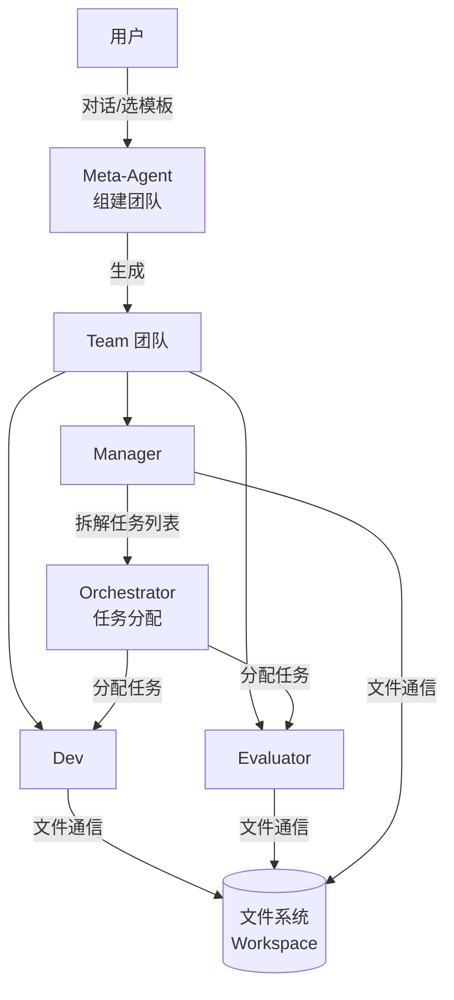
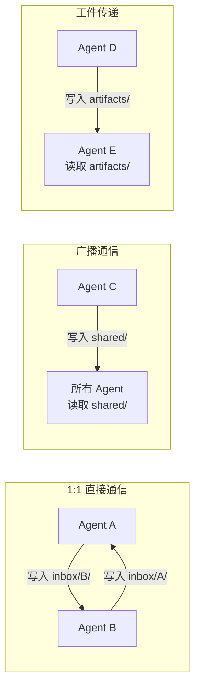
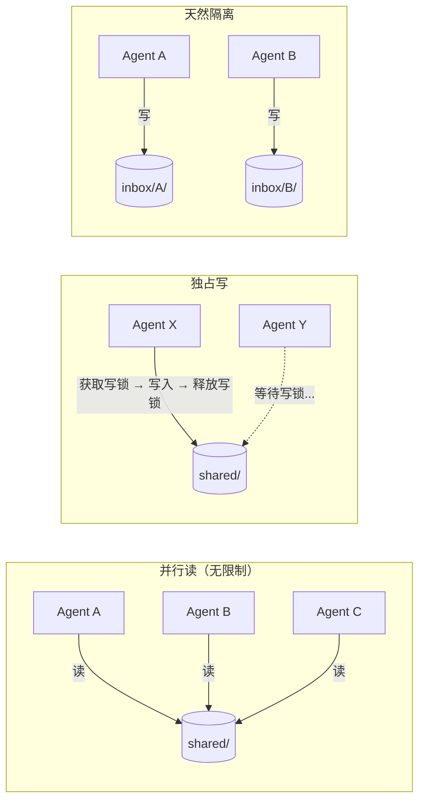
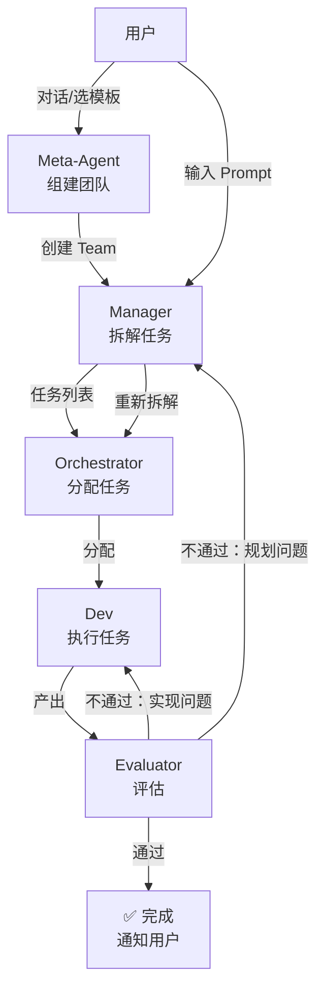
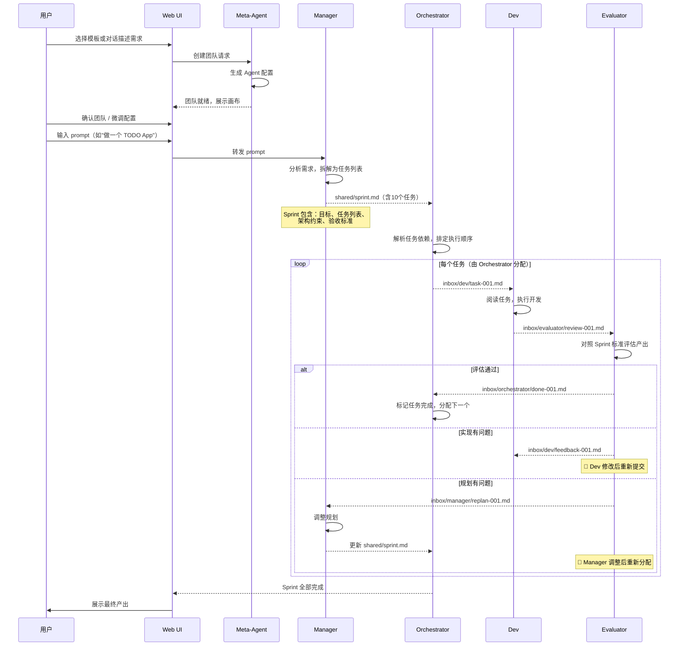
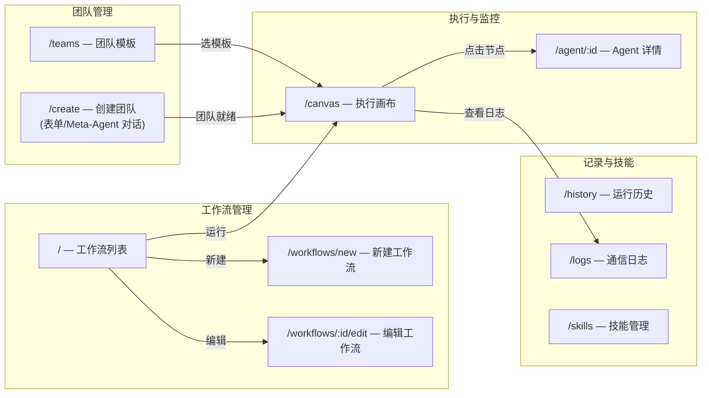
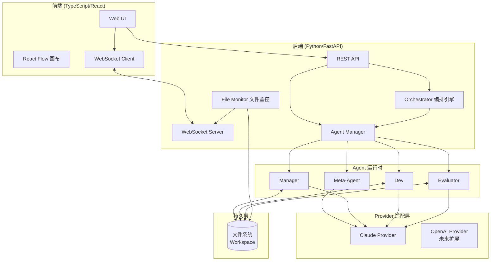
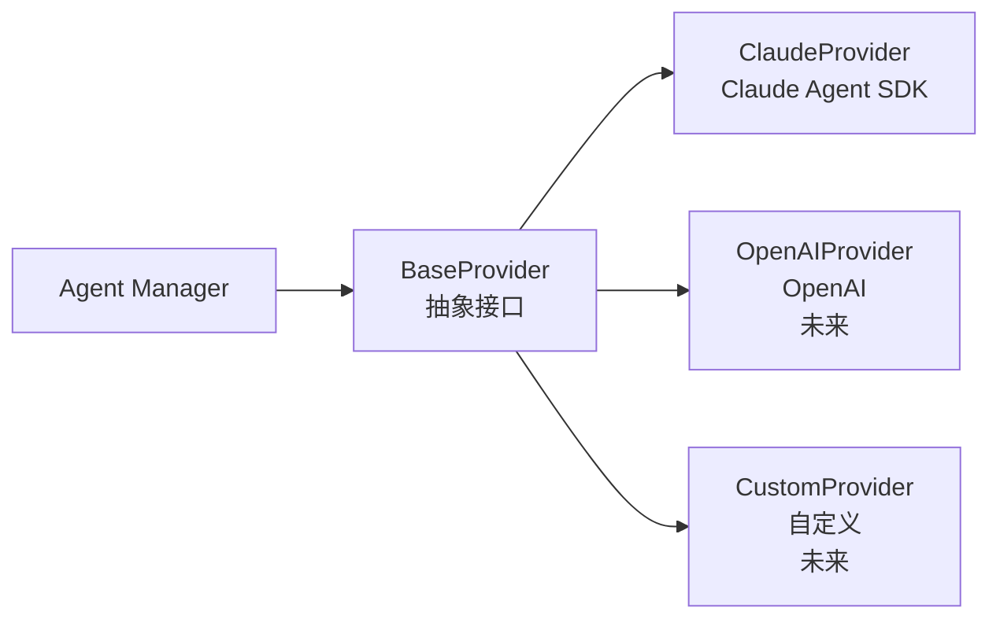
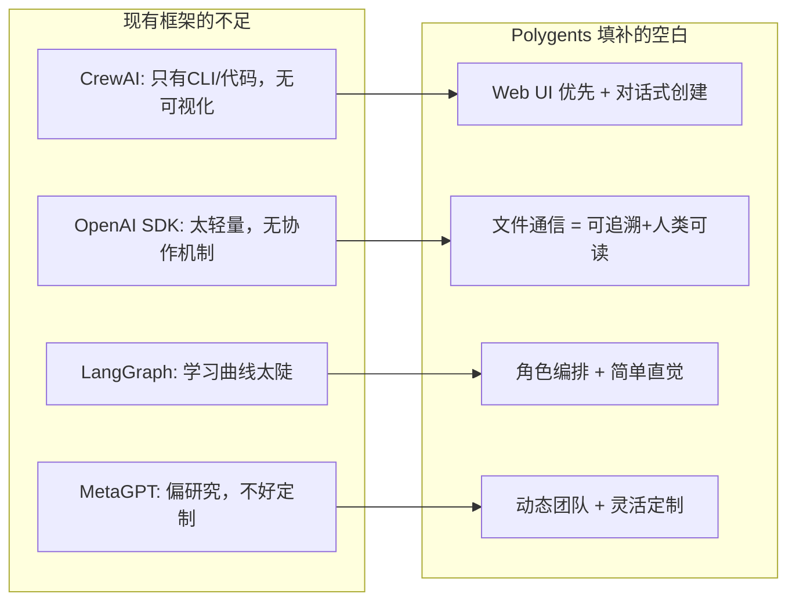
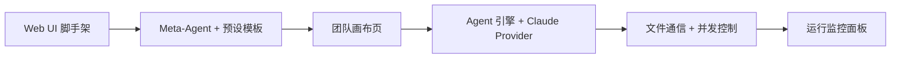

# Polygents - 多智能体协作框架设计文档

> **版本**: v0.2
> **日期**: 2026-04-05
> **状态**: Phase 1 & 2 已实现

---

## 1. 项目愿景

Polygents 是一个**角色编排式多智能体协作框架**，核心理念是"给 AI 一个组织架构"——像一家公司一样，不同 Agent 拥有不同角色、职责和技能，通过文件系统协作完成复杂任务。

### 1.1 核心差异化

| 特性 | Polygents | CrewAI | OpenAI Agents SDK |
|------|-----------|--------|-------------------|
| 通信机制 | **文件系统（Markdown）** | 内存传递 | 函数调用 |
| 团队创建 | **对话式动态生成 + 预设模板** | YAML 静态配置 | 代码定义 |
| 用户界面 | **Web UI 优先（拖拽+对话）** | CLI/代码 | 代码 |
| 后端模型 | 先 Claude，可扩展 | 模型无关 | 偏 OpenAI |
| 通信可追溯 | 天然支持（文件即记录） | 需额外配置 | 不支持 |

### 1.2 目标用户与场景

- **软件开发团队**: 架构师 + 开发者 + 测试员 + Code Reviewer 协作
- **研究分析团队**: 研究员 + 数据分析师 + 报告撰写者 协作
- **通用任务编排**: 任何需要多角色协作的复杂任务

---

## 2. 核心概念

### 2.0 概念总览

系统由四个层级的角色协作，各司其职：



**关键分工：**

| 角色 | 职责边界 | 什么时候介入 |
|------|----------|------------|
| **Meta-Agent** | 组建团队（创建 Agent 实例和配置） | 启动阶段，团队建好后退出 |
| **Manager** | 理解需求，拆解为任务列表 | 收到用户 prompt 后 |
| **Orchestrator** | 把任务列表分配给具体 Agent，调度执行 | Manager 拆完任务后 |
| **Dev** | 执行具体任务，产出代码/文档 | 被 Orchestrator 分配任务后 |
| **Evaluator** | 评估产出质量，通过或打回 | Dev 完成任务后 |

### 2.1 Agent（智能体）

Agent 是系统中的基本工作单元。

**属性：**

| 属性 | 说明 | 示例 |
|------|------|------|
| **id** | 唯一标识 | "dev" |
| **role** | 角色名称 | "高级后端工程师" |
| **role_type** | 角色类型 | "planner" / "executor" / "reviewer" |
| **system_prompt** | 系统提示词 | "你是高级开发工程师..." |
| **tools** | 可用的 Claude Code 工具 | ["Read", "Write", "Edit", "Bash", "Glob", "Grep"] |
| **skills** | 加载的 Skill 文件 | ["tdd", "code-review"] |
| **plugins** | 加载的 Claude Code 插件 | ["playwright"] |
| **model** | 使用的模型 | "claude-sonnet-4-6" / "claude-opus-4-6" |
| **provider** | 后端模型 | "claude" |

### 2.2 Team（团队）

一组 Agent 的集合，由 Meta-Agent 创建：

- **成员列表**: 哪些 Agent 在团队中（MVP：Manager + Dev + Evaluator）
- **协作模式**: 顺序执行 / 并行执行 / 自由协作
- **共享上下文**: 团队级别的知识和目标（shared/ 目录）
- **工作空间**: 文件系统中的工作目录

### 2.3 Task（任务）

由 Manager 拆解、Orchestrator 分配的具体工作：

- **描述**: 任务内容
- **分配**: 由 Orchestrator 指定执行者
- **依赖**: 前置任务
- **产出**: 期望的输出（文件/代码/报告）
- **状态**: pending → in_progress → review → completed / rejected

### 2.4 Orchestrator（编排引擎）

Orchestrator 是**系统内部组件**（不是 Agent），负责：

- 接收 Manager 拆解好的任务列表
- 根据角色将任务分配给对应 Agent
- 管理执行顺序和依赖关系
- 监控进度，处理超时和重试
- 协调闭环（Evaluator 打回 → 重新分配）

### 2.5 Meta-Agent（元代理）

通过 SSE 流式对话引导用户描述需求，自动生成团队模板：

- 通过对话理解用户需求，规划团队角色组成
- 也可从预设模板快速创建
- 自动创建 YAML 模板文件并实例化团队
- 团队建好后退出，后续工作交给 Orchestrator
- **API**: `POST /api/meta-agent/chat`（SSE 流式）、`POST /api/meta-agent/finalize`（手动回退）

---

## 3. 文件通信机制

这是 Polygents 最核心的设计特色——**Agent 间通过文件系统中的 Markdown 文件通信**。

### 3.1 工作空间目录结构

```
workspace/
├── .polygents/               # 系统配置
│   ├── team.yaml             # 团队配置
│   └── agents/               # Agent 配置文件
│       ├── manager.yaml
│       ├── dev.yaml
│       └── evaluator.yaml
├── inbox/                    # 收件箱（Agent 间直接通信）
│   ├── manager/
│   │   └── 001-replan-request.md
│   ├── dev/
│   │   └── 001-task-assignment.md
│   └── evaluator/
│       └── 001-review-request.md
├── shared/                   # 共享空间（团队级别）
│   ├── sprint.md             # Manager 生成的任务规划
│   ├── context.md            # 项目上下文
│   └── decisions.md          # 决策记录
├── artifacts/                # 工件产出
│   ├── code/                 # 代码产出
│   ├── docs/                 # 文档产出
│   └── reports/              # 报告产出
└── logs/                     # 通信日志（自动生成）
    └── 2026-03-30.md         # 按日期归档的通信记录
```

### 3.2 通信消息格式

每条消息是一个 Markdown 文件，带有 YAML frontmatter：

```markdown
---
id: msg-001
from: manager
to: dev
type: task_assignment    # task_assignment | question | review_request | reply | broadcast
priority: high
timestamp: 2026-03-30T10:23:00
related_to: null
---

## 任务：实现用户认证 API

### 需求
- POST /api/auth/login 接口
- JWT token 方式认证
- 支持刷新 token

### 约束
- 使用 FastAPI
- 密码需 bcrypt 加密

### 期望产出
- `artifacts/code/auth.py`
- `artifacts/code/test_auth.py`
```

### 3.3 通信模式



### 3.4 文件并发读写机制

多 Agent 并行执行时，需要避免文件读写冲突：



**规则：**

| 目录 | 读权限 | 写权限 | 说明 |
|------|--------|--------|------|
| `inbox/{自己}/` | 本人 | 其他 Agent | 别人给我发消息，我来读 |
| `inbox/{别人}/` | 无 | 本人 | 我给别人发消息 |
| `shared/` | 所有 Agent | **独占写**（同时只允许一个 Agent 写） | 写时获取锁，其他 Agent 可继续读或做别的事 |
| `artifacts/{自己}/` | 所有 Agent | 本人 | 我的产出，别人只能看 |

**写锁机制（MVP 简单实现）：**
- 使用文件锁（如 `shared/.write_lock`）
- Agent 写 shared/ 前先获取锁，写完释放
- 获取不到锁时，Agent 继续做其他不需要写 shared/ 的工作
- 超时自动释放（防止死锁）

### 3.5 文件通信的优势

1. **可追溯**: 所有通信自动留痕，支持 git 版本控制
2. **人类可读**: 用户随时可以阅读和编辑任何通信内容
3. **容错恢复**: Agent 崩溃后可从文件恢复状态
4. **异步友好**: 天然支持异步协作，无需实时连接
5. **可审计**: 所有决策过程透明可查

---

## 4. 核心角色与执行闭环

Polygents MVP 内置三个固定角色：**Manager / Dev / Evaluator**，形成"计划-执行-评估"自动闭环。

### 4.1 三角色定义

| 角色 | 职责 | 输入 | 输出 |
|------|------|------|------|
| **Manager** | 理解用户需求，拆解为 Sprint（high-level 规划） | 用户 prompt | `shared/sprint.md`（任务列表+架构规划） |
| **Dev** | 根据 Sprint 规划，逐个执行具体任务 | Sprint 规划 | `artifacts/` 下的代码/文档等产出 |
| **Evaluator** | 评估 Dev 的产出是否符合要求 | Dev 产出 + Sprint 标准 | `inbox/manager/` 或 `inbox/dev/` 评估报告 |

### 4.2 执行闭环流程



**关键规则：**
- Evaluator 不通过时自动重试，不需要用户介入
- 反馈给谁取决于问题类型：实现质量问题 → 回 Dev，需求理解/拆解问题 → 回 Manager
- 设置最大重试次数（默认 3 轮），超过后暂停并通知用户

### 4.3 完整执行时序



### 4.4 角色配置示例

```yaml
roles:
  manager:
    role_type: planner
    system_prompt: |
      你是项目经理。根据用户需求，生成清晰的 Sprint 规划。
      规划应包含：项目目标、任务拆解（编号）、架构建议、验收标准。
      输出到 shared/sprint.md。
    tools: ["Read", "Write", "Glob", "Grep"]
    model: claude-sonnet-4-6

  dev:
    role_type: executor
    system_prompt: |
      你是高级开发工程师。阅读 Sprint 规划，逐个完成分配的任务。
      写出高质量、可运行的代码。产出放到 artifacts/ 目录下。
      完成后通知 Evaluator 审查。
    tools: ["Read", "Write", "Edit", "Bash", "Glob", "Grep"]
    model: claude-sonnet-4-6

  evaluator:
    role_type: reviewer
    system_prompt: |
      你是严格的质量评审员。对照 Sprint 中的验收标准，评估 Dev 的产出。
      评估维度：功能完整性、代码质量、是否满足需求。
      通过则标记完成，不通过则写明具体问题和修改建议，
      发回给 Dev（实现问题）或 Manager（规划问题）。
    tools: ["Read", "Write", "Bash", "Glob", "Grep"]
    model: claude-sonnet-4-6

execution:
  max_retries: 3
  mode: sequential        # sequential | parallel | free
  notify_on_complete: true
```

### 4.5 Sprint 文件示例

Manager 生成的 `shared/sprint.md`：

```markdown
# Sprint: TODO App

## 目标
构建一个支持增删改查的命令行 TODO 应用

## 任务列表
1. [ ] 设计数据模型（Task 类，JSON 持久化）
2. [ ] 实现核心 CRUD 逻辑
3. [ ] 实现 CLI 交互界面
4. [ ] 编写单元测试

## 架构约束
- Python 3.10+
- 使用 JSON 文件存储，不引入数据库
- 使用 click 库做 CLI

## 验收标准
- 所有 CRUD 操作正常工作
- 测试覆盖率 > 80%
- 代码有合理的错误处理
```

### 4.6 后续扩展：自定义角色

当前已支持通过 Meta-Agent 对话或 Web UI 手动创建自定义角色，不限于 Manager/Dev/Evaluator。后续扩展方向：
- 角色模板市场（社区共享）
- 更多 Provider 适配（OpenAI 等）

---

## 5. Web UI 设计

### 5.1 技术选型

| 层级 | 技术 | 说明 |
|------|------|------|
| 前端框架 | React 19 + TypeScript | 组件化，类型安全 |
| 画布引擎 | React Flow (@xyflow/react) | 拖拽式节点编排 |
| UI 样式 | 纯 CSS 自定义 | 暗色主题，无第三方组件库 |
| 状态管理 | Zustand | 轻量灵活 |
| 路由 | React Router v7 | 客户端路由 |
| 通信协议 | WebSocket | 实时 Agent 活动推送 |
| 构建工具 | Vite 8 | 快速开发和构建 |
| 后端框架 | FastAPI (Python) | 与核心引擎同语言 |
| E2E 测试 | Playwright | 浏览器自动化测试 |

### 5.2 页面结构



### 5.3 各页面功能

#### 工作流列表页 (`/`)

项目入口，展示所有已保存的工作流。

- **工作流卡片**: 显示名称、描述、类型(single/team)、上次运行状态
- **一键操作**: 运行、编辑、删除
- **新建工作流**: 跳转到创建页面
- **空状态引导**: 无工作流时提示创建

#### 工作流编辑页 (`/workflows/new`, `/workflows/:id/edit`)

创建或编辑工作流配置。

- **基本信息**: 名称、描述
- **类型选择**: 单 Agent (`single`) 或团队 (`team`)
- **单 Agent 模式**: 配置 Agent 的 system_prompt、tools、model
- **团队模式**: 选择关联的团队模板
- **预设 Prompt**: 默认任务描述
- **预设 Goal**: 默认验收目标

#### 团队模板页 (`/teams`)

管理团队模板。

- **模板列表**: 所有预设和自定义模板
- **模板操作**: 创建、编辑、删除
- **导入导出**: YAML 格式导入/导出
- **角色预览**: 展示模板中的角色组成

#### 创建团队页 (`/create`)

提供两种创建团队的方式：

- **表单模式**: 手动填写团队名称、描述、Agent 配置
- **对话模式**: 和 Meta-Agent SSE 流式对话，描述需求后自动生成团队
- 右侧实时预览团队配置

#### 团队画布页 (`/canvas`)

拖拽式可视化编排界面 + 运行监控。

- **Agent 卡片**: 显示角色、状态指示灯（thinking/completed）、当前任务
- **连线**: Agent 间的通信关系和数据流
- **侧边面板切换**: 活动流 / Agent 配置 / 工作空间文件 / 任务看板
- **运行控制**: 暂停/继续/干预面板
- **Prompt 输入框**: 输入任务描述，启动运行
- **进度指示**: 总任务数、已完成数、当前任务

#### Agent 详情页 (`/agent/:id`)

单个 Agent 的完整信息。

- 基本信息（角色、role_type、模型）
- System Prompt 查看
- 工具配置列表
- 历史通信记录（inbox 消息）
- 产出的 artifact 文件列表

#### 运行历史页 (`/history`)

所有运行记录列表。

- 运行 ID、关联模板、状态（running/completed/failed）
- 时间范围（开始/结束）
- 任务摘要

#### 通信日志页 (`/logs`)

文件通信的时间线视图。

- 按日期浏览日志
- 按发送者/接收者/消息类型筛选
- 日志条目：时间戳、发送方 → 接收方、类型标签、内容预览

#### 技能管理页 (`/skills`)

管理 Agent 可用的 Skill 文件。

- 列出项目级和用户级 Skill
- 创建/编辑/删除 Skill（Markdown + YAML frontmatter 格式）
- Skill 加载到 Agent 后，Agent 在执行时自动获得对应能力

---

## 6. 系统架构

### 6.1 整体分层



### 6.2 核心模块职责

| 模块 | 语言 | 职责 |
|------|------|------|
| **Web UI** | TypeScript | 用户交互入口：首页、创建团队、画布、监控、日志 |
| **REST API** | Python | 团队 CRUD、Agent 管理、运行控制 |
| **WebSocket Server** | Python | 实时推送 Agent 活动和文件变动 |
| **Orchestrator** | Python | 接收 Manager 的任务列表，分配给 Agent，管理闭环 |
| **Agent Manager** | Python | Agent 生命周期管理（创建/启动/停止） |
| **File Monitor** | Python | 监控 workspace 文件变化，触发事件通知前端 |
| **Provider 适配层** | Python | 统一接口对接不同 LLM SDK |

### 6.3 Provider 适配层设计



BaseProvider 需要实现的核心方法：
- `send_message(system_prompt, prompt, tools, cwd, model, max_turns, plugins, on_activity) → str` — 发送消息并获取完整回复
- `stream_message(system_prompt, prompt, tools, cwd, model, max_turns, plugins) → AsyncIterator[str]` — 流式响应

工具执行由 Agent SDK 内部处理（Claude Code CLI 子进程自主调用工具），Provider 层无需实现 `execute_tool`。

`on_activity` 回调用于实时汇报 Agent 思考过程（TextBlock / ThinkingBlock），通过 WebSocket 推送到前端 ActivityFeed。

---

## 7. 竞品参考与学习

### 7.1 值得学习的开源项目

| 项目 | 学什么 | GitHub |
|------|--------|--------|
| **CrewAI** | 角色定义、任务分配、YAML 配置 | [crewAIInc/crewAI](https://github.com/crewAIInc/crewAI) |
| **OpenAI Agents SDK** | Handoff 模式、轻量 API 设计、Guardrails | [openai/openai-agents-python](https://github.com/openai/openai-agents-python) |
| **LangGraph** | 有状态图编排、Human-in-loop | [langchain-ai/langgraph](https://github.com/langchain-ai/langgraph) |
| **Claude Agent SDK** | Claude 集成、工具调用、MCP | [anthropics/claude-code](https://github.com/anthropics/claude-code) |
| **smolagents** | 极简设计、代码优先 | [huggingface/smolagents](https://github.com/huggingface/smolagents) |
| **MetaGPT** | 软件公司多角色模拟 | [geekan/MetaGPT](https://github.com/geekan/MetaGPT) |
| **React Flow** | 拖拽画布 UI 实现 | [xyflow/xyflow](https://github.com/xyflow/xyflow) |

### 7.2 Polygents 的差异化定位



---

## 8. 开发路线图

### Phase 1: MVP — UX 驱动，跑通全链路 ✅

> 目标：用户打开 Web UI → 对话/选模板创建团队 → 画布编辑 → 输入 prompt → 看到 Manager/Dev/Evaluator 闭环协作 → 查看产出



**前端（TypeScript/React）：**
- [x] 项目脚手架（Vite + React + TypeScript）
- [x] 首页：预设模板卡片 + 对话式创建入口
- [x] 创建团队页：模板模式 / 对话模式（Meta-Agent）
- [x] 团队画布页：React Flow 展示 Agent 卡片和通信连线
- [x] Agent 配置面板：点击卡片可编辑角色、prompt、工具
- [x] Prompt 输入框：在画布页输入任务描述，启动运行
- [x] 运行监控面板：实时展示 Agent 活动流和文件通信

**后端（Python/FastAPI）：**
- [x] FastAPI 服务 + WebSocket 端点
- [x] Meta-Agent：对话式创建团队 + 预设模板快速创建
- [x] Agent 定义与生命周期管理
- [x] ClaudeProvider 适配层（Claude Agent SDK）
- [x] 文件通信机制（inbox / shared / artifacts + 日志）
- [x] File Monitor：监控 workspace 文件变化，通过 WebSocket 推送到前端
- [x] Orchestrator：接收 Manager 任务列表，分配执行，管理闭环重试

**MVP 内置角色：**

| 角色 | 职责 | 通信方向 |
|------|------|----------|
| `Meta-Agent` | 组建团队（启动阶段，建完退出） | → 创建 Team |
| `Manager` | 接收用户 prompt，拆解 Sprint 任务列表 | → Orchestrator |
| `Dev` | 根据规划执行开发，产出代码/文档 | ← Orchestrator, → Evaluator |
| `Evaluator` | 评估产出质量，通过或打回 | ← Dev, → Orchestrator/Dev/Manager |

**预设团队模板（MVP 内置）：**

| 模板 | 角色组成 | 场景 |
|------|----------|------|
| `dev-team` | Manager + Dev + Evaluator | 软件开发 |
| `research-team` | Manager + Researcher + Evaluator | 调研分析 |
| `content-team` | Manager + Writer + Evaluator | 内容创作 |

### Phase 2: 交互增强 ✅

- [x] Agent 详情页（完整配置 + 历史通信 + 产出文件）
- [x] 通信日志页（按日期浏览 + 按发送者/类型筛选）
- [x] 在画布上拖拽添加/删除 Agent，自定义团队
- [x] 并行执行模式（依赖解析 + 死锁检测）
- [x] Human-in-the-loop：暂停、干预、修改 Agent 行为
- [x] 任务看板视图（Kanban 风格）
- [x] 工作流管理（Workflow CRUD + 一键运行）
- [x] 运行历史记录
- [x] Skill 文件管理
- [x] Plugin 发现与加载
- [x] Agent 思考过程实时流式展示

### Phase 3: 生态扩展

- [ ] OpenAI Provider 适配
- [ ] 自定义 Provider 接口（让用户接入任意 LLM）
- [ ] 更多工具支持（MCP 集成扩展）
- [ ] 团队模板市场（社区共享模板）
- [ ] 角色模板市场（社区共享角色）

---

## 附录：术语表

| 术语 | 含义 |
|------|------|
| Agent | 具有角色和技能的 AI 智能体实例 |
| Team | 一组协作 Agent 的集合 |
| Task | 分配给 Agent 的具体工作单元 |
| Orchestrator | 编排引擎，负责任务调度 |
| Meta-Agent | 特殊 Agent，负责动态生成团队 |
| Workspace | 文件系统中的工作目录 |
| Inbox | Agent 的收件箱目录 |
| Provider | LLM 后端适配器 |
| Artifact | Agent 产出的工件（代码/文档/报告） |
