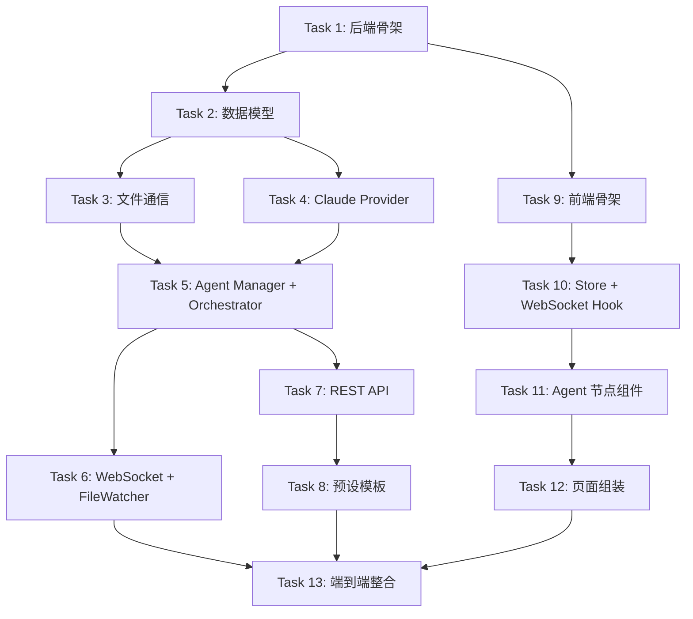

# Polygents Phase 1 MVP 实施计划

> **For Claude:** REQUIRED SUB-SKILL: Use superpowers:executing-plans to implement this plan task-by-task.

**Goal:** 跑通 Web UI → 创建团队 → 输入 prompt → Manager/Dev/Evaluator 闭环协作 → 实时监控的完整链路

**Architecture:** 后端 FastAPI (Python) 提供 REST API + WebSocket，核心引擎管理 Agent 生命周期和文件通信；前端 Vite + React + TypeScript + React Flow 提供可视化画布和运行监控。Agent 通过 Claude Agent SDK 调用 Claude，通过 Markdown 文件通信协作。

**Tech Stack:** Python 3.10+, FastAPI, watchfiles, claude-agent-sdk, anyio | Vite, React 18, TypeScript, @xyflow/react (React Flow v12), Zustand

---

## 项目结构总览

```
Polygents/
├── docs/
│   ├── design.md                  # 设计文档（已有）
│   └── plans/
│       └── 2026-03-31-phase1.md   # 本文档
├── backend/
│   ├── pyproject.toml
│   ├── app/
│   │   ├── __init__.py
│   │   ├── main.py                # FastAPI 入口 + lifespan
│   │   ├── config.py              # 配置管理
│   │   ├── api/
│   │   │   ├── __init__.py
│   │   │   ├── router.py          # REST 路由聚合
│   │   │   ├── teams.py           # 团队 CRUD
│   │   │   └── runs.py            # 运行控制
│   │   ├── ws/
│   │   │   ├── __init__.py
│   │   │   ├── manager.py         # ConnectionManager
│   │   │   └── handler.py         # WebSocket 端点
│   │   ├── engine/
│   │   │   ├── __init__.py
│   │   │   ├── orchestrator.py    # 编排引擎
│   │   │   ├── agent_manager.py   # Agent 生命周期
│   │   │   ├── file_comm.py       # 文件通信机制
│   │   │   └── file_watcher.py    # 文件变化监控
│   │   ├── providers/
│   │   │   ├── __init__.py
│   │   │   ├── base.py            # Provider 抽象接口
│   │   │   └── claude_provider.py # Claude Agent SDK 实现
│   │   ├── models/
│   │   │   ├── __init__.py
│   │   │   └── schemas.py         # Pydantic 数据模型
│   │   └── templates/             # 预设团队模板 YAML
│   │       ├── dev-team.yaml
│   │       ├── research-team.yaml
│   │       └── content-team.yaml
│   ├── tests/
│   │   ├── __init__.py
│   │   ├── test_file_comm.py
│   │   ├── test_orchestrator.py
│   │   └── test_schemas.py
│   └── workspace/                 # 运行时工作目录（.gitignore）
│       ├── inbox/
│       ├── shared/
│       ├── artifacts/
│       └── logs/
├── frontend/
│   ├── package.json
│   ├── tsconfig.json
│   ├── vite.config.ts
│   ├── index.html
│   └── src/
│       ├── main.tsx
│       ├── App.tsx
│       ├── store/
│       │   └── flowStore.ts       # Zustand store
│       ├── components/
│       │   ├── nodes/
│       │   │   └── AgentNode.tsx   # 自定义 Agent 节点
│       │   ├── Canvas.tsx          # React Flow 画布
│       │   ├── AgentPanel.tsx      # Agent 配置侧边栏
│       │   ├── RunMonitor.tsx      # 运行监控面板
│       │   └── ActivityFeed.tsx    # Agent 活动流
│       ├── hooks/
│       │   └── useWebSocket.ts    # WebSocket hook
│       ├── pages/
│       │   ├── HomePage.tsx
│       │   ├── CreatePage.tsx
│       │   └── CanvasPage.tsx
│       ├── types/
│       │   └── index.ts
│       └── styles/
│           └── index.css
└── README.md
```

---

## Task 1: 后端项目骨架

**Files:**
- Create: `backend/pyproject.toml`
- Create: `backend/app/__init__.py`
- Create: `backend/app/main.py`
- Create: `backend/app/config.py`
- Create: `backend/tests/__init__.py`

**Step 1: 创建 pyproject.toml**

```toml
[project]
name = "polygents"
version = "0.1.0"
description = "Multi-agent collaboration framework"
requires-python = ">=3.10"
dependencies = [
    "fastapi>=0.115.0",
    "uvicorn[standard]>=0.30.0",
    "pyyaml>=6.0",
    "watchfiles>=0.20.0",
    "claude-agent-sdk>=0.1.0",
    "anyio>=4.0.0",
    "pydantic>=2.0.0",
]

[project.optional-dependencies]
dev = [
    "pytest>=8.0",
    "pytest-asyncio>=0.23",
    "httpx>=0.27",
]
```

**Step 2: 创建 config.py**

```python
"""应用配置"""
from pathlib import Path

# 项目根路径
BASE_DIR = Path(__file__).resolve().parent.parent

# 工作目录
WORKSPACE_DIR = BASE_DIR / "workspace"

# 预设模板目录
TEMPLATES_DIR = Path(__file__).resolve().parent / "templates"

# 服务器配置
HOST = "127.0.0.1"
PORT = 8001

# Agent 配置
MAX_RETRIES = 3
```

**Step 3: 创建 main.py（最小可运行）**

```python
"""Polygents 后端入口"""
from contextlib import asynccontextmanager
from fastapi import FastAPI
from fastapi.middleware.cors import CORSMiddleware

from app.config import HOST, PORT


@asynccontextmanager
async def lifespan(app: FastAPI):
    # 启动时
    print("Polygents backend starting...")
    yield
    # 关闭时
    print("Polygents backend shutting down...")


app = FastAPI(title="Polygents", version="0.1.0", lifespan=lifespan)

app.add_middleware(
    CORSMiddleware,
    allow_origins=["*"],
    allow_methods=["*"],
    allow_headers=["*"],
)


@app.get("/api/health")
async def health():
    return {"status": "ok", "version": "0.1.0"}


if __name__ == "__main__":
    import uvicorn
    uvicorn.run("app.main:app", host=HOST, port=PORT, reload=True)
```

**Step 4: 验证后端启动**

Run: `cd Polygents/backend && pip install -e ".[dev]" && python -m app.main`
Expected: 服务启动在 http://127.0.0.1:8001，GET /api/health 返回 `{"status": "ok"}`

**Step 5: Commit**

```bash
git add Polygents/backend/
git commit -m "feat(polygents): backend project scaffold with FastAPI"
```

---

## Task 2: 数据模型 (Pydantic Schemas)

**Files:**
- Create: `backend/app/models/__init__.py`
- Create: `backend/app/models/schemas.py`
- Test: `backend/tests/test_schemas.py`

**Step 1: 编写 schemas 测试**

```python
# tests/test_schemas.py
import pytest
from app.models.schemas import AgentConfig, TeamConfig, TaskItem, RunStatus


def test_agent_config_minimal():
    agent = AgentConfig(
        id="dev",
        role="开发工程师",
        system_prompt="你是开发工程师",
        tools=["read_file", "write_file"],
    )
    assert agent.id == "dev"
    assert agent.provider == "claude"  # 默认值


def test_agent_config_full():
    agent = AgentConfig(
        id="dev",
        role="开发工程师",
        system_prompt="你是开发工程师",
        tools=["read_file", "write_file"],
        provider="claude",
    )
    assert agent.provider == "claude"


def test_team_config():
    team = TeamConfig(
        name="开发团队",
        agents=[
            AgentConfig(id="manager", role="经理", system_prompt="...", tools=["read_file", "write_file"]),
            AgentConfig(id="dev", role="开发", system_prompt="...", tools=["read_file", "write_file"]),
            AgentConfig(id="evaluator", role="评审", system_prompt="...", tools=["read_file"]),
        ],
    )
    assert len(team.agents) == 3


def test_task_item():
    task = TaskItem(id="task-001", description="实现登录接口", assignee="dev")
    assert task.status == "pending"


def test_run_status():
    run = RunStatus(id="run-001", team_name="开发团队", status="running")
    assert run.current_task is None
```

**Step 2: 运行测试确认失败**

Run: `cd Polygents/backend && python -m pytest tests/test_schemas.py -v`
Expected: FAIL — ModuleNotFoundError

**Step 3: 实现 schemas.py**

```python
"""数据模型定义"""
from pydantic import BaseModel, Field
from typing import Optional
from enum import Enum


class TaskStatus(str, Enum):
    pending = "pending"
    in_progress = "in_progress"
    review = "review"
    completed = "completed"
    rejected = "rejected"


class AgentConfig(BaseModel):
    """Agent 配置"""
    id: str
    role: str
    system_prompt: str
    tools: list[str] = Field(default_factory=list)
    provider: str = "claude"


class TeamConfig(BaseModel):
    """团队配置"""
    name: str
    agents: list[AgentConfig]
    max_retries: int = 3


class TaskItem(BaseModel):
    """任务项"""
    id: str
    description: str
    assignee: str
    depends_on: list[str] = Field(default_factory=list)
    output: Optional[str] = None
    status: TaskStatus = TaskStatus.pending


class SprintPlan(BaseModel):
    """Manager 生成的 Sprint 规划"""
    goal: str
    tasks: list[TaskItem]
    constraints: list[str] = Field(default_factory=list)
    acceptance_criteria: list[str] = Field(default_factory=list)


class RunStatus(BaseModel):
    """运行状态"""
    id: str
    team_name: str
    status: str  # "idle" | "running" | "completed" | "failed"
    current_task: Optional[str] = None
    completed_tasks: list[str] = Field(default_factory=list)
    retry_count: int = 0


class FileChangeEvent(BaseModel):
    """文件变更事件"""
    type: str = "file_change"
    change: str  # "created" | "modified" | "deleted"
    path: str


class AgentActivityEvent(BaseModel):
    """Agent 活动事件"""
    type: str = "agent_activity"
    agent_id: str
    action: str  # "thinking" | "writing" | "reading" | "completed"
    detail: str = ""


class WSMessage(BaseModel):
    """WebSocket 消息统一格式"""
    type: str
    data: dict = Field(default_factory=dict)
```

**Step 4: 运行测试确认通过**

Run: `cd Polygents/backend && python -m pytest tests/test_schemas.py -v`
Expected: 全部 PASS

**Step 5: Commit**

```bash
git add Polygents/backend/app/models/ Polygents/backend/tests/test_schemas.py
git commit -m "feat(polygents): add Pydantic data models for agents, teams, tasks"
```

---

## Task 3: 文件通信机制

**Files:**
- Create: `backend/app/engine/__init__.py`
- Create: `backend/app/engine/file_comm.py`
- Test: `backend/tests/test_file_comm.py`

**Step 1: 编写文件通信测试**

```python
# tests/test_file_comm.py
import pytest
import tempfile
from pathlib import Path
from app.engine.file_comm import FileComm


@pytest.fixture
def workspace(tmp_path):
    """创建临时工作目录"""
    comm = FileComm(tmp_path)
    comm.init_workspace()
    return comm


def test_init_workspace(workspace):
    """初始化应创建所有必需目录"""
    base = workspace.base_dir
    assert (base / "inbox").is_dir()
    assert (base / "shared").is_dir()
    assert (base / "artifacts").is_dir()
    assert (base / "logs").is_dir()
    assert (base / ".polygents").is_dir()


def test_init_agent_dirs(workspace):
    """初始化 Agent 应创建其 inbox 和 artifacts 子目录"""
    workspace.init_agent("dev")
    base = workspace.base_dir
    assert (base / "inbox" / "dev").is_dir()
    assert (base / "artifacts" / "dev").is_dir()


def test_send_message(workspace):
    """Agent 间发送消息"""
    workspace.init_agent("manager")
    workspace.init_agent("dev")
    workspace.send_message(
        from_agent="manager",
        to_agent="dev",
        msg_type="task_assignment",
        content="## 实现登录接口\n\n需要 JWT 认证",
    )
    inbox = workspace.base_dir / "inbox" / "dev"
    files = list(inbox.glob("*.md"))
    assert len(files) == 1
    content = files[0].read_text(encoding="utf-8")
    assert "from: manager" in content
    assert "to: dev" in content
    assert "JWT 认证" in content


def test_read_inbox(workspace):
    """读取 Agent 收件箱"""
    workspace.init_agent("dev")
    workspace.send_message("manager", "dev", "task_assignment", "任务1")
    workspace.send_message("evaluator", "dev", "feedback", "修改建议")
    messages = workspace.read_inbox("dev")
    assert len(messages) == 2


def test_write_shared(workspace):
    """写入共享文件"""
    workspace.write_shared("sprint.md", "# Sprint Plan\n\n## 任务列表")
    content = (workspace.base_dir / "shared" / "sprint.md").read_text(encoding="utf-8")
    assert "Sprint Plan" in content


def test_read_shared(workspace):
    """读取共享文件"""
    workspace.write_shared("sprint.md", "# Sprint")
    content = workspace.read_shared("sprint.md")
    assert "Sprint" in content


def test_write_artifact(workspace):
    """写入工件"""
    workspace.init_agent("dev")
    workspace.write_artifact("dev", "code/main.py", "print('hello')")
    content = (workspace.base_dir / "artifacts" / "dev" / "code" / "main.py").read_text(encoding="utf-8")
    assert "hello" in content


def test_write_log(workspace):
    """写入通信日志"""
    workspace.log_communication("manager", "dev", "task_assignment", "做个API")
    log_dir = workspace.base_dir / "logs"
    files = list(log_dir.glob("*.md"))
    assert len(files) == 1
```

**Step 2: 运行测试确认失败**

Run: `cd Polygents/backend && python -m pytest tests/test_file_comm.py -v`
Expected: FAIL

**Step 3: 实现 file_comm.py**

```python
"""文件通信机制 — Agent 间通过 Markdown 文件通信"""
from pathlib import Path
from datetime import datetime
import threading


class FileComm:
    """管理 Agent 间的文件通信"""

    def __init__(self, base_dir: Path):
        self.base_dir = Path(base_dir)
        self._write_lock = threading.Lock()  # shared/ 写锁
        self._msg_counter = 0

    def init_workspace(self):
        """初始化工作目录结构"""
        for d in ["inbox", "shared", "artifacts", "logs", ".polygents", ".polygents/agents"]:
            (self.base_dir / d).mkdir(parents=True, exist_ok=True)

    def init_agent(self, agent_id: str):
        """为 Agent 创建所需目录"""
        (self.base_dir / "inbox" / agent_id).mkdir(parents=True, exist_ok=True)
        (self.base_dir / "artifacts" / agent_id).mkdir(parents=True, exist_ok=True)

    def send_message(
        self,
        from_agent: str,
        to_agent: str,
        msg_type: str,
        content: str,
        priority: str = "normal",
    ) -> Path:
        """发送消息到目标 Agent 的 inbox"""
        self._msg_counter += 1
        timestamp = datetime.now().isoformat()
        filename = f"{self._msg_counter:03d}-{msg_type}.md"

        frontmatter = (
            f"---\n"
            f"id: msg-{self._msg_counter:03d}\n"
            f"from: {from_agent}\n"
            f"to: {to_agent}\n"
            f"type: {msg_type}\n"
            f"priority: {priority}\n"
            f"timestamp: {timestamp}\n"
            f"---\n\n"
        )

        file_path = self.base_dir / "inbox" / to_agent / filename
        file_path.write_text(frontmatter + content, encoding="utf-8")

        # 记录到日志
        self.log_communication(from_agent, to_agent, msg_type, content)
        return file_path

    def read_inbox(self, agent_id: str) -> list[dict]:
        """读取 Agent 的所有收件箱消息"""
        inbox_dir = self.base_dir / "inbox" / agent_id
        messages = []
        if not inbox_dir.exists():
            return messages

        for f in sorted(inbox_dir.glob("*.md")):
            text = f.read_text(encoding="utf-8")
            meta, body = self._parse_frontmatter(text)
            messages.append({"meta": meta, "body": body, "file": str(f)})
        return messages

    def clear_inbox(self, agent_id: str):
        """清空 Agent 的收件箱"""
        inbox_dir = self.base_dir / "inbox" / agent_id
        if inbox_dir.exists():
            for f in inbox_dir.glob("*.md"):
                f.unlink()

    def write_shared(self, filename: str, content: str):
        """写入共享目录（带写锁）"""
        with self._write_lock:
            file_path = self.base_dir / "shared" / filename
            file_path.parent.mkdir(parents=True, exist_ok=True)
            file_path.write_text(content, encoding="utf-8")

    def read_shared(self, filename: str) -> str:
        """读取共享文件"""
        file_path = self.base_dir / "shared" / filename
        if file_path.exists():
            return file_path.read_text(encoding="utf-8")
        return ""

    def write_artifact(self, agent_id: str, rel_path: str, content: str):
        """写入 Agent 的工件目录"""
        file_path = self.base_dir / "artifacts" / agent_id / rel_path
        file_path.parent.mkdir(parents=True, exist_ok=True)
        file_path.write_text(content, encoding="utf-8")

    def log_communication(self, from_agent: str, to_agent: str, msg_type: str, content: str):
        """追加通信日志"""
        today = datetime.now().strftime("%Y-%m-%d")
        log_file = self.base_dir / "logs" / f"{today}.md"

        timestamp = datetime.now().strftime("%H:%M:%S")
        entry = (
            f"\n### [{timestamp}] {from_agent} → {to_agent} ({msg_type})\n\n"
            f"{content[:200]}{'...' if len(content) > 200 else ''}\n"
        )

        with open(log_file, "a", encoding="utf-8") as f:
            f.write(entry)

    def _parse_frontmatter(self, text: str) -> tuple[dict, str]:
        """解析 YAML frontmatter"""
        if not text.startswith("---"):
            return {}, text

        parts = text.split("---", 2)
        if len(parts) < 3:
            return {}, text

        meta = {}
        for line in parts[1].strip().split("\n"):
            if ":" in line:
                key, val = line.split(":", 1)
                meta[key.strip()] = val.strip()

        return meta, parts[2].strip()
```

**Step 4: 运行测试确认通过**

Run: `cd Polygents/backend && python -m pytest tests/test_file_comm.py -v`
Expected: 全部 PASS

**Step 5: Commit**

```bash
git add Polygents/backend/app/engine/ Polygents/backend/tests/test_file_comm.py
git commit -m "feat(polygents): file communication system with inbox/shared/artifacts"
```

---

## Task 4: Claude Provider 适配层

**Files:**
- Create: `backend/app/providers/__init__.py`
- Create: `backend/app/providers/base.py`
- Create: `backend/app/providers/claude_provider.py`

**Step 1: 创建 Provider 抽象接口**

```python
# providers/base.py
"""Provider 抽象接口"""
from abc import ABC, abstractmethod
from typing import AsyncIterator


class BaseProvider(ABC):
    """LLM Provider 统一抽象"""

    @abstractmethod
    async def send_message(
        self,
        system_prompt: str,
        prompt: str,
        tools: list[str] | None = None,
        cwd: str | None = None,
    ) -> str:
        """发送消息，获取完整回复"""
        ...

    @abstractmethod
    async def stream_message(
        self,
        system_prompt: str,
        prompt: str,
        tools: list[str] | None = None,
        cwd: str | None = None,
    ) -> AsyncIterator[str]:
        """流式发送消息"""
        ...
```

**Step 2: 实现 ClaudeProvider**

```python
# providers/claude_provider.py
"""Claude Agent SDK Provider"""
from claude_agent_sdk import query, ClaudeAgentOptions, ResultMessage, AssistantMessage
from app.providers.base import BaseProvider
from typing import AsyncIterator, Callable, Optional


class ClaudeProvider(BaseProvider):
    """通过 Claude Agent SDK 调用 Claude"""

    def __init__(self, on_activity: Optional[Callable] = None):
        self.on_activity = on_activity

    async def send_message(
        self,
        system_prompt: str,
        prompt: str,
        tools: list[str] | None = None,
        cwd: str | None = None,
    ) -> str:
        """发送消息，收集完整回复"""
        options = ClaudeAgentOptions(
            system_prompt=system_prompt,
            allowed_tools=tools or ["Read", "Write", "Edit", "Bash", "Glob", "Grep"],
            permission_mode="bypassPermissions",
            cwd=cwd,
        )

        result_text = ""
        async for message in query(prompt=prompt, options=options):
            if isinstance(message, ResultMessage):
                result_text = message.result or ""

        return result_text

    async def stream_message(
        self,
        system_prompt: str,
        prompt: str,
        tools: list[str] | None = None,
        cwd: str | None = None,
    ) -> AsyncIterator[str]:
        """流式发送消息"""
        options = ClaudeAgentOptions(
            system_prompt=system_prompt,
            allowed_tools=tools or ["Read", "Write", "Edit", "Bash", "Glob", "Grep"],
            permission_mode="bypassPermissions",
            cwd=cwd,
        )

        async for message in query(prompt=prompt, options=options):
            if isinstance(message, AssistantMessage):
                for block in message.content:
                    if hasattr(block, "text"):
                        yield block.text
            elif isinstance(message, ResultMessage):
                if message.result:
                    yield message.result
```

**Step 3: 创建 __init__.py**

```python
# providers/__init__.py
from app.providers.claude_provider import ClaudeProvider

__all__ = ["ClaudeProvider"]
```

**Step 4: Commit**

```bash
git add Polygents/backend/app/providers/
git commit -m "feat(polygents): Claude Agent SDK provider with streaming support"
```

---

## Task 5: Agent Manager 和 Orchestrator

**Files:**
- Create: `backend/app/engine/agent_manager.py`
- Create: `backend/app/engine/orchestrator.py`
- Test: `backend/tests/test_orchestrator.py`

**Step 1: 编写 Orchestrator 测试**

```python
# tests/test_orchestrator.py
import pytest
from app.models.schemas import AgentConfig, TeamConfig, TaskItem, TaskStatus


def test_parse_sprint_tasks():
    """从 sprint markdown 解析任务列表"""
    from app.engine.orchestrator import parse_sprint_markdown

    sprint_md = """# Sprint: TODO App

## 目标
做一个 TODO 应用

## 任务列表
1. [ ] 设计数据模型
2. [ ] 实现 CRUD 逻辑
3. [ ] 编写测试
"""
    tasks = parse_sprint_markdown(sprint_md)
    assert len(tasks) == 3
    assert tasks[0].description == "设计数据模型"
    assert tasks[0].status == TaskStatus.pending


def test_assign_task_to_dev():
    """任务默认分配给 dev"""
    from app.engine.orchestrator import parse_sprint_markdown

    sprint_md = """# Sprint
## 任务列表
1. [ ] 写代码
"""
    tasks = parse_sprint_markdown(sprint_md)
    assert tasks[0].assignee == "dev"
```

**Step 2: 运行测试确认失败**

Run: `cd Polygents/backend && python -m pytest tests/test_orchestrator.py -v`
Expected: FAIL

**Step 3: 实现 agent_manager.py**

```python
# engine/agent_manager.py
"""Agent 生命周期管理"""
from app.models.schemas import AgentConfig
from app.providers.base import BaseProvider
from app.engine.file_comm import FileComm
from typing import Optional, Callable


class AgentInstance:
    """运行中的 Agent 实例"""

    def __init__(
        self,
        config: AgentConfig,
        provider: BaseProvider,
        file_comm: FileComm,
        on_activity: Optional[Callable] = None,
    ):
        self.config = config
        self.provider = provider
        self.file_comm = file_comm
        self.on_activity = on_activity

    async def execute(self, prompt: str) -> str:
        """执行一个任务，返回结果文本"""
        if self.on_activity:
            await self.on_activity(self.config.id, "thinking", f"正在处理: {prompt[:50]}...")

        workspace_dir = str(self.file_comm.base_dir)
        result = await self.provider.send_message(
            system_prompt=self.config.system_prompt,
            prompt=prompt,
            tools=self.config.tools,
            cwd=workspace_dir,
        )

        if self.on_activity:
            await self.on_activity(self.config.id, "completed", "任务完成")

        return result


class AgentManager:
    """管理所有 Agent 实例"""

    def __init__(self, provider: BaseProvider, file_comm: FileComm):
        self.provider = provider
        self.file_comm = file_comm
        self.agents: dict[str, AgentInstance] = {}
        self.on_activity: Optional[Callable] = None

    def create_agent(self, config: AgentConfig) -> AgentInstance:
        """创建 Agent 实例"""
        self.file_comm.init_agent(config.id)
        instance = AgentInstance(
            config=config,
            provider=self.provider,
            file_comm=self.file_comm,
            on_activity=self.on_activity,
        )
        self.agents[config.id] = instance
        return instance

    def get_agent(self, agent_id: str) -> Optional[AgentInstance]:
        return self.agents.get(agent_id)

    def list_agents(self) -> list[str]:
        return list(self.agents.keys())
```

**Step 4: 实现 orchestrator.py**

```python
# engine/orchestrator.py
"""编排引擎 — 协调 Manager/Dev/Evaluator 闭环"""
import re
from typing import Optional, Callable
from app.models.schemas import TaskItem, TaskStatus, TeamConfig
from app.engine.agent_manager import AgentManager
from app.engine.file_comm import FileComm


def parse_sprint_markdown(sprint_md: str) -> list[TaskItem]:
    """从 Sprint markdown 中解析任务列表"""
    tasks = []
    pattern = r'^\d+\.\s*\[[ x]\]\s*(.+)$'
    for i, match in enumerate(re.finditer(pattern, sprint_md, re.MULTILINE)):
        tasks.append(TaskItem(
            id=f"task-{i+1:03d}",
            description=match.group(1).strip(),
            assignee="dev",
        ))
    return tasks


class Orchestrator:
    """编排引擎：接收任务列表，分配执行，管理闭环"""

    def __init__(
        self,
        agent_manager: AgentManager,
        file_comm: FileComm,
        max_retries: int = 3,
        on_status: Optional[Callable] = None,
    ):
        self.agent_manager = agent_manager
        self.file_comm = file_comm
        self.max_retries = max_retries
        self.on_status = on_status

    async def run(self, user_prompt: str):
        """执行完整闭环：Manager拆解 → Dev执行 → Evaluator评估"""
        # 通知状态
        await self._notify("running", detail="Manager 正在拆解任务...")

        # 1. Manager 拆解任务
        manager = self.agent_manager.get_agent("manager")
        sprint_prompt = (
            f"用户需求如下：\n\n{user_prompt}\n\n"
            f"请分析需求并生成 Sprint 规划，输出到 shared/sprint.md。\n"
            f"规划必须包含：目标、任务列表（用 `1. [ ] 任务描述` 格式）、架构约束、验收标准。"
        )
        await manager.execute(sprint_prompt)

        # 2. 读取 Sprint，解析任务
        sprint_md = self.file_comm.read_shared("sprint.md")
        if not sprint_md:
            await self._notify("failed", detail="Manager 未能生成 Sprint 规划")
            return

        tasks = parse_sprint_markdown(sprint_md)
        if not tasks:
            await self._notify("failed", detail="Sprint 中未找到任务列表")
            return

        await self._notify("running", detail=f"解析到 {len(tasks)} 个任务，开始执行...")

        # 3. 逐个任务执行 Dev → Evaluator 闭环
        for task in tasks:
            await self._execute_task_loop(task, sprint_md)

        await self._notify("completed", detail="所有任务已完成！")

    async def _execute_task_loop(self, task: TaskItem, sprint_md: str):
        """单个任务的 Dev → Evaluator 闭环"""
        dev = self.agent_manager.get_agent("dev")
        evaluator = self.agent_manager.get_agent("evaluator")

        for attempt in range(self.max_retries):
            await self._notify("running", detail=f"执行任务: {task.description} (第{attempt+1}轮)")

            # Dev 执行
            dev_prompt = (
                f"当前 Sprint 规划：\n\n{sprint_md}\n\n"
                f"请执行以下任务：\n{task.description}\n\n"
                f"将产出放到 artifacts/dev/ 目录下。"
            )
            if attempt > 0:
                feedback = self.file_comm.read_inbox("dev")
                if feedback:
                    last_feedback = feedback[-1]["body"]
                    dev_prompt += f"\n\n上一轮评审反馈：\n{last_feedback}"

            await dev.execute(dev_prompt)

            # Evaluator 评估
            eval_prompt = (
                f"Sprint 规划：\n\n{sprint_md}\n\n"
                f"任务描述：{task.description}\n\n"
                f"请检查 artifacts/dev/ 目录下的产出，对照验收标准评估。\n\n"
                f"如果通过，回复 'APPROVED'。\n"
                f"如果不通过，回复 'REJECTED'，并说明具体问题和修改建议。"
            )
            eval_result = await evaluator.execute(eval_prompt)

            if "APPROVED" in eval_result.upper():
                await self._notify("running", detail=f"✅ 任务通过: {task.description}")
                task.status = TaskStatus.completed
                return
            else:
                # 写入反馈
                self.file_comm.send_message(
                    from_agent="evaluator",
                    to_agent="dev",
                    msg_type="feedback",
                    content=eval_result,
                )

        # 超过重试次数
        task.status = TaskStatus.rejected
        await self._notify("running", detail=f"⚠️ 任务超过重试次数: {task.description}")

    async def _notify(self, status: str, detail: str = ""):
        """通知状态变更"""
        if self.on_status:
            await self.on_status(status, detail)
```

**Step 5: 运行测试确认通过**

Run: `cd Polygents/backend && python -m pytest tests/test_orchestrator.py -v`
Expected: 全部 PASS

**Step 6: Commit**

```bash
git add Polygents/backend/app/engine/ Polygents/backend/tests/test_orchestrator.py
git commit -m "feat(polygents): orchestrator with Manager/Dev/Evaluator loop"
```

---

## Task 6: WebSocket + 文件监控

**Files:**
- Create: `backend/app/ws/__init__.py`
- Create: `backend/app/ws/manager.py`
- Create: `backend/app/ws/handler.py`
- Create: `backend/app/engine/file_watcher.py`
- Modify: `backend/app/main.py`

**Step 1: 实现 ConnectionManager**

```python
# ws/manager.py
"""WebSocket 连接管理"""
from fastapi import WebSocket


class ConnectionManager:
    def __init__(self):
        self.active_connections: list[WebSocket] = []

    async def connect(self, websocket: WebSocket):
        await websocket.accept()
        self.active_connections.append(websocket)

    def disconnect(self, websocket: WebSocket):
        if websocket in self.active_connections:
            self.active_connections.remove(websocket)

    async def broadcast(self, message: dict):
        dead = []
        for conn in self.active_connections[:]:
            try:
                await conn.send_json(message)
            except Exception:
                dead.append(conn)
        for conn in dead:
            self.disconnect(conn)

    @property
    def count(self):
        return len(self.active_connections)


ws_manager = ConnectionManager()
```

**Step 2: 实现 FileWatcher**

```python
# engine/file_watcher.py
"""文件变化监控 — 推送到 WebSocket"""
from watchfiles import awatch, Change
from app.ws.manager import ws_manager


async def watch_workspace(path: str):
    """监控工作目录变化，广播到所有 WebSocket 客户端"""
    change_map = {
        Change.added: "created",
        Change.modified: "modified",
        Change.deleted: "deleted",
    }
    async for changes in awatch(path):
        for change_type, file_path in changes:
            await ws_manager.broadcast({
                "type": "file_change",
                "change": change_map[change_type],
                "path": file_path,
            })
```

**Step 3: 实现 WebSocket handler**

```python
# ws/handler.py
"""WebSocket 端点"""
from fastapi import APIRouter, WebSocket, WebSocketDisconnect
from app.ws.manager import ws_manager

router = APIRouter()


@router.websocket("/ws")
async def websocket_endpoint(websocket: WebSocket):
    await ws_manager.connect(websocket)
    try:
        while True:
            data = await websocket.receive_json()
            msg_type = data.get("type", "")

            if msg_type == "ping":
                await websocket.send_json({"type": "pong"})

            elif msg_type == "start_run":
                # 启动运行（由 REST API 处理实际逻辑，这里只做通知转发）
                await ws_manager.broadcast({
                    "type": "system",
                    "data": {"message": "运行已触发"},
                })
    except WebSocketDisconnect:
        ws_manager.disconnect(websocket)
```

**Step 4: 更新 main.py — 集成所有模块**

```python
# main.py 完整版
"""Polygents 后端入口"""
import asyncio
from contextlib import asynccontextmanager
from pathlib import Path

from fastapi import FastAPI
from fastapi.middleware.cors import CORSMiddleware

from app.config import HOST, PORT, WORKSPACE_DIR
from app.ws.handler import router as ws_router
from app.ws.manager import ws_manager
from app.engine.file_watcher import watch_workspace
from app.engine.file_comm import FileComm
from app.engine.agent_manager import AgentManager
from app.engine.orchestrator import Orchestrator
from app.providers.claude_provider import ClaudeProvider
from app.api.router import api_router

# 全局实例
file_comm = FileComm(WORKSPACE_DIR)
provider = ClaudeProvider()
agent_manager = AgentManager(provider=provider, file_comm=file_comm)
orchestrator = Orchestrator(agent_manager=agent_manager, file_comm=file_comm)


@asynccontextmanager
async def lifespan(app: FastAPI):
    # 初始化工作目录
    file_comm.init_workspace()

    # 启动文件监控
    watcher_task = asyncio.create_task(watch_workspace(str(WORKSPACE_DIR)))

    # 连接 orchestrator 状态通知到 WebSocket
    async def on_status(status: str, detail: str):
        await ws_manager.broadcast({
            "type": "run_status",
            "data": {"status": status, "detail": detail},
        })
    orchestrator.on_status = on_status

    # 连接 Agent 活动通知到 WebSocket
    async def on_activity(agent_id: str, action: str, detail: str):
        await ws_manager.broadcast({
            "type": "agent_activity",
            "data": {"agent_id": agent_id, "action": action, "detail": detail},
        })
    agent_manager.on_activity = on_activity

    print(f"Polygents backend started. Workspace: {WORKSPACE_DIR}")
    yield
    watcher_task.cancel()
    print("Polygents backend stopped.")


app = FastAPI(title="Polygents", version="0.1.0", lifespan=lifespan)

app.add_middleware(
    CORSMiddleware,
    allow_origins=["*"],
    allow_methods=["*"],
    allow_headers=["*"],
)

# 路由
app.include_router(api_router, prefix="/api")
app.include_router(ws_router)


if __name__ == "__main__":
    import uvicorn
    uvicorn.run("app.main:app", host=HOST, port=PORT, reload=True)
```

**Step 5: Commit**

```bash
git add Polygents/backend/app/ws/ Polygents/backend/app/engine/file_watcher.py Polygents/backend/app/main.py
git commit -m "feat(polygents): WebSocket broadcasting and file change watcher"
```

---

## Task 7: REST API 端点

**Files:**
- Create: `backend/app/api/__init__.py`
- Create: `backend/app/api/router.py`
- Create: `backend/app/api/teams.py`
- Create: `backend/app/api/runs.py`

**Step 1: 实现团队 API**

```python
# api/teams.py
"""团队管理 API"""
from fastapi import APIRouter, HTTPException
from pathlib import Path
import yaml

from app.config import TEMPLATES_DIR

router = APIRouter(prefix="/teams", tags=["teams"])


@router.get("/templates")
async def list_templates():
    """列出所有预设团队模板"""
    templates = []
    if TEMPLATES_DIR.exists():
        for f in TEMPLATES_DIR.glob("*.yaml"):
            with open(f, encoding="utf-8") as fh:
                data = yaml.safe_load(fh)
                templates.append({
                    "id": f.stem,
                    "name": data.get("name", f.stem),
                    "description": data.get("description", ""),
                    "agents": [a.get("role", "") for a in data.get("agents", [])],
                })
    return templates


@router.get("/templates/{template_id}")
async def get_template(template_id: str):
    """获取模板详情"""
    file_path = TEMPLATES_DIR / f"{template_id}.yaml"
    if not file_path.exists():
        raise HTTPException(status_code=404, detail="Template not found")
    with open(file_path, encoding="utf-8") as f:
        return yaml.safe_load(f)
```

**Step 2: 实现运行 API**

```python
# api/runs.py
"""运行控制 API"""
import asyncio
from fastapi import APIRouter
from pydantic import BaseModel

router = APIRouter(prefix="/runs", tags=["runs"])

# 引用全局实例（在 main.py 中设置）
_orchestrator = None
_agent_manager = None
_file_comm = None


def init_run_api(orchestrator, agent_manager, file_comm):
    """注入依赖（由 main.py 调用）"""
    global _orchestrator, _agent_manager, _file_comm
    _orchestrator = orchestrator
    _agent_manager = agent_manager
    _file_comm = file_comm


class StartRunRequest(BaseModel):
    prompt: str
    template_id: str | None = None


@router.post("/start")
async def start_run(req: StartRunRequest):
    """启动一次运行"""
    if _orchestrator is None:
        return {"error": "Engine not initialized"}

    # 如果指定了模板，加载并创建 Agent
    if req.template_id:
        from app.config import TEMPLATES_DIR
        import yaml
        template_path = TEMPLATES_DIR / f"{req.template_id}.yaml"
        if template_path.exists():
            with open(template_path, encoding="utf-8") as f:
                template = yaml.safe_load(f)
            from app.models.schemas import AgentConfig
            for agent_data in template.get("agents", []):
                config = AgentConfig(**agent_data)
                _agent_manager.create_agent(config)

    # 在后台启动运行
    asyncio.create_task(_orchestrator.run(req.prompt))

    return {"status": "started", "prompt": req.prompt}


@router.get("/status")
async def get_status():
    """获取当前运行状态"""
    return {
        "agents": _agent_manager.list_agents() if _agent_manager else [],
    }
```

**Step 3: 路由聚合**

```python
# api/router.py
"""REST 路由聚合"""
from fastapi import APIRouter
from app.api.teams import router as teams_router
from app.api.runs import router as runs_router

api_router = APIRouter()
api_router.include_router(teams_router)
api_router.include_router(runs_router)
```

**Step 4: Commit**

```bash
git add Polygents/backend/app/api/
git commit -m "feat(polygents): REST API for team templates and run control"
```

---

## Task 8: 预设团队模板

**Files:**
- Create: `backend/app/templates/dev-team.yaml`
- Create: `backend/app/templates/research-team.yaml`
- Create: `backend/app/templates/content-team.yaml`

**Step 1: 创建开发团队模板**

```yaml
# templates/dev-team.yaml
name: "开发团队"
description: "Manager 规划 + Dev 开发 + Evaluator 评审的标准开发团队"
agents:
  - id: manager
    role: "项目经理"
    system_prompt: |
      你是项目经理。你的职责是理解用户需求并生成清晰的 Sprint 规划。

      规划格式要求：
      1. 写入 shared/sprint.md
      2. 包含：项目目标、任务列表（用 `1. [ ] 任务描述` 格式）、架构约束、验收标准
      3. 任务拆解要具体、可执行，每个任务应该是一个独立的开发单元

      你只负责规划，不要写代码。
    tools:
      - Read
      - Write
      - Glob

  - id: dev
    role: "高级开发工程师"
    system_prompt: |
      你是高级开发工程师。你的职责是根据 Sprint 规划完成具体的开发任务。

      工作流程：
      1. 阅读 shared/sprint.md 了解整体规划
      2. 阅读 inbox/dev/ 中的任务分配
      3. 编写高质量、可运行的代码
      4. 将代码产出放到 artifacts/dev/ 目录下
      5. 如果有评审反馈，阅读并修改代码

      代码要求：结构清晰、有适当注释、包含错误处理。
    tools:
      - Read
      - Write
      - Edit
      - Bash
      - Glob
      - Grep

  - id: evaluator
    role: "质量评审员"
    system_prompt: |
      你是严格的质量评审员。你的职责是评估开发工程师的产出是否符合要求。

      评估流程：
      1. 阅读 shared/sprint.md 了解验收标准
      2. 检查 artifacts/dev/ 目录下的产出
      3. 对照验收标准逐项评估

      评估维度：功能完整性、代码质量、是否满足需求。

      输出格式：
      - 如果通过：回复包含 "APPROVED"，附上简短评价
      - 如果不通过：回复包含 "REJECTED"，列出具体问题和修改建议
    tools:
      - Read
      - Glob
      - Grep
      - Bash
```

**Step 2: 创建研究团队模板**

```yaml
# templates/research-team.yaml
name: "研究团队"
description: "Manager 规划 + Researcher 调研 + Evaluator 评审的研究分析团队"
agents:
  - id: manager
    role: "研究主管"
    system_prompt: |
      你是研究主管。你的职责是理解研究需求并规划研究任务。

      规划格式要求：
      1. 写入 shared/sprint.md
      2. 包含：研究目标、任务列表（用 `1. [ ] 任务描述` 格式）、研究方法、验收标准
      3. 每个任务应该有明确的研究问题和期望产出
    tools:
      - Read
      - Write
      - Glob

  - id: dev
    role: "研究员"
    system_prompt: |
      你是资深研究员。你的职责是根据研究计划进行深入调研和分析。

      工作流程：
      1. 阅读 shared/sprint.md 了解研究计划
      2. 进行调研、数据分析、文献综述
      3. 将研究产出（报告、分析文档）放到 artifacts/dev/ 目录下

      产出要求：逻辑清晰、有数据支撑、结论明确。
    tools:
      - Read
      - Write
      - Bash
      - Glob
      - Grep
      - WebSearch
      - WebFetch

  - id: evaluator
    role: "评审专家"
    system_prompt: |
      你是评审专家。评估研究产出的质量。

      评估维度：研究方法是否合理、结论是否有数据支撑、是否回答了研究问题。

      输出格式：
      - 通过：回复包含 "APPROVED"
      - 不通过：回复包含 "REJECTED"，说明问题
    tools:
      - Read
      - Glob
      - Grep
```

**Step 3: 创建内容团队模板**

```yaml
# templates/content-team.yaml
name: "内容团队"
description: "Manager 规划 + Writer 创作 + Evaluator 审核的内容创作团队"
agents:
  - id: manager
    role: "内容主编"
    system_prompt: |
      你是内容主编。你的职责是规划内容创作任务。

      规划格式要求：
      1. 写入 shared/sprint.md
      2. 包含：内容目标、任务列表（用 `1. [ ] 任务描述` 格式）、风格要求、验收标准
    tools:
      - Read
      - Write
      - Glob

  - id: dev
    role: "内容创作者"
    system_prompt: |
      你是资深内容创作者。根据内容规划进行写作。

      工作流程：
      1. 阅读 shared/sprint.md 了解创作计划
      2. 撰写高质量内容
      3. 将内容放到 artifacts/dev/ 目录下

      写作要求：文笔流畅、结构清晰、观点鲜明。
    tools:
      - Read
      - Write
      - Glob
      - WebSearch
      - WebFetch

  - id: evaluator
    role: "内容审核"
    system_prompt: |
      你是内容审核。评估创作内容的质量。

      评估维度：内容准确性、文笔质量、结构完整性、是否达到创作目标。

      输出格式：
      - 通过：回复包含 "APPROVED"
      - 不通过：回复包含 "REJECTED"，说明问题
    tools:
      - Read
      - Glob
```

**Step 4: Commit**

```bash
git add Polygents/backend/app/templates/
git commit -m "feat(polygents): preset team templates (dev, research, content)"
```

---

## Task 9: 前端项目骨架

**Files:**
- Create: `frontend/package.json`
- Create: `frontend/vite.config.ts`
- Create: `frontend/tsconfig.json`
- Create: `frontend/index.html`
- Create: `frontend/src/main.tsx`
- Create: `frontend/src/App.tsx`
- Create: `frontend/src/types/index.ts`

**Step 1: 初始化前端项目**

Run:
```bash
cd Polygents && npm create vite@latest frontend -- --template react-ts
cd frontend && npm install @xyflow/react zustand react-router-dom
```

**Step 2: 创建类型定义**

```typescript
// src/types/index.ts
export interface AgentConfig {
  id: string;
  role: string;
  system_prompt: string;
  tools: string[];
  provider: string;
}

export interface TeamTemplate {
  id: string;
  name: string;
  description: string;
  agents: AgentConfig[];
}

export interface WSMessage {
  type: string;
  data: Record<string, unknown>;
}

export interface AgentActivity {
  type: "agent_activity";
  data: {
    agent_id: string;
    action: string;
    detail: string;
  };
}

export interface FileChange {
  type: "file_change";
  change: string;
  path: string;
}

export interface RunStatusEvent {
  type: "run_status";
  data: {
    status: string;
    detail: string;
  };
}
```

**Step 3: 创建 App.tsx 路由骨架**

```tsx
// src/App.tsx
import { BrowserRouter, Routes, Route } from "react-router-dom";
import HomePage from "./pages/HomePage";
import CreatePage from "./pages/CreatePage";
import CanvasPage from "./pages/CanvasPage";

export default function App() {
  return (
    <BrowserRouter>
      <Routes>
        <Route path="/" element={<HomePage />} />
        <Route path="/create" element={<CreatePage />} />
        <Route path="/canvas" element={<CanvasPage />} />
      </Routes>
    </BrowserRouter>
  );
}
```

**Step 4: 创建占位页面**

```tsx
// src/pages/HomePage.tsx
export default function HomePage() {
  return <div>Home - 模板选择</div>;
}

// src/pages/CreatePage.tsx
export default function CreatePage() {
  return <div>Create - 创建团队</div>;
}

// src/pages/CanvasPage.tsx
export default function CanvasPage() {
  return <div>Canvas - 团队画布</div>;
}
```

**Step 5: 验证前端启动**

Run: `cd Polygents/frontend && npm run dev`
Expected: Vite 开发服务器启动，浏览器可看到路由页面

**Step 6: Commit**

```bash
git add Polygents/frontend/
git commit -m "feat(polygents): frontend scaffold with Vite, React, React Flow, routing"
```

---

## Task 10: Zustand Store + WebSocket Hook

**Files:**
- Create: `frontend/src/store/flowStore.ts`
- Create: `frontend/src/hooks/useWebSocket.ts`

**Step 1: 实现 Zustand Store**

```typescript
// src/store/flowStore.ts
import { create } from "zustand";
import {
  type Node,
  type Edge,
  type OnNodesChange,
  type OnEdgesChange,
  type OnConnect,
  applyNodeChanges,
  applyEdgeChanges,
  addEdge,
} from "@xyflow/react";
import type { AgentConfig, WSMessage } from "../types";

interface FlowState {
  // React Flow 状态
  nodes: Node[];
  edges: Edge[];
  onNodesChange: OnNodesChange;
  onEdgesChange: OnEdgesChange;
  onConnect: OnConnect;

  // 业务状态
  selectedNodeId: string | null;
  activities: WSMessage[];
  runStatus: string;
  runDetail: string;

  // Actions
  setSelectedNode: (id: string | null) => void;
  loadTeam: (agents: AgentConfig[]) => void;
  addActivity: (activity: WSMessage) => void;
  setRunStatus: (status: string, detail: string) => void;
}

const useFlowStore = create<FlowState>((set, get) => ({
  nodes: [],
  edges: [],
  selectedNodeId: null,
  activities: [],
  runStatus: "idle",
  runDetail: "",

  onNodesChange: (changes) => {
    set({ nodes: applyNodeChanges(changes, get().nodes) });
  },

  onEdgesChange: (changes) => {
    set({ edges: applyEdgeChanges(changes, get().edges) });
  },

  onConnect: (connection) => {
    set({ edges: addEdge(connection, get().edges) });
  },

  setSelectedNode: (id) => set({ selectedNodeId: id }),

  loadTeam: (agents) => {
    // 生成节点：Manager → Dev → Evaluator 纵向排列
    const nodes: Node[] = agents.map((agent, i) => ({
      id: agent.id,
      type: "agent",
      position: { x: 250, y: i * 180 },
      data: {
        role: agent.role,
        status: "idle",
        systemPrompt: agent.system_prompt,
        tools: agent.tools,
      },
    }));

    // 生成边：按顺序连线
    const edges: Edge[] = [];
    for (let i = 0; i < agents.length - 1; i++) {
      edges.push({
        id: `e-${agents[i].id}-${agents[i + 1].id}`,
        source: agents[i].id,
        target: agents[i + 1].id,
        animated: true,
      });
    }
    // Evaluator → Manager 回路
    if (agents.length >= 3) {
      edges.push({
        id: `e-${agents[agents.length - 1].id}-${agents[0].id}`,
        source: agents[agents.length - 1].id,
        target: agents[0].id,
        animated: true,
        style: { strokeDasharray: "5 5" },
        label: "反馈",
      });
    }

    set({ nodes, edges });
  },

  addActivity: (activity) => {
    set((state) => ({
      activities: [...state.activities.slice(-99), activity],
    }));
  },

  setRunStatus: (status, detail) => set({ runStatus: status, runDetail: detail }),
}));

export default useFlowStore;
```

**Step 2: 实现 WebSocket Hook**

```typescript
// src/hooks/useWebSocket.ts
import { useEffect, useRef, useCallback } from "react";
import useFlowStore from "../store/flowStore";

const WS_URL = "ws://127.0.0.1:8001/ws";

export function useWebSocket() {
  const wsRef = useRef<WebSocket | null>(null);
  const reconnectTimer = useRef<ReturnType<typeof setTimeout>>();
  const addActivity = useFlowStore((s) => s.addActivity);
  const setRunStatus = useFlowStore((s) => s.setRunStatus);

  const connect = useCallback(() => {
    const ws = new WebSocket(WS_URL);

    ws.onopen = () => {
      console.log("WebSocket connected");
    };

    ws.onmessage = (event) => {
      const msg = JSON.parse(event.data);

      if (msg.type === "pong") return;

      if (msg.type === "run_status") {
        setRunStatus(msg.data.status, msg.data.detail);
      }

      addActivity(msg);
    };

    ws.onclose = () => {
      console.log("WebSocket disconnected, reconnecting...");
      reconnectTimer.current = setTimeout(connect, 3000);
    };

    wsRef.current = ws;
  }, [addActivity, setRunStatus]);

  useEffect(() => {
    connect();
    return () => {
      clearTimeout(reconnectTimer.current);
      wsRef.current?.close();
    };
  }, [connect]);

  const send = useCallback((data: Record<string, unknown>) => {
    if (wsRef.current?.readyState === WebSocket.OPEN) {
      wsRef.current.send(JSON.stringify(data));
    }
  }, []);

  return { send };
}
```

**Step 3: Commit**

```bash
git add Polygents/frontend/src/store/ Polygents/frontend/src/hooks/
git commit -m "feat(polygents): Zustand flow store and WebSocket hook"
```

---

## Task 11: 自定义 Agent 节点组件

**Files:**
- Create: `frontend/src/components/nodes/AgentNode.tsx`
- Create: `frontend/src/styles/index.css`

**Step 1: 实现 AgentNode 组件**

```tsx
// src/components/nodes/AgentNode.tsx
import { memo } from "react";
import { Handle, Position, type NodeProps, type Node } from "@xyflow/react";

type AgentNodeData = {
  role: string;
  status: "idle" | "thinking" | "writing" | "completed";
  systemPrompt: string;
  tools: string[];
};

type AgentNodeType = Node<AgentNodeData, "agent">;

const statusConfig = {
  idle: { color: "#64748b", label: "待命" },
  thinking: { color: "#f59e0b", label: "思考中" },
  writing: { color: "#3b82f6", label: "执行中" },
  completed: { color: "#22c55e", label: "完成" },
};

const AgentNode = memo(({ id, data, selected }: NodeProps<AgentNodeType>) => {
  const { color, label } = statusConfig[data.status] || statusConfig.idle;

  return (
    <div
      className={`agent-node ${selected ? "selected" : ""}`}
      style={{ borderColor: selected ? "#6366f1" : "#334155" }}
    >
      <Handle type="target" position={Position.Top} />

      <div className="agent-node-header">
        <div className="agent-status-dot" style={{ backgroundColor: color }} />
        <span className="agent-role">{data.role}</span>
        <span className="agent-status-label">{label}</span>
      </div>

      <div className="agent-node-id">{id}</div>
      <div className="agent-node-tools">
        {data.tools.slice(0, 3).map((t) => (
          <span key={t} className="tool-tag">{t}</span>
        ))}
        {data.tools.length > 3 && (
          <span className="tool-tag">+{data.tools.length - 3}</span>
        )}
      </div>

      <Handle type="source" position={Position.Bottom} />
    </div>
  );
});

AgentNode.displayName = "AgentNode";
export default AgentNode;
```

**Step 2: 添加 CSS 样式**

```css
/* src/styles/index.css */
:root {
  --bg-primary: #0f172a;
  --bg-secondary: #1e293b;
  --bg-tertiary: #334155;
  --text-primary: #f1f5f9;
  --text-secondary: #94a3b8;
  --accent: #6366f1;
  --border: #334155;
}

* {
  margin: 0;
  padding: 0;
  box-sizing: border-box;
}

body {
  font-family: "Inter", -apple-system, BlinkMacSystemFont, sans-serif;
  background: var(--bg-primary);
  color: var(--text-primary);
}

/* Agent Node */
.agent-node {
  background: var(--bg-secondary);
  border: 2px solid var(--border);
  border-radius: 12px;
  padding: 14px 18px;
  min-width: 200px;
  transition: border-color 0.2s, box-shadow 0.2s;
}

.agent-node.selected,
.agent-node:hover {
  border-color: var(--accent);
  box-shadow: 0 0 20px rgba(99, 102, 241, 0.15);
}

.agent-node-header {
  display: flex;
  align-items: center;
  gap: 8px;
  margin-bottom: 6px;
}

.agent-status-dot {
  width: 10px;
  height: 10px;
  border-radius: 50%;
  flex-shrink: 0;
}

.agent-role {
  font-weight: 600;
  font-size: 14px;
  flex: 1;
}

.agent-status-label {
  font-size: 11px;
  color: var(--text-secondary);
}

.agent-node-id {
  font-size: 11px;
  color: var(--text-secondary);
  margin-bottom: 8px;
}

.agent-node-tools {
  display: flex;
  flex-wrap: wrap;
  gap: 4px;
}

.tool-tag {
  font-size: 10px;
  background: var(--bg-tertiary);
  color: var(--text-secondary);
  padding: 2px 6px;
  border-radius: 4px;
}

/* Layout */
.app-layout {
  display: flex;
  height: 100vh;
  width: 100vw;
}

.canvas-container {
  flex: 1;
  position: relative;
}

.side-panel {
  width: 360px;
  background: var(--bg-secondary);
  border-left: 1px solid var(--border);
  overflow-y: auto;
  padding: 20px;
}

.side-panel h3 {
  margin-bottom: 16px;
  font-size: 16px;
}

/* Activity Feed */
.activity-feed {
  max-height: 300px;
  overflow-y: auto;
}

.activity-item {
  padding: 8px 12px;
  border-left: 3px solid var(--accent);
  margin-bottom: 8px;
  font-size: 13px;
  background: var(--bg-primary);
  border-radius: 0 6px 6px 0;
}

.activity-item .agent-name {
  font-weight: 600;
  color: var(--accent);
}

/* Prompt Input */
.prompt-bar {
  position: absolute;
  bottom: 20px;
  left: 50%;
  transform: translateX(-50%);
  display: flex;
  gap: 8px;
  z-index: 10;
}

.prompt-bar input {
  width: 500px;
  padding: 12px 16px;
  border-radius: 8px;
  border: 1px solid var(--border);
  background: var(--bg-secondary);
  color: var(--text-primary);
  font-size: 14px;
  outline: none;
}

.prompt-bar input:focus {
  border-color: var(--accent);
}

.prompt-bar button {
  padding: 12px 24px;
  border-radius: 8px;
  border: none;
  background: var(--accent);
  color: white;
  font-weight: 600;
  cursor: pointer;
  font-size: 14px;
}

.prompt-bar button:hover {
  opacity: 0.9;
}

.prompt-bar button:disabled {
  opacity: 0.5;
  cursor: not-allowed;
}

/* Home Page */
.home-page {
  max-width: 900px;
  margin: 0 auto;
  padding: 60px 20px;
  text-align: center;
}

.home-page h1 {
  font-size: 36px;
  margin-bottom: 12px;
}

.home-page .subtitle {
  color: var(--text-secondary);
  margin-bottom: 48px;
  font-size: 16px;
}

.template-grid {
  display: grid;
  grid-template-columns: repeat(auto-fit, minmax(260px, 1fr));
  gap: 20px;
  margin-bottom: 40px;
}

.template-card {
  background: var(--bg-secondary);
  border: 1px solid var(--border);
  border-radius: 12px;
  padding: 24px;
  text-align: left;
  cursor: pointer;
  transition: border-color 0.2s, transform 0.2s;
}

.template-card:hover {
  border-color: var(--accent);
  transform: translateY(-2px);
}

.template-card h3 {
  margin-bottom: 8px;
}

.template-card p {
  color: var(--text-secondary);
  font-size: 13px;
}
```

**Step 3: Commit**

```bash
git add Polygents/frontend/src/components/nodes/ Polygents/frontend/src/styles/
git commit -m "feat(polygents): custom AgentNode component with dark theme"
```

---

## Task 12: 画布页面 + 运行监控 + Home 页面

**Files:**
- Create: `frontend/src/components/Canvas.tsx`
- Create: `frontend/src/components/AgentPanel.tsx`
- Create: `frontend/src/components/ActivityFeed.tsx`
- Update: `frontend/src/pages/CanvasPage.tsx`
- Update: `frontend/src/pages/HomePage.tsx`

**Step 1: 实现 Canvas 组件**

```tsx
// src/components/Canvas.tsx
import { useCallback } from "react";
import { ReactFlow, Background, Controls, MiniMap, type Node } from "@xyflow/react";
import "@xyflow/react/dist/style.css";
import AgentNode from "./nodes/AgentNode";
import useFlowStore from "../store/flowStore";
import { useShallow } from "zustand/react/shallow";

const nodeTypes = { agent: AgentNode };

export default function Canvas() {
  const { nodes, edges, onNodesChange, onEdgesChange, onConnect } = useFlowStore(
    useShallow((s) => ({
      nodes: s.nodes,
      edges: s.edges,
      onNodesChange: s.onNodesChange,
      onEdgesChange: s.onEdgesChange,
      onConnect: s.onConnect,
    }))
  );

  const setSelectedNode = useFlowStore((s) => s.setSelectedNode);

  const onNodeClick = useCallback(
    (_: React.MouseEvent, node: Node) => setSelectedNode(node.id),
    [setSelectedNode]
  );

  const onPaneClick = useCallback(
    () => setSelectedNode(null),
    [setSelectedNode]
  );

  return (
    <ReactFlow
      nodes={nodes}
      edges={edges}
      nodeTypes={nodeTypes}
      onNodesChange={onNodesChange}
      onEdgesChange={onEdgesChange}
      onConnect={onConnect}
      onNodeClick={onNodeClick}
      onPaneClick={onPaneClick}
      fitView
    >
      <Background variant="dots" gap={20} size={1} color="#334155" />
      <Controls />
      <MiniMap
        nodeColor={() => "#6366f1"}
        style={{ background: "#1e293b" }}
      />
    </ReactFlow>
  );
}
```

**Step 2: 实现 AgentPanel**

```tsx
// src/components/AgentPanel.tsx
import useFlowStore from "../store/flowStore";

export default function AgentPanel() {
  const selectedNodeId = useFlowStore((s) => s.selectedNodeId);
  const nodes = useFlowStore((s) => s.nodes);

  const node = nodes.find((n) => n.id === selectedNodeId);
  if (!node) return null;

  const { role, status, systemPrompt, tools } = node.data as {
    role: string;
    status: string;
    systemPrompt: string;
    tools: string[];
  };

  return (
    <div className="side-panel">
      <h3>{role}</h3>
      <p style={{ color: "var(--text-secondary)", marginBottom: 16, fontSize: 13 }}>
        ID: {node.id} | 状态: {status}
      </p>

      <div style={{ marginBottom: 16 }}>
        <label style={{ fontSize: 12, color: "var(--text-secondary)" }}>System Prompt</label>
        <textarea
          value={systemPrompt}
          readOnly
          style={{
            width: "100%",
            height: 160,
            marginTop: 4,
            padding: 10,
            background: "var(--bg-primary)",
            color: "var(--text-primary)",
            border: "1px solid var(--border)",
            borderRadius: 8,
            fontSize: 12,
            resize: "vertical",
          }}
        />
      </div>

      <div>
        <label style={{ fontSize: 12, color: "var(--text-secondary)" }}>Tools</label>
        <div style={{ display: "flex", flexWrap: "wrap", gap: 4, marginTop: 4 }}>
          {tools.map((t) => (
            <span key={t} className="tool-tag" style={{ fontSize: 12, padding: "4px 8px" }}>
              {t}
            </span>
          ))}
        </div>
      </div>
    </div>
  );
}
```

**Step 3: 实现 ActivityFeed**

```tsx
// src/components/ActivityFeed.tsx
import useFlowStore from "../store/flowStore";

export default function ActivityFeed() {
  const activities = useFlowStore((s) => s.activities);
  const runStatus = useFlowStore((s) => s.runStatus);
  const runDetail = useFlowStore((s) => s.runDetail);

  return (
    <div className="side-panel">
      <h3>运行监控</h3>
      <div style={{ marginBottom: 16, fontSize: 13 }}>
        <span style={{ color: "var(--text-secondary)" }}>状态: </span>
        <span style={{ fontWeight: 600 }}>{runStatus}</span>
        {runDetail && (
          <p style={{ color: "var(--text-secondary)", marginTop: 4, fontSize: 12 }}>
            {runDetail}
          </p>
        )}
      </div>

      <h4 style={{ fontSize: 13, marginBottom: 8, color: "var(--text-secondary)" }}>活动流</h4>
      <div className="activity-feed">
        {activities.length === 0 ? (
          <p style={{ color: "var(--text-secondary)", fontSize: 12 }}>等待运行...</p>
        ) : (
          [...activities].reverse().map((a, i) => (
            <div key={i} className="activity-item">
              {a.type === "agent_activity" && (
                <>
                  <span className="agent-name">
                    {(a.data as Record<string, string>).agent_id}
                  </span>
                  {" "}{(a.data as Record<string, string>).detail}
                </>
              )}
              {a.type === "file_change" && (
                <span>
                  文件{(a as Record<string, string>).change}: {(a as Record<string, string>).path}
                </span>
              )}
              {a.type === "run_status" && (
                <span>{(a.data as Record<string, string>).detail}</span>
              )}
            </div>
          ))
        )}
      </div>
    </div>
  );
}
```

**Step 4: 实现 CanvasPage**

```tsx
// src/pages/CanvasPage.tsx
import { useState, useCallback } from "react";
import { ReactFlowProvider } from "@xyflow/react";
import Canvas from "../components/Canvas";
import AgentPanel from "../components/AgentPanel";
import ActivityFeed from "../components/ActivityFeed";
import { useWebSocket } from "../hooks/useWebSocket";
import useFlowStore from "../store/flowStore";

export default function CanvasPage() {
  const [prompt, setPrompt] = useState("");
  const { send } = useWebSocket();
  const selectedNodeId = useFlowStore((s) => s.selectedNodeId);
  const runStatus = useFlowStore((s) => s.runStatus);

  const handleRun = useCallback(async () => {
    if (!prompt.trim()) return;

    const teamId = new URLSearchParams(window.location.search).get("template") || "dev-team";

    await fetch("http://127.0.0.1:8001/api/runs/start", {
      method: "POST",
      headers: { "Content-Type": "application/json" },
      body: JSON.stringify({ prompt, template_id: teamId }),
    });

    setPrompt("");
  }, [prompt]);

  return (
    <ReactFlowProvider>
      <div className="app-layout">
        <div className="canvas-container">
          <Canvas />
          <div className="prompt-bar">
            <input
              value={prompt}
              onChange={(e) => setPrompt(e.target.value)}
              placeholder="输入任务描述，如：做一个 TODO App"
              onKeyDown={(e) => e.key === "Enter" && handleRun()}
              disabled={runStatus === "running"}
            />
            <button onClick={handleRun} disabled={runStatus === "running" || !prompt.trim()}>
              {runStatus === "running" ? "运行中..." : "开始运行"}
            </button>
          </div>
        </div>
        {selectedNodeId ? <AgentPanel /> : <ActivityFeed />}
      </div>
    </ReactFlowProvider>
  );
}
```

**Step 5: 实现 HomePage**

```tsx
// src/pages/HomePage.tsx
import { useEffect, useState } from "react";
import { useNavigate } from "react-router-dom";
import useFlowStore from "../store/flowStore";
import type { AgentConfig } from "../types";

interface Template {
  id: string;
  name: string;
  description: string;
  agents: string[];
}

export default function HomePage() {
  const [templates, setTemplates] = useState<Template[]>([]);
  const navigate = useNavigate();
  const loadTeam = useFlowStore((s) => s.loadTeam);

  useEffect(() => {
    fetch("http://127.0.0.1:8001/api/teams/templates")
      .then((r) => r.json())
      .then(setTemplates)
      .catch(console.error);
  }, []);

  const selectTemplate = async (id: string) => {
    const res = await fetch(`http://127.0.0.1:8001/api/teams/templates/${id}`);
    const data = await res.json();
    loadTeam(data.agents as AgentConfig[]);
    navigate(`/canvas?template=${id}`);
  };

  return (
    <div className="home-page">
      <h1>Polygents</h1>
      <p className="subtitle">多智能体协作框架 — 给 AI 一个组织架构</p>

      <div className="template-grid">
        {templates.map((t) => (
          <div key={t.id} className="template-card" onClick={() => selectTemplate(t.id)}>
            <h3>{t.name}</h3>
            <p>{t.description}</p>
            <div style={{ marginTop: 12, display: "flex", gap: 4, flexWrap: "wrap" }}>
              {t.agents.map((a) => (
                <span key={a} className="tool-tag">{a}</span>
              ))}
            </div>
          </div>
        ))}
      </div>
    </div>
  );
}
```

**Step 6: 更新 main.tsx 引入全局样式**

```tsx
// src/main.tsx
import React from "react";
import ReactDOM from "react-dom/client";
import App from "./App";
import "./styles/index.css";

ReactDOM.createRoot(document.getElementById("root")!).render(
  <React.StrictMode>
    <App />
  </React.StrictMode>
);
```

**Step 7: 验证前端功能**

Run: `cd Polygents/frontend && npm run dev`
Expected:
- 首页显示 3 个模板卡片（需后端运行）
- 点击模板跳转到画布页，显示 3 个 Agent 节点和连线
- 底部有 prompt 输入框

**Step 8: Commit**

```bash
git add Polygents/frontend/src/
git commit -m "feat(polygents): canvas page with agent nodes, activity feed, and run control"
```

---

## Task 13: 端到端整合测试

**Step 1: 启动后端**

Run: `cd Polygents/backend && python -m app.main`
Expected: FastAPI 在 http://127.0.0.1:8001 启动

**Step 2: 启动前端**

Run: `cd Polygents/frontend && npm run dev`
Expected: Vite 在 http://localhost:5173 启动

**Step 3: 功能验证清单**

- [ ] 首页加载模板列表 (`GET /api/teams/templates`)
- [ ] 点击模板卡片，画布展示 3 个 Agent 节点
- [ ] 点击节点展开配置面板
- [ ] 输入 prompt 并点击"开始运行"
- [ ] 右侧 Activity Feed 实时显示 Agent 活动
- [ ] 运行完成后状态变为"completed"

**Step 4: 修复发现的问题**

根据测试中发现的任何问题进行修复。

**Step 5: 最终 Commit**

```bash
git add -A Polygents/
git commit -m "feat(polygents): MVP Phase 1 end-to-end integration"
```

---

## 任务依赖关系总览



**可并行执行的任务：**
- Task 3 和 Task 4（独立模块）
- Task 6 和 Task 7（都依赖 Task 5，但互不依赖）
- Task 9~12（前端）可与 Task 3~8（后端）并行推进
