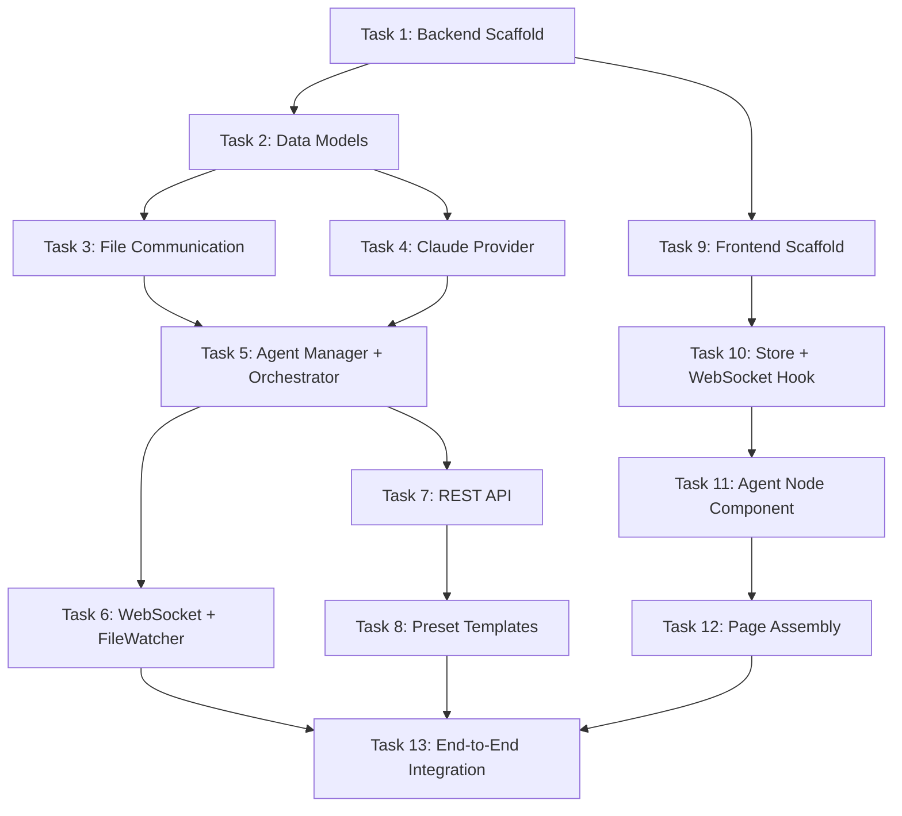

# Polygents Phase 1 MVP Implementation Plan

> **For Claude:** REQUIRED SUB-SKILL: Use superpowers:executing-plans to implement this plan task-by-task.

**Goal:** Run through the complete pipeline of Web UI → Create Team → Input prompt → Manager/Dev/Evaluator closed-loop collaboration → Real-time monitoring

**Architecture:** Backend FastAPI (Python) provides REST API + WebSocket, core engine manages Agent lifecycle and file-based communication; Frontend Vite + React + TypeScript + React Flow provides visual canvas and run monitoring. Agents call Claude via Claude Agent SDK and collaborate through Markdown file-based communication.

**Tech Stack:** Python 3.10+, FastAPI, watchfiles, claude-agent-sdk, anyio | Vite, React 18, TypeScript, @xyflow/react (React Flow v12), Zustand

---

## Project Structure Overview

```
Polygents/
├── docs/
│   ├── design.md                  # Design document (existing)
│   └── plans/
│       └── 2026-03-31-phase1.md   # This document
├── backend/
│   ├── pyproject.toml
│   ├── app/
│   │   ├── __init__.py
│   │   ├── main.py                # FastAPI entry point + lifespan
│   │   ├── config.py              # Configuration management
│   │   ├── api/
│   │   │   ├── __init__.py
│   │   │   ├── router.py          # REST route aggregation
│   │   │   ├── teams.py           # Team CRUD
│   │   │   └── runs.py            # Run control
│   │   ├── ws/
│   │   │   ├── __init__.py
│   │   │   ├── manager.py         # ConnectionManager
│   │   │   └── handler.py         # WebSocket endpoint
│   │   ├── engine/
│   │   │   ├── __init__.py
│   │   │   ├── orchestrator.py    # Orchestration engine
│   │   │   ├── agent_manager.py   # Agent lifecycle
│   │   │   ├── file_comm.py       # File communication mechanism
│   │   │   └── file_watcher.py    # File change monitoring
│   │   ├── providers/
│   │   │   ├── __init__.py
│   │   │   ├── base.py            # Provider abstract interface
│   │   │   └── claude_provider.py # Claude Agent SDK implementation
│   │   ├── models/
│   │   │   ├── __init__.py
│   │   │   └── schemas.py         # Pydantic data models
│   │   └── templates/             # Preset team template YAML files
│   │       ├── dev-team.yaml
│   │       ├── research-team.yaml
│   │       └── content-team.yaml
│   ├── tests/
│   │   ├── __init__.py
│   │   ├── test_file_comm.py
│   │   ├── test_orchestrator.py
│   │   └── test_schemas.py
│   └── workspace/                 # Runtime working directory (.gitignore)
│       ├── inbox/
│       ├── shared/
│       ├── artifacts/
│       └── logs/
├── frontend/
│   ├── package.json
│   ├── tsconfig.json
│   ├── vite.config.ts
│   ├── index.html
│   └── src/
│       ├── main.tsx
│       ├── App.tsx
│       ├── store/
│       │   └── flowStore.ts       # Zustand store
│       ├── components/
│       │   ├── nodes/
│       │   │   └── AgentNode.tsx   # Custom Agent node
│       │   ├── Canvas.tsx          # React Flow canvas
│       │   ├── AgentPanel.tsx      # Agent config sidebar
│       │   ├── RunMonitor.tsx      # Run monitoring panel
│       │   └── ActivityFeed.tsx    # Agent activity feed
│       ├── hooks/
│       │   └── useWebSocket.ts    # WebSocket hook
│       ├── pages/
│       │   ├── HomePage.tsx
│       │   ├── CreatePage.tsx
│       │   └── CanvasPage.tsx
│       ├── types/
│       │   └── index.ts
│       └── styles/
│           └── index.css
└── README.md
```

---

## Task 1: Backend Project Scaffold

**Files:**
- Create: `backend/pyproject.toml`
- Create: `backend/app/__init__.py`
- Create: `backend/app/main.py`
- Create: `backend/app/config.py`
- Create: `backend/tests/__init__.py`

**Step 1: Create pyproject.toml**

```toml
[project]
name = "polygents"
version = "0.1.0"
description = "Multi-agent collaboration framework"
requires-python = ">=3.10"
dependencies = [
    "fastapi>=0.115.0",
    "uvicorn[standard]>=0.30.0",
    "pyyaml>=6.0",
    "watchfiles>=0.20.0",
    "claude-agent-sdk>=0.1.0",
    "anyio>=4.0.0",
    "pydantic>=2.0.0",
]

[project.optional-dependencies]
dev = [
    "pytest>=8.0",
    "pytest-asyncio>=0.23",
    "httpx>=0.27",
]
```

**Step 2: Create config.py**

```python
"""Application configuration"""
from pathlib import Path

# Project root path
BASE_DIR = Path(__file__).resolve().parent.parent

# Working directory
WORKSPACE_DIR = BASE_DIR / "workspace"

# Preset template directory
TEMPLATES_DIR = Path(__file__).resolve().parent / "templates"

# Server configuration
HOST = "127.0.0.1"
PORT = 8001

# Agent configuration
MAX_RETRIES = 3
```

**Step 3: Create main.py (minimal runnable version)**

```python
"""Polygents backend entry point"""
from contextlib import asynccontextmanager
from fastapi import FastAPI
from fastapi.middleware.cors import CORSMiddleware

from app.config import HOST, PORT


@asynccontextmanager
async def lifespan(app: FastAPI):
    # On startup
    print("Polygents backend starting...")
    yield
    # On shutdown
    print("Polygents backend shutting down...")


app = FastAPI(title="Polygents", version="0.1.0", lifespan=lifespan)

app.add_middleware(
    CORSMiddleware,
    allow_origins=["*"],
    allow_methods=["*"],
    allow_headers=["*"],
)


@app.get("/api/health")
async def health():
    return {"status": "ok", "version": "0.1.0"}


if __name__ == "__main__":
    import uvicorn
    uvicorn.run("app.main:app", host=HOST, port=PORT, reload=True)
```

**Step 4: Verify backend startup**

Run: `cd Polygents/backend && pip install -e ".[dev]" && python -m app.main`
Expected: Server starts at http://127.0.0.1:8001, GET /api/health returns `{"status": "ok"}`

**Step 5: Commit**

```bash
git add Polygents/backend/
git commit -m "feat(polygents): backend project scaffold with FastAPI"
```

---

## Task 2: Data Models (Pydantic Schemas)

**Files:**
- Create: `backend/app/models/__init__.py`
- Create: `backend/app/models/schemas.py`
- Test: `backend/tests/test_schemas.py`

**Step 1: Write schemas tests**

```python
# tests/test_schemas.py
import pytest
from app.models.schemas import AgentConfig, TeamConfig, TaskItem, RunStatus


def test_agent_config_minimal():
    agent = AgentConfig(
        id="dev",
        role="Development Engineer",
        system_prompt="You are a development engineer",
        tools=["read_file", "write_file"],
    )
    assert agent.id == "dev"
    assert agent.provider == "claude"  # default value


def test_agent_config_full():
    agent = AgentConfig(
        id="dev",
        role="Development Engineer",
        system_prompt="You are a development engineer",
        tools=["read_file", "write_file"],
        provider="claude",
    )
    assert agent.provider == "claude"


def test_team_config():
    team = TeamConfig(
        name="Development Team",
        agents=[
            AgentConfig(id="manager", role="Manager", system_prompt="...", tools=["read_file", "write_file"]),
            AgentConfig(id="dev", role="Developer", system_prompt="...", tools=["read_file", "write_file"]),
            AgentConfig(id="evaluator", role="Reviewer", system_prompt="...", tools=["read_file"]),
        ],
    )
    assert len(team.agents) == 3


def test_task_item():
    task = TaskItem(id="task-001", description="Implement login API", assignee="dev")
    assert task.status == "pending"


def test_run_status():
    run = RunStatus(id="run-001", team_name="Development Team", status="running")
    assert run.current_task is None
```

**Step 2: Run tests to confirm failure**

Run: `cd Polygents/backend && python -m pytest tests/test_schemas.py -v`
Expected: FAIL — ModuleNotFoundError

**Step 3: Implement schemas.py**

```python
"""Data model definitions"""
from pydantic import BaseModel, Field
from typing import Optional
from enum import Enum


class TaskStatus(str, Enum):
    pending = "pending"
    in_progress = "in_progress"
    review = "review"
    completed = "completed"
    rejected = "rejected"


class AgentConfig(BaseModel):
    """Agent configuration"""
    id: str
    role: str
    system_prompt: str
    tools: list[str] = Field(default_factory=list)
    provider: str = "claude"


class TeamConfig(BaseModel):
    """Team configuration"""
    name: str
    agents: list[AgentConfig]
    max_retries: int = 3


class TaskItem(BaseModel):
    """Task item"""
    id: str
    description: str
    assignee: str
    depends_on: list[str] = Field(default_factory=list)
    output: Optional[str] = None
    status: TaskStatus = TaskStatus.pending


class SprintPlan(BaseModel):
    """Sprint plan generated by Manager"""
    goal: str
    tasks: list[TaskItem]
    constraints: list[str] = Field(default_factory=list)
    acceptance_criteria: list[str] = Field(default_factory=list)


class RunStatus(BaseModel):
    """Run status"""
    id: str
    team_name: str
    status: str  # "idle" | "running" | "completed" | "failed"
    current_task: Optional[str] = None
    completed_tasks: list[str] = Field(default_factory=list)
    retry_count: int = 0


class FileChangeEvent(BaseModel):
    """File change event"""
    type: str = "file_change"
    change: str  # "created" | "modified" | "deleted"
    path: str


class AgentActivityEvent(BaseModel):
    """Agent activity event"""
    type: str = "agent_activity"
    agent_id: str
    action: str  # "thinking" | "writing" | "reading" | "completed"
    detail: str = ""


class WSMessage(BaseModel):
    """WebSocket message unified format"""
    type: str
    data: dict = Field(default_factory=dict)
```

**Step 4: Run tests to confirm passing**

Run: `cd Polygents/backend && python -m pytest tests/test_schemas.py -v`
Expected: All PASS

**Step 5: Commit**

```bash
git add Polygents/backend/app/models/ Polygents/backend/tests/test_schemas.py
git commit -m "feat(polygents): add Pydantic data models for agents, teams, tasks"
```

---

## Task 3: File Communication Mechanism

**Files:**
- Create: `backend/app/engine/__init__.py`
- Create: `backend/app/engine/file_comm.py`
- Test: `backend/tests/test_file_comm.py`

**Step 1: Write file communication tests**

```python
# tests/test_file_comm.py
import pytest
import tempfile
from pathlib import Path
from app.engine.file_comm import FileComm


@pytest.fixture
def workspace(tmp_path):
    """Create temporary working directory"""
    comm = FileComm(tmp_path)
    comm.init_workspace()
    return comm


def test_init_workspace(workspace):
    """Initialization should create all required directories"""
    base = workspace.base_dir
    assert (base / "inbox").is_dir()
    assert (base / "shared").is_dir()
    assert (base / "artifacts").is_dir()
    assert (base / "logs").is_dir()
    assert (base / ".polygents").is_dir()


def test_init_agent_dirs(workspace):
    """Initializing an Agent should create its inbox and artifacts subdirectories"""
    workspace.init_agent("dev")
    base = workspace.base_dir
    assert (base / "inbox" / "dev").is_dir()
    assert (base / "artifacts" / "dev").is_dir()


def test_send_message(workspace):
    """Send message between Agents"""
    workspace.init_agent("manager")
    workspace.init_agent("dev")
    workspace.send_message(
        from_agent="manager",
        to_agent="dev",
        msg_type="task_assignment",
        content="## Implement Login API\n\nRequires JWT authentication",
    )
    inbox = workspace.base_dir / "inbox" / "dev"
    files = list(inbox.glob("*.md"))
    assert len(files) == 1
    content = files[0].read_text(encoding="utf-8")
    assert "from: manager" in content
    assert "to: dev" in content
    assert "JWT" in content


def test_read_inbox(workspace):
    """Read Agent inbox"""
    workspace.init_agent("dev")
    workspace.send_message("manager", "dev", "task_assignment", "Task 1")
    workspace.send_message("evaluator", "dev", "feedback", "Revision suggestions")
    messages = workspace.read_inbox("dev")
    assert len(messages) == 2


def test_write_shared(workspace):
    """Write to shared file"""
    workspace.write_shared("sprint.md", "# Sprint Plan\n\n## Task List")
    content = (workspace.base_dir / "shared" / "sprint.md").read_text(encoding="utf-8")
    assert "Sprint Plan" in content


def test_read_shared(workspace):
    """Read shared file"""
    workspace.write_shared("sprint.md", "# Sprint")
    content = workspace.read_shared("sprint.md")
    assert "Sprint" in content


def test_write_artifact(workspace):
    """Write artifact"""
    workspace.init_agent("dev")
    workspace.write_artifact("dev", "code/main.py", "print('hello')")
    content = (workspace.base_dir / "artifacts" / "dev" / "code" / "main.py").read_text(encoding="utf-8")
    assert "hello" in content


def test_write_log(workspace):
    """Write communication log"""
    workspace.log_communication("manager", "dev", "task_assignment", "Build an API")
    log_dir = workspace.base_dir / "logs"
    files = list(log_dir.glob("*.md"))
    assert len(files) == 1
```

**Step 2: Run tests to confirm failure**

Run: `cd Polygents/backend && python -m pytest tests/test_file_comm.py -v`
Expected: FAIL

**Step 3: Implement file_comm.py**

```python
"""File communication mechanism — Agents communicate via Markdown files"""
from pathlib import Path
from datetime import datetime
import threading


class FileComm:
    """Manages file-based communication between Agents"""

    def __init__(self, base_dir: Path):
        self.base_dir = Path(base_dir)
        self._write_lock = threading.Lock()  # Write lock for shared/
        self._msg_counter = 0

    def init_workspace(self):
        """Initialize working directory structure"""
        for d in ["inbox", "shared", "artifacts", "logs", ".polygents", ".polygents/agents"]:
            (self.base_dir / d).mkdir(parents=True, exist_ok=True)

    def init_agent(self, agent_id: str):
        """Create required directories for an Agent"""
        (self.base_dir / "inbox" / agent_id).mkdir(parents=True, exist_ok=True)
        (self.base_dir / "artifacts" / agent_id).mkdir(parents=True, exist_ok=True)

    def send_message(
        self,
        from_agent: str,
        to_agent: str,
        msg_type: str,
        content: str,
        priority: str = "normal",
    ) -> Path:
        """Send a message to the target Agent's inbox"""
        self._msg_counter += 1
        timestamp = datetime.now().isoformat()
        filename = f"{self._msg_counter:03d}-{msg_type}.md"

        frontmatter = (
            f"---\n"
            f"id: msg-{self._msg_counter:03d}\n"
            f"from: {from_agent}\n"
            f"to: {to_agent}\n"
            f"type: {msg_type}\n"
            f"priority: {priority}\n"
            f"timestamp: {timestamp}\n"
            f"---\n\n"
        )

        file_path = self.base_dir / "inbox" / to_agent / filename
        file_path.write_text(frontmatter + content, encoding="utf-8")

        # Log the communication
        self.log_communication(from_agent, to_agent, msg_type, content)
        return file_path

    def read_inbox(self, agent_id: str) -> list[dict]:
        """Read all inbox messages for an Agent"""
        inbox_dir = self.base_dir / "inbox" / agent_id
        messages = []
        if not inbox_dir.exists():
            return messages

        for f in sorted(inbox_dir.glob("*.md")):
            text = f.read_text(encoding="utf-8")
            meta, body = self._parse_frontmatter(text)
            messages.append({"meta": meta, "body": body, "file": str(f)})
        return messages

    def clear_inbox(self, agent_id: str):
        """Clear an Agent's inbox"""
        inbox_dir = self.base_dir / "inbox" / agent_id
        if inbox_dir.exists():
            for f in inbox_dir.glob("*.md"):
                f.unlink()

    def write_shared(self, filename: str, content: str):
        """Write to shared directory (with write lock)"""
        with self._write_lock:
            file_path = self.base_dir / "shared" / filename
            file_path.parent.mkdir(parents=True, exist_ok=True)
            file_path.write_text(content, encoding="utf-8")

    def read_shared(self, filename: str) -> str:
        """Read a shared file"""
        file_path = self.base_dir / "shared" / filename
        if file_path.exists():
            return file_path.read_text(encoding="utf-8")
        return ""

    def write_artifact(self, agent_id: str, rel_path: str, content: str):
        """Write to an Agent's artifacts directory"""
        file_path = self.base_dir / "artifacts" / agent_id / rel_path
        file_path.parent.mkdir(parents=True, exist_ok=True)
        file_path.write_text(content, encoding="utf-8")

    def log_communication(self, from_agent: str, to_agent: str, msg_type: str, content: str):
        """Append to communication log"""
        today = datetime.now().strftime("%Y-%m-%d")
        log_file = self.base_dir / "logs" / f"{today}.md"

        timestamp = datetime.now().strftime("%H:%M:%S")
        entry = (
            f"\n### [{timestamp}] {from_agent} → {to_agent} ({msg_type})\n\n"
            f"{content[:200]}{'...' if len(content) > 200 else ''}\n"
        )

        with open(log_file, "a", encoding="utf-8") as f:
            f.write(entry)

    def _parse_frontmatter(self, text: str) -> tuple[dict, str]:
        """Parse YAML frontmatter"""
        if not text.startswith("---"):
            return {}, text

        parts = text.split("---", 2)
        if len(parts) < 3:
            return {}, text

        meta = {}
        for line in parts[1].strip().split("\n"):
            if ":" in line:
                key, val = line.split(":", 1)
                meta[key.strip()] = val.strip()
        return meta, parts[2].strip()
```

**Step 4: Run tests to confirm passing**

Run: `cd Polygents/backend && python -m pytest tests/test_file_comm.py -v`
Expected: All PASS

**Step 5: Commit**

```bash
git add Polygents/backend/app/engine/ Polygents/backend/tests/test_file_comm.py
git commit -m "feat(polygents): file communication system with inbox/shared/artifacts"
```

---

## Task 4: Claude Provider Adapter Layer

**Files:**
- Create: `backend/app/providers/__init__.py`
- Create: `backend/app/providers/base.py`
- Create: `backend/app/providers/claude_provider.py`

**Step 1: Create Provider abstract interface**

```python
# providers/base.py
"""Provider abstract interface"""
from abc import ABC, abstractmethod
from typing import AsyncIterator


class BaseProvider(ABC):
    """LLM Provider unified abstraction"""

    @abstractmethod
    async def send_message(
        self,
        system_prompt: str,
        prompt: str,
        tools: list[str] | None = None,
        cwd: str | None = None,
    ) -> str:
        """Send a message and get the complete response"""
        ...

    @abstractmethod
    async def stream_message(
        self,
        system_prompt: str,
        prompt: str,
        tools: list[str] | None = None,
        cwd: str | None = None,
    ) -> AsyncIterator[str]:
        """Send a message with streaming response"""
        ...
```

**Step 2: Implement ClaudeProvider**

```python
# providers/claude_provider.py
"""Claude Agent SDK Provider"""
from claude_agent_sdk import query, ClaudeAgentOptions, ResultMessage, AssistantMessage
from app.providers.base import BaseProvider
from typing import AsyncIterator, Callable, Optional


class ClaudeProvider(BaseProvider):
    """Call Claude via Claude Agent SDK"""

    def __init__(self, on_activity: Optional[Callable] = None):
        self.on_activity = on_activity

    async def send_message(
        self,
        system_prompt: str,
        prompt: str,
        tools: list[str] | None = None,
        cwd: str | None = None,
    ) -> str:
        """Send a message and collect the complete response"""
        options = ClaudeAgentOptions(
            system_prompt=system_prompt,
            allowed_tools=tools or ["Read", "Write", "Edit", "Bash", "Glob", "Grep"],
            permission_mode="bypassPermissions",
            cwd=cwd,
        )

        result_text = ""
        async for message in query(prompt=prompt, options=options):
            if isinstance(message, ResultMessage):
                result_text = message.result or ""

        return result_text

    async def stream_message(
        self,
        system_prompt: str,
        prompt: str,
        tools: list[str] | None = None,
        cwd: str | None = None,
    ) -> AsyncIterator[str]:
        """Send a message with streaming response"""
        options = ClaudeAgentOptions(
            system_prompt=system_prompt,
            allowed_tools=tools or ["Read", "Write", "Edit", "Bash", "Glob", "Grep"],
            permission_mode="bypassPermissions",
            cwd=cwd,
        )

        async for message in query(prompt=prompt, options=options):
            if isinstance(message, AssistantMessage):
                for block in message.content:
                    if hasattr(block, "text"):
                        yield block.text
            elif isinstance(message, ResultMessage):
                if message.result:
                    yield message.result
```

**Step 3: Create __init__.py**

```python
# providers/__init__.py
from app.providers.claude_provider import ClaudeProvider

__all__ = ["ClaudeProvider"]
```

**Step 4: Commit**

```bash
git add Polygents/backend/app/providers/
git commit -m "feat(polygents): Claude Agent SDK provider with streaming support"
```

---

## Task 5: Agent Manager and Orchestrator

**Files:**
- Create: `backend/app/engine/agent_manager.py`
- Create: `backend/app/engine/orchestrator.py`
- Test: `backend/tests/test_orchestrator.py`

**Step 1: Write Orchestrator tests**

```python
# tests/test_orchestrator.py
import pytest
from app.models.schemas import AgentConfig, TeamConfig, TaskItem, TaskStatus


def test_parse_sprint_tasks():
    """Parse task list from sprint markdown"""
    from app.engine.orchestrator import parse_sprint_markdown

    sprint_md = """# Sprint: TODO App

## Goal
Build a TODO application

## Task List
1. [ ] Design data models
2. [ ] Implement CRUD logic
3. [ ] Write tests
"""
    tasks = parse_sprint_markdown(sprint_md)
    assert len(tasks) == 3
    assert tasks[0].description == "Design data models"
    assert tasks[0].status == TaskStatus.pending


def test_assign_task_to_dev():
    """Tasks are assigned to dev by default"""
    from app.engine.orchestrator import parse_sprint_markdown

    sprint_md = """# Sprint
## Task List
1. [ ] Write code
"""
    tasks = parse_sprint_markdown(sprint_md)
    assert tasks[0].assignee == "dev"
```

**Step 2: Run tests to confirm failure**

Run: `cd Polygents/backend && python -m pytest tests/test_orchestrator.py -v`
Expected: FAIL

**Step 3: Implement agent_manager.py**

```python
# engine/agent_manager.py
"""Agent lifecycle management"""
from app.models.schemas import AgentConfig
from app.providers.base import BaseProvider
from app.engine.file_comm import FileComm
from typing import Optional, Callable


class AgentInstance:
    """Running Agent instance"""

    def __init__(
        self,
        config: AgentConfig,
        provider: BaseProvider,
        file_comm: FileComm,
        on_activity: Optional[Callable] = None,
    ):
        self.config = config
        self.provider = provider
        self.file_comm = file_comm
        self.on_activity = on_activity

    async def execute(self, prompt: str) -> str:
        """Execute a task and return the result text"""
        if self.on_activity:
            await self.on_activity(self.config.id, "thinking", f"Processing: {prompt[:50]}...")

        workspace_dir = str(self.file_comm.base_dir)
        result = await self.provider.send_message(
            system_prompt=self.config.system_prompt,
            prompt=prompt,
            tools=self.config.tools,
            cwd=workspace_dir,
        )

        if self.on_activity:
            await self.on_activity(self.config.id, "completed", "Task completed")

        return result


class AgentManager:
    """Manages all Agent instances"""

    def __init__(self, provider: BaseProvider, file_comm: FileComm):
        self.provider = provider
        self.file_comm = file_comm
        self.agents: dict[str, AgentInstance] = {}
        self.on_activity: Optional[Callable] = None

    def create_agent(self, config: AgentConfig) -> AgentInstance:
        """Create an Agent instance"""
        self.file_comm.init_agent(config.id)
        instance = AgentInstance(
            config=config,
            provider=self.provider,
            file_comm=self.file_comm,
            on_activity=self.on_activity,
        )
        self.agents[config.id] = instance
        return instance

    def get_agent(self, agent_id: str) -> Optional[AgentInstance]:
        return self.agents.get(agent_id)

    def list_agents(self) -> list[str]:
        return list(self.agents.keys())
```

**Step 4: Implement orchestrator.py**

```python
# engine/orchestrator.py
"""Orchestration engine — Coordinates Manager/Dev/Evaluator closed loop"""
import re
from typing import Optional, Callable
from app.models.schemas import TaskItem, TaskStatus, TeamConfig
from app.engine.agent_manager import AgentManager
from app.engine.file_comm import FileComm


def parse_sprint_markdown(sprint_md: str) -> list[TaskItem]:
    """Parse task list from Sprint markdown"""
    tasks = []
    pattern = r'^\d+\.\s*\[[ x]\]\s*(.+)$'
    for i, match in enumerate(re.finditer(pattern, sprint_md, re.MULTILINE)):
        tasks.append(TaskItem(
            id=f"task-{i+1:03d}",
            description=match.group(1).strip(),
            assignee="dev",
        ))
    return tasks


class Orchestrator:
    """Orchestration engine: receives task list, assigns execution, manages closed loop"""

    def __init__(
        self,
        agent_manager: AgentManager,
        file_comm: FileComm,
        max_retries: int = 3,
        on_status: Optional[Callable] = None,
    ):
        self.agent_manager = agent_manager
        self.file_comm = file_comm
        self.max_retries = max_retries
        self.on_status = on_status

    async def run(self, user_prompt: str):
        """Execute full closed loop: Manager decomposes → Dev executes → Evaluator reviews"""
        # Notify status
        await self._notify("running", detail="Manager is decomposing the task...")

        # 1. Manager decomposes the task
        manager = self.agent_manager.get_agent("manager")
        sprint_prompt = (
            f"User requirements are as follows:\n\n{user_prompt}\n\n"
            f"Please analyze the requirements and generate a Sprint plan, output to shared/sprint.md.\n"
            f"The plan must include: goal, task list (using `1. [ ] task description` format), architecture constraints, acceptance criteria."
        )
        await manager.execute(sprint_prompt)

        # 2. Read Sprint and parse tasks
        sprint_md = self.file_comm.read_shared("sprint.md")
        if not sprint_md:
            await self._notify("failed", detail="Manager failed to generate Sprint plan")
            return

        tasks = parse_sprint_markdown(sprint_md)
        if not tasks:
            await self._notify("failed", detail="No task list found in Sprint")
            return

        await self._notify("running", detail=f"Parsed {len(tasks)} tasks, starting execution...")

        # 3. Execute Dev → Evaluator closed loop for each task
        for task in tasks:
            await self._execute_task_loop(task, sprint_md)

        await self._notify("completed", detail="All tasks completed!")

    async def _execute_task_loop(self, task: TaskItem, sprint_md: str):
        """Dev → Evaluator closed loop for a single task"""
        dev = self.agent_manager.get_agent("dev")
        evaluator = self.agent_manager.get_agent("evaluator")

        for attempt in range(self.max_retries):
            await self._notify("running", detail=f"Executing task: {task.description} (round {attempt+1})")

            # Dev executes
            dev_prompt = (
                f"Current Sprint plan:\n\n{sprint_md}\n\n"
                f"Please execute the following task:\n{task.description}\n\n"
                f"Place the output in the artifacts/dev/ directory."
            )
            if attempt > 0:
                feedback = self.file_comm.read_inbox("dev")
                if feedback:
                    last_feedback = feedback[-1]["body"]
                    dev_prompt += f"\n\nPrevious round review feedback:\n{last_feedback}"

            await dev.execute(dev_prompt)

            # Evaluator reviews
            eval_prompt = (
                f"Sprint plan:\n\n{sprint_md}\n\n"
                f"Task description: {task.description}\n\n"
                f"Please check the output in the artifacts/dev/ directory and evaluate against acceptance criteria.\n\n"
                f"If approved, reply with 'APPROVED'.\n"
                f"If not approved, reply with 'REJECTED', and specify the issues and revision suggestions."
            )
            eval_result = await evaluator.execute(eval_prompt)

            if "APPROVED" in eval_result.upper():
                await self._notify("running", detail=f"Task approved: {task.description}")
                task.status = TaskStatus.completed
                return
            else:
                # Write feedback
                self.file_comm.send_message(
                    from_agent="evaluator",
                    to_agent="dev",
                    msg_type="feedback",
                    content=eval_result,
                )

        # Exceeded retry limit
        task.status = TaskStatus.rejected
        await self._notify("running", detail=f"Task exceeded retry limit: {task.description}")

    async def _notify(self, status: str, detail: str = ""):
        """Notify status change"""
        if self.on_status:
            await self.on_status(status, detail)
```

**Step 5: Run tests to confirm passing**

Run: `cd Polygents/backend && python -m pytest tests/test_orchestrator.py -v`
Expected: All PASS

**Step 6: Commit**

```bash
git add Polygents/backend/app/engine/ Polygents/backend/tests/test_orchestrator.py
git commit -m "feat(polygents): orchestrator with Manager/Dev/Evaluator loop"
```

---

## Task 6: WebSocket + File Monitoring

**Files:**
- Create: `backend/app/ws/__init__.py`
- Create: `backend/app/ws/manager.py`
- Create: `backend/app/ws/handler.py`
- Create: `backend/app/engine/file_watcher.py`
- Modify: `backend/app/main.py`

**Step 1: Implement ConnectionManager**

```python
# ws/manager.py
"""WebSocket connection management"""
from fastapi import WebSocket


class ConnectionManager:
    def __init__(self):
        self.active_connections: list[WebSocket] = []

    async def connect(self, websocket: WebSocket):
        await websocket.accept()
        self.active_connections.append(websocket)

    def disconnect(self, websocket: WebSocket):
        if websocket in self.active_connections:
            self.active_connections.remove(websocket)

    async def broadcast(self, message: dict):
        dead = []
        for conn in self.active_connections[:]:
            try:
                await conn.send_json(message)
            except Exception:
                dead.append(conn)
        for conn in dead:
            self.disconnect(conn)

    @property
    def count(self):
        return len(self.active_connections)


ws_manager = ConnectionManager()
```

**Step 2: Implement FileWatcher**

```python
# engine/file_watcher.py
"""File change monitoring — Pushes to WebSocket"""
from watchfiles import awatch, Change
from app.ws.manager import ws_manager


async def watch_workspace(path: str):
    """Monitor workspace directory changes and broadcast to all WebSocket clients"""
    change_map = {
        Change.added: "created",
        Change.modified: "modified",
        Change.deleted: "deleted",
    }
    async for changes in awatch(path):
        for change_type, file_path in changes:
            await ws_manager.broadcast({
                "type": "file_change",
                "change": change_map[change_type],
                "path": file_path,
            })
```

**Step 3: Implement WebSocket handler**

```python
# ws/handler.py
"""WebSocket endpoint"""
from fastapi import APIRouter, WebSocket, WebSocketDisconnect
from app.ws.manager import ws_manager

router = APIRouter()


@router.websocket("/ws")
async def websocket_endpoint(websocket: WebSocket):
    await ws_manager.connect(websocket)
    try:
        while True:
            data = await websocket.receive_json()
            msg_type = data.get("type", "")

            if msg_type == "ping":
                await websocket.send_json({"type": "pong"})

            elif msg_type == "start_run":
                # Start a run (actual logic handled by REST API, this only forwards notifications)
                await ws_manager.broadcast({
                    "type": "system",
                    "data": {"message": "Run has been triggered"},
                })
    except WebSocketDisconnect:
        ws_manager.disconnect(websocket)
```

**Step 4: Update main.py — Integrate all modules**

```python
# main.py full version
"""Polygents backend entry point"""
import asyncio
from contextlib import asynccontextmanager
from pathlib import Path

from fastapi import FastAPI
from fastapi.middleware.cors import CORSMiddleware

from app.config import HOST, PORT, WORKSPACE_DIR
from app.ws.handler import router as ws_router
from app.ws.manager import ws_manager
from app.engine.file_watcher import watch_workspace
from app.engine.file_comm import FileComm
from app.engine.agent_manager import AgentManager
from app.engine.orchestrator import Orchestrator
from app.providers.claude_provider import ClaudeProvider
from app.api.router import api_router

# Global instances
file_comm = FileComm(WORKSPACE_DIR)
provider = ClaudeProvider()
agent_manager = AgentManager(provider=provider, file_comm=file_comm)
orchestrator = Orchestrator(agent_manager=agent_manager, file_comm=file_comm)


@asynccontextmanager
async def lifespan(app: FastAPI):
    # Initialize working directory
    file_comm.init_workspace()

    # Start file monitoring
    watcher_task = asyncio.create_task(watch_workspace(str(WORKSPACE_DIR)))

    # Connect orchestrator status notifications to WebSocket
    async def on_status(status: str, detail: str):
        await ws_manager.broadcast({
            "type": "run_status",
            "data": {"status": status, "detail": detail},
        })
    orchestrator.on_status = on_status

    # Connect Agent activity notifications to WebSocket
    async def on_activity(agent_id: str, action: str, detail: str):
        await ws_manager.broadcast({
            "type": "agent_activity",
            "data": {"agent_id": agent_id, "action": action, "detail": detail},
        })
    agent_manager.on_activity = on_activity

    print(f"Polygents backend started. Workspace: {WORKSPACE_DIR}")
    yield
    watcher_task.cancel()
    print("Polygents backend stopped.")


app = FastAPI(title="Polygents", version="0.1.0", lifespan=lifespan)

app.add_middleware(
    CORSMiddleware,
    allow_origins=["*"],
    allow_methods=["*"],
    allow_headers=["*"],
)

# Routes
app.include_router(api_router, prefix="/api")
app.include_router(ws_router)


if __name__ == "__main__":
    import uvicorn
    uvicorn.run("app.main:app", host=HOST, port=PORT, reload=True)
```

**Step 5: Commit**

```bash
git add Polygents/backend/app/ws/ Polygents/backend/app/engine/file_watcher.py Polygents/backend/app/main.py
git commit -m "feat(polygents): WebSocket broadcasting and file change watcher"
```

---

## Task 7: REST API Endpoints

**Files:**
- Create: `backend/app/api/__init__.py`
- Create: `backend/app/api/router.py`
- Create: `backend/app/api/teams.py`
- Create: `backend/app/api/runs.py`

**Step 1: Implement Team API**

```python
# api/teams.py
"""Team management API"""
from fastapi import APIRouter, HTTPException
from pathlib import Path
import yaml

from app.config import TEMPLATES_DIR

router = APIRouter(prefix="/teams", tags=["teams"])


@router.get("/templates")
async def list_templates():
    """List all preset team templates"""
    templates = []
    if TEMPLATES_DIR.exists():
        for f in TEMPLATES_DIR.glob("*.yaml"):
            with open(f, encoding="utf-8") as fh:
                data = yaml.safe_load(fh)
                templates.append({
                    "id": f.stem,
                    "name": data.get("name", f.stem),
                    "description": data.get("description", ""),
                    "agents": [a.get("role", "") for a in data.get("agents", [])],
                })
    return templates


@router.get("/templates/{template_id}")
async def get_template(template_id: str):
    """Get template details"""
    file_path = TEMPLATES_DIR / f"{template_id}.yaml"
    if not file_path.exists():
        raise HTTPException(status_code=404, detail="Template not found")
    with open(file_path, encoding="utf-8") as f:
        return yaml.safe_load(f)
```

**Step 2: Implement Run API**

```python
# api/runs.py
"""Run control API"""
import asyncio
from fastapi import APIRouter
from pydantic import BaseModel

router = APIRouter(prefix="/runs", tags=["runs"])

# Reference to global instances (set in main.py)
_orchestrator = None
_agent_manager = None
_file_comm = None


def init_run_api(orchestrator, agent_manager, file_comm):
    """Inject dependencies (called by main.py)"""
    global _orchestrator, _agent_manager, _file_comm
    _orchestrator = orchestrator
    _agent_manager = agent_manager
    _file_comm = file_comm


class StartRunRequest(BaseModel):
    prompt: str
    template_id: str | None = None


@router.post("/start")
async def start_run(req: StartRunRequest):
    """Start a run"""
    if _orchestrator is None:
        return {"error": "Engine not initialized"}

    # If a template is specified, load and create Agents
    if req.template_id:
        from app.config import TEMPLATES_DIR
        import yaml
        template_path = TEMPLATES_DIR / f"{req.template_id}.yaml"
        if template_path.exists():
            with open(template_path, encoding="utf-8") as f:
                template = yaml.safe_load(f)
            from app.models.schemas import AgentConfig
            for agent_data in template.get("agents", []):
                config = AgentConfig(**agent_data)
                _agent_manager.create_agent(config)

    # Start run in background
    asyncio.create_task(_orchestrator.run(req.prompt))

    return {"status": "started", "prompt": req.prompt}


@router.get("/status")
async def get_status():
    """Get current run status"""
    return {
        "agents": _agent_manager.list_agents() if _agent_manager else [],
    }
```

**Step 3: Route aggregation**

```python
# api/router.py
"""REST route aggregation"""
from fastapi import APIRouter
from app.api.teams import router as teams_router
from app.api.runs import router as runs_router

api_router = APIRouter()
api_router.include_router(teams_router)
api_router.include_router(runs_router)
```

**Step 4: Commit**

```bash
git add Polygents/backend/app/api/
git commit -m "feat(polygents): REST API for team templates and run control"
```

---

## Task 8: Preset Team Templates

**Files:**
- Create: `backend/app/templates/dev-team.yaml`
- Create: `backend/app/templates/research-team.yaml`
- Create: `backend/app/templates/content-team.yaml`

**Step 1: Create Development Team template**

```yaml
# templates/dev-team.yaml
name: "Development Team"
description: "Standard development team with Manager planning + Dev development + Evaluator review"
agents:
  - id: manager
    role: "Project Manager"
    system_prompt: |
      You are a project manager. Your responsibility is to understand user requirements and generate clear Sprint plans.

      Plan format requirements:
      1. Write to shared/sprint.md
      2. Include: project goal, task list (using `1. [ ] task description` format), architecture constraints, acceptance criteria
      3. Task decomposition should be specific and actionable, each task should be an independent development unit

      You are only responsible for planning, do not write code.
    tools:
      - Read
      - Write
      - Glob

  - id: dev
    role: "Senior Development Engineer"
    system_prompt: |
      You are a senior development engineer. Your responsibility is to complete specific development tasks according to the Sprint plan.

      Workflow:
      1. Read shared/sprint.md to understand the overall plan
      2. Read task assignments in inbox/dev/
      3. Write high-quality, runnable code
      4. Place code output in the artifacts/dev/ directory
      5. If there is review feedback, read and modify the code

      Code requirements: clear structure, appropriate comments, error handling included.
    tools:
      - Read
      - Write
      - Edit
      - Bash
      - Glob
      - Grep

  - id: evaluator
    role: "Quality Reviewer"
    system_prompt: |
      You are a strict quality reviewer. Your responsibility is to evaluate whether the developer's output meets the requirements.

      Review process:
      1. Read shared/sprint.md to understand acceptance criteria
      2. Check the output in the artifacts/dev/ directory
      3. Evaluate against acceptance criteria item by item

      Review dimensions: functional completeness, code quality, requirement satisfaction.

      Output format:
      - If approved: reply with "APPROVED", with a brief evaluation
      - If not approved: reply with "REJECTED", listing specific issues and revision suggestions
    tools:
      - Read
      - Glob
      - Grep
      - Bash
```

**Step 2: Create Research Team template**

```yaml
# templates/research-team.yaml
name: "Research Team"
description: "Research and analysis team with Manager planning + Researcher investigation + Evaluator review"
agents:
  - id: manager
    role: "Research Director"
    system_prompt: |
      You are a research director. Your responsibility is to understand research needs and plan research tasks.

      Plan format requirements:
      1. Write to shared/sprint.md
      2. Include: research objectives, task list (using `1. [ ] task description` format), research methods, acceptance criteria
      3. Each task should have a clear research question and expected output
    tools:
      - Read
      - Write
      - Glob

  - id: dev
    role: "Researcher"
    system_prompt: |
      You are a senior researcher. Your responsibility is to conduct in-depth investigation and analysis according to the research plan.

      Workflow:
      1. Read shared/sprint.md to understand the research plan
      2. Conduct research, data analysis, literature review
      3. Place research output (reports, analysis documents) in the artifacts/dev/ directory

      Output requirements: clear logic, data-supported, definitive conclusions.
    tools:
      - Read
      - Write
      - Bash
      - Glob
      - Grep
      - WebSearch
      - WebFetch

  - id: evaluator
    role: "Review Expert"
    system_prompt: |
      You are a review expert. Evaluate the quality of research output.

      Review dimensions: whether research methods are reasonable, whether conclusions are data-supported, whether research questions are answered.

      Output format:
      - If approved: reply with "APPROVED"
      - If not approved: reply with "REJECTED", explaining the issues
    tools:
      - Read
      - Glob
      - Grep
```

**Step 3: Create Content Team template**

```yaml
# templates/content-team.yaml
name: "Content Team"
description: "Content creation team with Manager planning + Writer creation + Evaluator review"
agents:
  - id: manager
    role: "Content Editor-in-Chief"
    system_prompt: |
      You are a content editor-in-chief. Your responsibility is to plan content creation tasks.

      Plan format requirements:
      1. Write to shared/sprint.md
      2. Include: content objectives, task list (using `1. [ ] task description` format), style requirements, acceptance criteria
    tools:
      - Read
      - Write
      - Glob

  - id: dev
    role: "Content Creator"
    system_prompt: |
      You are a senior content creator. Write content according to the content plan.

      Workflow:
      1. Read shared/sprint.md to understand the creation plan
      2. Write high-quality content
      3. Place content in the artifacts/dev/ directory

      Writing requirements: fluent writing, clear structure, distinctive viewpoints.
    tools:
      - Read
      - Write
      - Glob
      - WebSearch
      - WebFetch

  - id: evaluator
    role: "Content Reviewer"
    system_prompt: |
      You are a content reviewer. Evaluate the quality of created content.

      Review dimensions: content accuracy, writing quality, structural completeness, whether creation goals are met.

      Output format:
      - If approved: reply with "APPROVED"
      - If not approved: reply with "REJECTED", explaining the issues
    tools:
      - Read
      - Glob
```

**Step 4: Commit**

```bash
git add Polygents/backend/app/templates/
git commit -m "feat(polygents): preset team templates (dev, research, content)"
```

---

## Task 9: Frontend Project Scaffold

**Files:**
- Create: `frontend/package.json`
- Create: `frontend/vite.config.ts`
- Create: `frontend/tsconfig.json`
- Create: `frontend/index.html`
- Create: `frontend/src/main.tsx`
- Create: `frontend/src/App.tsx`
- Create: `frontend/src/types/index.ts`

**Step 1: Initialize frontend project**

Run:
```bash
cd Polygents && npm create vite@latest frontend -- --template react-ts
cd frontend && npm install @xyflow/react zustand react-router-dom
```

**Step 2: Create type definitions**

```typescript
// src/types/index.ts
export interface AgentConfig {
  id: string;
  role: string;
  system_prompt: string;
  tools: string[];
  provider: string;
}

export interface TeamTemplate {
  id: string;
  name: string;
  description: string;
  agents: AgentConfig[];
}

export interface WSMessage {
  type: string;
  data: Record<string, unknown>;
}

export interface AgentActivity {
  type: "agent_activity";
  data: {
    agent_id: string;
    action: string;
    detail: string;
  };
}

export interface FileChange {
  type: "file_change";
  change: string;
  path: string;
}

export interface RunStatusEvent {
  type: "run_status";
  data: {
    status: string;
    detail: string;
  };
}
```

**Step 3: Create App.tsx routing scaffold**

```tsx
// src/App.tsx
import { BrowserRouter, Routes, Route } from "react-router-dom";
import HomePage from "./pages/HomePage";
import CreatePage from "./pages/CreatePage";
import CanvasPage from "./pages/CanvasPage";

export default function App() {
  return (
    <BrowserRouter>
      <Routes>
        <Route path="/" element={<HomePage />} />
        <Route path="/create" element={<CreatePage />} />
        <Route path="/canvas" element={<CanvasPage />} />
      </Routes>
    </BrowserRouter>
  );
}
```

**Step 4: Create placeholder pages**

```tsx
// src/pages/HomePage.tsx
export default function HomePage() {
  return <div>Home - Template Selection</div>;
}

// src/pages/CreatePage.tsx
export default function CreatePage() {
  return <div>Create - Create Team</div>;
}

// src/pages/CanvasPage.tsx
export default function CanvasPage() {
  return <div>Canvas - Team Canvas</div>;
}
```

**Step 5: Verify frontend startup**

Run: `cd Polygents/frontend && npm run dev`
Expected: Vite dev server starts, routed pages visible in browser

**Step 6: Commit**

```bash
git add Polygents/frontend/
git commit -m "feat(polygents): frontend scaffold with Vite, React, React Flow, routing"
```

---

## Task 10: Zustand Store + WebSocket Hook

**Files:**
- Create: `frontend/src/store/flowStore.ts`
- Create: `frontend/src/hooks/useWebSocket.ts`

**Step 1: Implement Zustand Store**

```typescript
// src/store/flowStore.ts
import { create } from "zustand";
import {
  type Node,
  type Edge,
  type OnNodesChange,
  type OnEdgesChange,
  type OnConnect,
  applyNodeChanges,
  applyEdgeChanges,
  addEdge,
} from "@xyflow/react";
import type { AgentConfig, WSMessage } from "../types";

interface FlowState {
  // React Flow state
  nodes: Node[];
  edges: Edge[];
  onNodesChange: OnNodesChange;
  onEdgesChange: OnEdgesChange;
  onConnect: OnConnect;

  // Business state
  selectedNodeId: string | null;
  activities: WSMessage[];
  runStatus: string;
  runDetail: string;

  // Actions
  setSelectedNode: (id: string | null) => void;
  loadTeam: (agents: AgentConfig[]) => void;
  addActivity: (activity: WSMessage) => void;
  setRunStatus: (status: string, detail: string) => void;
}

const useFlowStore = create<FlowState>((set, get) => ({
  nodes: [],
  edges: [],
  selectedNodeId: null,
  activities: [],
  runStatus: "idle",
  runDetail: "",

  onNodesChange: (changes) => {
    set({ nodes: applyNodeChanges(changes, get().nodes) });
  },

  onEdgesChange: (changes) => {
    set({ edges: applyEdgeChanges(changes, get().edges) });
  },

  onConnect: (connection) => {
    set({ edges: addEdge(connection, get().edges) });
  },

  setSelectedNode: (id) => set({ selectedNodeId: id }),

  loadTeam: (agents) => {
    // Generate nodes: Manager → Dev → Evaluator arranged vertically
    const nodes: Node[] = agents.map((agent, i) => ({
      id: agent.id,
      type: "agent",
      position: { x: 250, y: i * 180 },
      data: {
        role: agent.role,
        status: "idle",
        systemPrompt: agent.system_prompt,
        tools: agent.tools,
      },
    }));

    // Generate edges: connect in order
    const edges: Edge[] = [];
    for (let i = 0; i < agents.length - 1; i++) {
      edges.push({
        id: `e-${agents[i].id}-${agents[i + 1].id}`,
        source: agents[i].id,
        target: agents[i + 1].id,
        animated: true,
      });
    }
    // Evaluator → Manager feedback loop
    if (agents.length >= 3) {
      edges.push({
        id: `e-${agents[agents.length - 1].id}-${agents[0].id}`,
        source: agents[agents.length - 1].id,
        target: agents[0].id,
        animated: true,
        style: { strokeDasharray: "5 5" },
        label: "Feedback",
      });
    }

    set({ nodes, edges });
  },

  addActivity: (activity) => {
    set((state) => ({
      activities: [...state.activities.slice(-99), activity],
    }));
  },

  setRunStatus: (status, detail) => set({ runStatus: status, runDetail: detail }),
}));

export default useFlowStore;
```

**Step 2: Implement WebSocket Hook**

```typescript
// src/hooks/useWebSocket.ts
import { useEffect, useRef, useCallback } from "react";
import useFlowStore from "../store/flowStore";

const WS_URL = "ws://127.0.0.1:8001/ws";

export function useWebSocket() {
  const wsRef = useRef<WebSocket | null>(null);
  const reconnectTimer = useRef<ReturnType<typeof setTimeout>>();
  const addActivity = useFlowStore((s) => s.addActivity);
  const setRunStatus = useFlowStore((s) => s.setRunStatus);

  const connect = useCallback(() => {
    const ws = new WebSocket(WS_URL);

    ws.onopen = () => {
      console.log("WebSocket connected");
    };

    ws.onmessage = (event) => {
      const msg = JSON.parse(event.data);

      if (msg.type === "pong") return;

      if (msg.type === "run_status") {
        setRunStatus(msg.data.status, msg.data.detail);
      }

      addActivity(msg);
    };

    ws.onclose = () => {
      console.log("WebSocket disconnected, reconnecting...");
      reconnectTimer.current = setTimeout(connect, 3000);
    };

    wsRef.current = ws;
  }, [addActivity, setRunStatus]);

  useEffect(() => {
    connect();
    return () => {
      clearTimeout(reconnectTimer.current);
      wsRef.current?.close();
    };
  }, [connect]);

  const send = useCallback((data: Record<string, unknown>) => {
    if (wsRef.current?.readyState === WebSocket.OPEN) {
      wsRef.current.send(JSON.stringify(data));
    }
  }, []);

  return { send };
}
```

**Step 3: Commit**

```bash
git add Polygents/frontend/src/store/ Polygents/frontend/src/hooks/
git commit -m "feat(polygents): Zustand flow store and WebSocket hook"
```

---

## Task 11: Custom Agent Node Component

**Files:**
- Create: `frontend/src/components/nodes/AgentNode.tsx`
- Create: `frontend/src/styles/index.css`

**Step 1: Implement AgentNode component**

```tsx
// src/components/nodes/AgentNode.tsx
import { memo } from "react";
import { Handle, Position, type NodeProps, type Node } from "@xyflow/react";

type AgentNodeData = {
  role: string;
  status: "idle" | "thinking" | "writing" | "completed";
  systemPrompt: string;
  tools: string[];
};

type AgentNodeType = Node<AgentNodeData, "agent">;

const statusConfig = {
  idle: { color: "#64748b", label: "Standby" },
  thinking: { color: "#f59e0b", label: "Thinking" },
  writing: { color: "#3b82f6", label: "Executing" },
  completed: { color: "#22c55e", label: "Completed" },
};

const AgentNode = memo(({ id, data, selected }: NodeProps<AgentNodeType>) => {
  const { color, label } = statusConfig[data.status] || statusConfig.idle;

  return (
    <div
      className={`agent-node ${selected ? "selected" : ""}`}
      style={{ borderColor: selected ? "#6366f1" : "#334155" }}
    >
      <Handle type="target" position={Position.Top} />

      <div className="agent-node-header">
        <div className="agent-status-dot" style={{ backgroundColor: color }} />
        <span className="agent-role">{data.role}</span>
        <span className="agent-status-label">{label}</span>
      </div>

      <div className="agent-node-id">{id}</div>
      <div className="agent-node-tools">
        {data.tools.slice(0, 3).map((t) => (
          <span key={t} className="tool-tag">{t}</span>
        ))}
        {data.tools.length > 3 && (
          <span className="tool-tag">+{data.tools.length - 3}</span>
        )}
      </div>

      <Handle type="source" position={Position.Bottom} />
    </div>
  );
});

AgentNode.displayName = "AgentNode";
export default AgentNode;
```

**Step 2: Add CSS styles**

```css
/* src/styles/index.css */
:root {
  --bg-primary: #0f172a;
  --bg-secondary: #1e293b;
  --bg-tertiary: #334155;
  --text-primary: #f1f5f9;
  --text-secondary: #94a3b8;
  --accent: #6366f1;
  --border: #334155;
}

* {
  margin: 0;
  padding: 0;
  box-sizing: border-box;
}

body {
  font-family: "Inter", -apple-system, BlinkMacSystemFont, sans-serif;
  background: var(--bg-primary);
  color: var(--text-primary);
}

/* Agent Node */
.agent-node {
  background: var(--bg-secondary);
  border: 2px solid var(--border);
  border-radius: 12px;
  padding: 14px 18px;
  min-width: 200px;
  transition: border-color 0.2s, box-shadow 0.2s;
}

.agent-node.selected,
.agent-node:hover {
  border-color: var(--accent);
  box-shadow: 0 0 20px rgba(99, 102, 241, 0.15);
}

.agent-node-header {
  display: flex;
  align-items: center;
  gap: 8px;
  margin-bottom: 6px;
}

.agent-status-dot {
  width: 10px;
  height: 10px;
  border-radius: 50%;
  flex-shrink: 0;
}

.agent-role {
  font-weight: 600;
  font-size: 14px;
  flex: 1;
}

.agent-status-label {
  font-size: 11px;
  color: var(--text-secondary);
}

.agent-node-id {
  font-size: 11px;
  color: var(--text-secondary);
  margin-bottom: 8px;
}

.agent-node-tools {
  display: flex;
  flex-wrap: wrap;
  gap: 4px;
}

.tool-tag {
  font-size: 10px;
  background: var(--bg-tertiary);
  color: var(--text-secondary);
  padding: 2px 6px;
  border-radius: 4px;
}

/* Layout */
.app-layout {
  display: flex;
  height: 100vh;
  width: 100vw;
}

.canvas-container {
  flex: 1;
  position: relative;
}

.side-panel {
  width: 360px;
  background: var(--bg-secondary);
  border-left: 1px solid var(--border);
  overflow-y: auto;
  padding: 20px;
}

.side-panel h3 {
  margin-bottom: 16px;
  font-size: 16px;
}

/* Activity Feed */
.activity-feed {
  max-height: 300px;
  overflow-y: auto;
}

.activity-item {
  padding: 8px 12px;
  border-left: 3px solid var(--accent);
  margin-bottom: 8px;
  font-size: 13px;
  background: var(--bg-primary);
  border-radius: 0 6px 6px 0;
}

.activity-item .agent-name {
  font-weight: 600;
  color: var(--accent);
}

/* Prompt Input */
.prompt-bar {
  position: absolute;
  bottom: 20px;
  left: 50%;
  transform: translateX(-50%);
  display: flex;
  gap: 8px;
  z-index: 10;
}

.prompt-bar input {
  width: 500px;
  padding: 12px 16px;
  border-radius: 8px;
  border: 1px solid var(--border);
  background: var(--bg-secondary);
  color: var(--text-primary);
  font-size: 14px;
  outline: none;
}

.prompt-bar input:focus {
  border-color: var(--accent);
}

.prompt-bar button {
  padding: 12px 24px;
  border-radius: 8px;
  border: none;
  background: var(--accent);
  color: white;
  font-weight: 600;
  cursor: pointer;
  font-size: 14px;
}

.prompt-bar button:hover {
  opacity: 0.9;
}

.prompt-bar button:disabled {
  opacity: 0.5;
  cursor: not-allowed;
}

/* Home Page */
.home-page {
  max-width: 900px;
  margin: 0 auto;
  padding: 60px 20px;
  text-align: center;
}

.home-page h1 {
  font-size: 36px;
  margin-bottom: 12px;
}

.home-page .subtitle {
  color: var(--text-secondary);
  margin-bottom: 48px;
  font-size: 16px;
}

.template-grid {
  display: grid;
  grid-template-columns: repeat(auto-fit, minmax(260px, 1fr));
  gap: 20px;
  margin-bottom: 40px;
}

.template-card {
  background: var(--bg-secondary);
  border: 1px solid var(--border);
  border-radius: 12px;
  padding: 24px;
  text-align: left;
  cursor: pointer;
  transition: border-color 0.2s, transform 0.2s;
}

.template-card:hover {
  border-color: var(--accent);
  transform: translateY(-2px);
}

.template-card h3 {
  margin-bottom: 8px;
}

.template-card p {
  color: var(--text-secondary);
  font-size: 13px;
}
```

**Step 3: Commit**

```bash
git add Polygents/frontend/src/components/nodes/ Polygents/frontend/src/styles/
git commit -m "feat(polygents): custom AgentNode component with dark theme"
```

---

## Task 12: Canvas Page + Run Monitoring + Home Page

**Files:**
- Create: `frontend/src/components/Canvas.tsx`
- Create: `frontend/src/components/AgentPanel.tsx`
- Create: `frontend/src/components/ActivityFeed.tsx`
- Update: `frontend/src/pages/CanvasPage.tsx`
- Update: `frontend/src/pages/HomePage.tsx`

**Step 1: Implement Canvas component**

```tsx
// src/components/Canvas.tsx
import { useCallback } from "react";
import { ReactFlow, Background, Controls, MiniMap, type Node } from "@xyflow/react";
import "@xyflow/react/dist/style.css";
import AgentNode from "./nodes/AgentNode";
import useFlowStore from "../store/flowStore";
import { useShallow } from "zustand/react/shallow";

const nodeTypes = { agent: AgentNode };

export default function Canvas() {
  const { nodes, edges, onNodesChange, onEdgesChange, onConnect } = useFlowStore(
    useShallow((s) => ({
      nodes: s.nodes,
      edges: s.edges,
      onNodesChange: s.onNodesChange,
      onEdgesChange: s.onEdgesChange,
      onConnect: s.onConnect,
    }))
  );

  const setSelectedNode = useFlowStore((s) => s.setSelectedNode);

  const onNodeClick = useCallback(
    (_: React.MouseEvent, node: Node) => setSelectedNode(node.id),
    [setSelectedNode]
  );

  const onPaneClick = useCallback(
    () => setSelectedNode(null),
    [setSelectedNode]
  );

  return (
    <ReactFlow
      nodes={nodes}
      edges={edges}
      nodeTypes={nodeTypes}
      onNodesChange={onNodesChange}
      onEdgesChange={onEdgesChange}
      onConnect={onConnect}
      onNodeClick={onNodeClick}
      onPaneClick={onPaneClick}
      fitView
    >
      <Background variant="dots" gap={20} size={1} color="#334155" />
      <Controls />
      <MiniMap
        nodeColor={() => "#6366f1"}
        style={{ background: "#1e293b" }}
      />
    </ReactFlow>
  );
}
```

**Step 2: Implement AgentPanel**

```tsx
// src/components/AgentPanel.tsx
import useFlowStore from "../store/flowStore";

export default function AgentPanel() {
  const selectedNodeId = useFlowStore((s) => s.selectedNodeId);
  const nodes = useFlowStore((s) => s.nodes);

  const node = nodes.find((n) => n.id === selectedNodeId);
  if (!node) return null;

  const { role, status, systemPrompt, tools } = node.data as {
    role: string;
    status: string;
    systemPrompt: string;
    tools: string[];
  };

  return (
    <div className="side-panel">
      <h3>{role}</h3>
      <p style={{ color: "var(--text-secondary)", marginBottom: 16, fontSize: 13 }}>
        ID: {node.id} | Status: {status}
      </p>

      <div style={{ marginBottom: 16 }}>
        <label style={{ fontSize: 12, color: "var(--text-secondary)" }}>System Prompt</label>
        <textarea
          value={systemPrompt}
          readOnly
          style={{
            width: "100%",
            height: 160,
            marginTop: 4,
            padding: 10,
            background: "var(--bg-primary)",
            color: "var(--text-primary)",
            border: "1px solid var(--border)",
            borderRadius: 8,
            fontSize: 12,
            resize: "vertical",
          }}
        />
      </div>

      <div>
        <label style={{ fontSize: 12, color: "var(--text-secondary)" }}>Tools</label>
        <div style={{ display: "flex", flexWrap: "wrap", gap: 4, marginTop: 4 }}>
          {tools.map((t) => (
            <span key={t} className="tool-tag" style={{ fontSize: 12, padding: "4px 8px" }}>
              {t}
            </span>
          ))}
        </div>
      </div>
    </div>
  );
}
```

**Step 3: Implement ActivityFeed**

```tsx
// src/components/ActivityFeed.tsx
import useFlowStore from "../store/flowStore";

export default function ActivityFeed() {
  const activities = useFlowStore((s) => s.activities);
  const runStatus = useFlowStore((s) => s.runStatus);
  const runDetail = useFlowStore((s) => s.runDetail);

  return (
    <div className="side-panel">
      <h3>Run Monitor</h3>
      <div style={{ marginBottom: 16, fontSize: 13 }}>
        <span style={{ color: "var(--text-secondary)" }}>Status: </span>
        <span style={{ fontWeight: 600 }}>{runStatus}</span>
        {runDetail && (
          <p style={{ color: "var(--text-secondary)", marginTop: 4, fontSize: 12 }}>
            {runDetail}
          </p>
        )}
      </div>

      <h4 style={{ fontSize: 13, marginBottom: 8, color: "var(--text-secondary)" }}>Activity Feed</h4>
      <div className="activity-feed">
        {activities.length === 0 ? (
          <p style={{ color: "var(--text-secondary)", fontSize: 12 }}>Waiting for run...</p>
        ) : (
          [...activities].reverse().map((a, i) => (
            <div key={i} className="activity-item">
              {a.type === "agent_activity" && (
                <>
                  <span className="agent-name">
                    {(a.data as Record<string, string>).agent_id}
                  </span>
                  {" "}{(a.data as Record<string, string>).detail}
                </>
              )}
              {a.type === "file_change" && (
                <span>
                  File {(a as Record<string, string>).change}: {(a as Record<string, string>).path}
                </span>
              )}
              {a.type === "run_status" && (
                <span>{(a.data as Record<string, string>).detail}</span>
              )}
            </div>
          ))
        )}
      </div>
    </div>
  );
}
```

**Step 4: Implement CanvasPage**

```tsx
// src/pages/CanvasPage.tsx
import { useState, useCallback } from "react";
import { ReactFlowProvider } from "@xyflow/react";
import Canvas from "../components/Canvas";
import AgentPanel from "../components/AgentPanel";
import ActivityFeed from "../components/ActivityFeed";
import { useWebSocket } from "../hooks/useWebSocket";
import useFlowStore from "../store/flowStore";

export default function CanvasPage() {
  const [prompt, setPrompt] = useState("");
  const { send } = useWebSocket();
  const selectedNodeId = useFlowStore((s) => s.selectedNodeId);
  const runStatus = useFlowStore((s) => s.runStatus);

  const handleRun = useCallback(async () => {
    if (!prompt.trim()) return;

    const teamId = new URLSearchParams(window.location.search).get("template") || "dev-team";

    await fetch("http://127.0.0.1:8001/api/runs/start", {
      method: "POST",
      headers: { "Content-Type": "application/json" },
      body: JSON.stringify({ prompt, template_id: teamId }),
    });

    setPrompt("");
  }, [prompt]);

  return (
    <ReactFlowProvider>
      <div className="app-layout">
        <div className="canvas-container">
          <Canvas />
          <div className="prompt-bar">
            <input
              value={prompt}
              onChange={(e) => setPrompt(e.target.value)}
              placeholder="Enter task description, e.g.: Build a TODO App"
              onKeyDown={(e) => e.key === "Enter" && handleRun()}
              disabled={runStatus === "running"}
            />
            <button onClick={handleRun} disabled={runStatus === "running" || !prompt.trim()}>
              {runStatus === "running" ? "Running..." : "Start Run"}
            </button>
          </div>
        </div>
        {selectedNodeId ? <AgentPanel /> : <ActivityFeed />}
      </div>
    </ReactFlowProvider>
  );
}
```

**Step 5: Implement HomePage**

```tsx
// src/pages/HomePage.tsx
import { useEffect, useState } from "react";
import { useNavigate } from "react-router-dom";
import useFlowStore from "../store/flowStore";
import type { AgentConfig } from "../types";

interface Template {
  id: string;
  name: string;
  description: string;
  agents: string[];
}

export default function HomePage() {
  const [templates, setTemplates] = useState<Template[]>([]);
  const navigate = useNavigate();
  const loadTeam = useFlowStore((s) => s.loadTeam);

  useEffect(() => {
    fetch("http://127.0.0.1:8001/api/teams/templates")
      .then((r) => r.json())
      .then(setTemplates)
      .catch(console.error);
  }, []);

  const selectTemplate = async (id: string) => {
    const res = await fetch(`http://127.0.0.1:8001/api/teams/templates/${id}`);
    const data = await res.json();
    loadTeam(data.agents as AgentConfig[]);
    navigate(`/canvas?template=${id}`);
  };

  return (
    <div className="home-page">
      <h1>Polygents</h1>
      <p className="subtitle">Multi-Agent Collaboration Framework — Give AI an Organizational Structure</p>

      <div className="template-grid">
        {templates.map((t) => (
          <div key={t.id} className="template-card" onClick={() => selectTemplate(t.id)}>
            <h3>{t.name}</h3>
            <p>{t.description}</p>
            <div style={{ marginTop: 12, display: "flex", gap: 4, flexWrap: "wrap" }}>
              {t.agents.map((a) => (
                <span key={a} className="tool-tag">{a}</span>
              ))}
            </div>
          </div>
        ))}
      </div>
    </div>
  );
}
```

**Step 6: Update main.tsx to import global styles**

```tsx
// src/main.tsx
import React from "react";
import ReactDOM from "react-dom/client";
import App from "./App";
import "./styles/index.css";

ReactDOM.createRoot(document.getElementById("root")!).render(
  <React.StrictMode>
    <App />
  </React.StrictMode>
);
```

**Step 7: Verify frontend functionality**

Run: `cd Polygents/frontend && npm run dev`
Expected:
- Home page displays 3 template cards (requires backend running)
- Clicking a template navigates to canvas page, showing 3 Agent nodes with connections
- Prompt input box at the bottom

**Step 8: Commit**

```bash
git add Polygents/frontend/src/
git commit -m "feat(polygents): canvas page with agent nodes, activity feed, and run control"
```

---

## Task 13: End-to-End Integration Test

**Step 1: Start backend**

Run: `cd Polygents/backend && python -m app.main`
Expected: FastAPI starts at http://127.0.0.1:8001

**Step 2: Start frontend**

Run: `cd Polygents/frontend && npm run dev`
Expected: Vite starts at http://localhost:5173

**Step 3: Functional verification checklist**

- [ ] Home page loads template list (`GET /api/teams/templates`)
- [ ] Clicking a template card displays 3 Agent nodes on canvas
- [ ] Clicking a node expands the config panel
- [ ] Enter prompt and click "Start Run"
- [ ] Right-side Activity Feed shows Agent activity in real-time
- [ ] Run status changes to "completed" when finished

**Step 4: Fix discovered issues**

Fix any issues found during testing.

**Step 5: Final Commit**

```bash
git add -A Polygents/
git commit -m "feat(polygents): MVP Phase 1 end-to-end integration"
```

---

## Task Dependency Overview



**Tasks that can be executed in parallel:**
- Task 3 and Task 4 (independent modules)
- Task 6 and Task 7 (both depend on Task 5, but not on each other)
- Tasks 9~12 (frontend) can proceed in parallel with Tasks 3~8 (backend)
