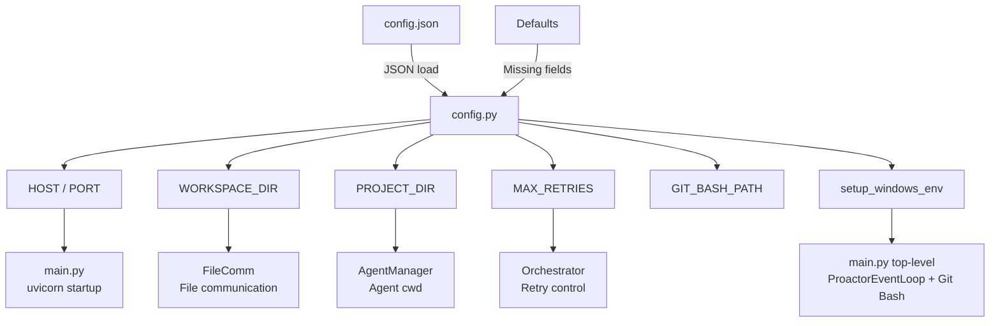
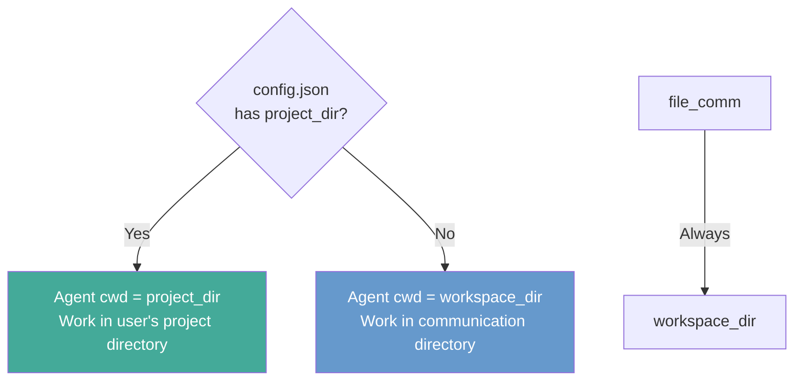

# Configuration System Design

**Date:** 2026-04-01
**Status:** Implemented

## Overview

Consolidate all scattered hardcoded configurations into `backend/config.json`, enabling flexible configuration without code changes.

## Configuration File

**Path:** `backend/config.json` (not committed to git)
**Template:** `backend/config.json.example` (committed to git)

```json
{
  "server": {
    "host": "127.0.0.1",
    "port": 8001
  },
  "agent": {
    "workspace_dir": "./workspace",
    "project_dir": null,
    "max_retries": 3
  },
  "git_bash": {
    "path": null
  }
}
```

## Configuration Options

| Option | Default | Description |
|--------|---------|-------------|
| `server.host` | `127.0.0.1` | Server bind address |
| `server.port` | `8001` | Server port |
| `agent.workspace_dir` | `./workspace` (relative to backend/) | File communication directory (file_comm) |
| `agent.project_dir` | `null` | Agent SDK cwd, null = use workspace_dir |
| `agent.max_retries` | `3` | Max retry count for Dev→Evaluator closed loop |
| `git_bash.path` | `null` (auto-detect) | Windows only, bash path required by Claude Code CLI |

## Architecture



## Agent cwd Logic



**With project_dir:** Agent can read/write user's actual project code, run tests, search codebase
**Without project_dir:** Agent only works within workspace/ via file communication

## Modified Files

1. **`backend/config.json.example`** — Added, configuration template
2. **`backend/app/config.py`** — Rewritten, unified configuration entry point
3. **`backend/app/main.py`** — Simplified, calls `setup_windows_env()`
4. **`backend/app/engine/agent_manager.py`** — Supports project_dir as cwd
5. **`Polygents/.gitignore`** — Added, ignores config.json and WorkSpace/
