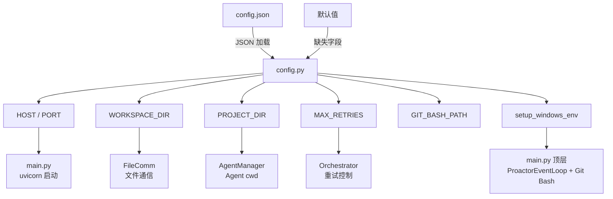
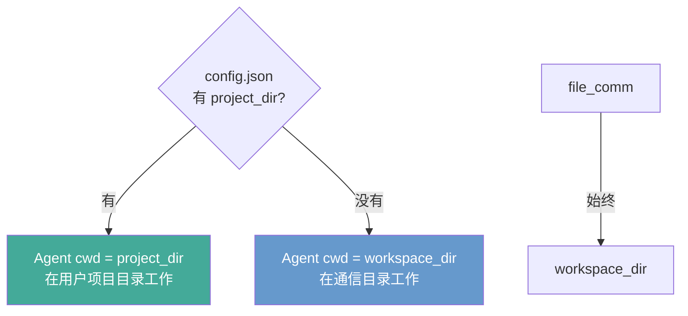

# 配置系统设计

**日期：** 2026-04-01
**状态：** 已实现

## 概述

将所有散落的硬编码配置统一到 `backend/config.json`，支持灵活配置而无需改代码。

## 配置文件

**路径：** `backend/config.json`（不提交到 git）
**模板：** `backend/config.json.example`（提交到 git）

```json
{
  "server": {
    "host": "127.0.0.1",
    "port": 8001
  },
  "agent": {
    "workspace_dir": "./workspace",
    "project_dir": null,
    "max_retries": 3
  },
  "git_bash": {
    "path": null
  }
}
```

## 配置项说明

| 配置项 | 默认值 | 说明 |
|--------|--------|------|
| `server.host` | `127.0.0.1` | 服务器绑定地址 |
| `server.port` | `8001` | 服务器端口 |
| `agent.workspace_dir` | `./workspace`（相对于 backend/） | 文件通信目录（file_comm） |
| `agent.project_dir` | `null` | Agent SDK cwd，null = 用 workspace_dir |
| `agent.max_retries` | `3` | Dev→Evaluator 闭环最大重试次数 |
| `git_bash.path` | `null`（自动探测） | Windows 专用，Claude Code CLI 需要的 bash 路径 |

## 架构



## Agent cwd 逻辑



**有 project_dir 时：** Agent 能读写用户真实项目代码、运行测试、搜索代码库
**没有 project_dir 时：** Agent 只在 workspace/ 里通过文件通信工作

## 修改的文件

1. **`backend/config.json.example`** — 新增，配置模板
2. **`backend/app/config.py`** — 重写，统一配置入口
3. **`backend/app/main.py`** — 简化，调用 `setup_windows_env()`
4. **`backend/app/engine/agent_manager.py`** — 支持 project_dir 作为 cwd
5. **`Polygents/.gitignore`** — 新增，忽略 config.json 和 WorkSpace/
