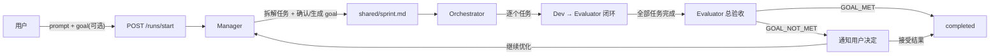

# Goal 机制设计

## 概要

为 Polygents 增加 Goal 驱动的运行终止机制：
- 用户可选填 goal，不填由 Manager 自动生成
- 所有任务跑完后，Evaluator 做总验收，对照 goal 判断整体是否达成
- GOAL_MET → completed / GOAL_NOT_MET → 通知用户决定（接受 or 继续优化）

## 数据流

## 改动清单

### 后端
1. `schemas.py` — 无需改动，SprintPlan 已有 goal 字段
2. `runs.py` — StartRunRequest 增加 `goal: str | None = None`，传给 orchestrator.run()
3. `orchestrator.py`:
   - run() 增加 goal 参数，传给 Manager prompt
   - 新增 extract_goal() 从 sprint.md 提取 goal
   - 新增 _final_validation() 总验收逻辑
   - GOAL_NOT_MET 时广播等待用户决定
4. `ws/handler.py` — 处理 `goal_decision` 消息（accept/retry）

### 前端
5. `types/index.ts` — WSMessage 增加 goal_validation 类型
6. `store/flowStore.ts` — 增加 goalValidation 状态
7. `CanvasPage.tsx` — 增加 goal 输入框 + 验收结果交互 UI
