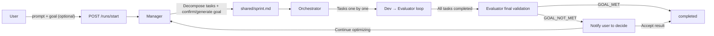

# Goal Mechanism Design

## Summary

Add a Goal-driven run termination mechanism to Polygents:
- Users can optionally provide a goal; if omitted, Manager auto-generates one
- After all tasks are completed, Evaluator performs a final validation against the goal to determine overall success
- GOAL_MET → completed / GOAL_NOT_MET → notify user to decide (accept or continue optimizing)

## Data Flow

## Change List

### Backend
1. `schemas.py` — No changes needed, SprintPlan already has a goal field
2. `runs.py` — Add `goal: str | None = None` to StartRunRequest, pass to orchestrator.run()
3. `orchestrator.py`:
   - Add goal parameter to run(), pass to Manager prompt
   - Add extract_goal() to extract goal from sprint.md
   - Add _final_validation() for final validation logic
   - Broadcast and wait for user decision when GOAL_NOT_MET
4. `ws/handler.py` — Handle `goal_decision` message (accept/retry)

### Frontend
5. `types/index.ts` — Add goal_validation type to WSMessage
6. `store/flowStore.ts` — Add goalValidation state
7. `CanvasPage.tsx` — Add goal input field + validation result interaction UI
