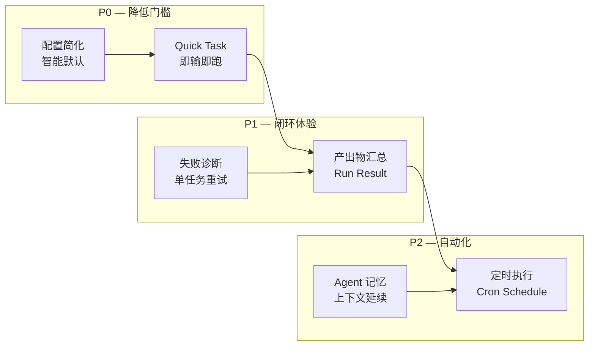
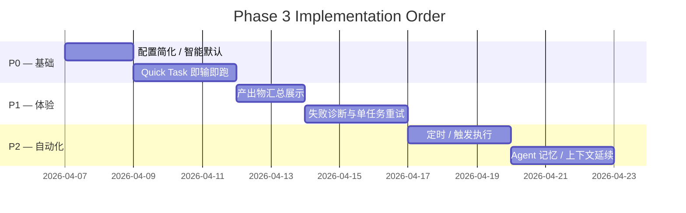

# Phase 3 功能规划 — 个人效率工具增强

> **日期**: 2026-04-06
> **定位**: 个人效率工具
> **状态**: 规划中

---

## 总览

Phase 1 & 2 已完成核心能力链路（创建团队 → 配置 Agent → 运行 → 闭环协作 → 查看产出）。Phase 3 聚焦于**降低使用门槛**和**提升使用体验**，让 Polygents 从"能用"变成"好用"。



---

## Feature 1: Quick Task — 即输即跑（P0）

### 问题
个人场景下很多任务一个 Agent 就够了（翻译、日报、生成报告），但现在必须先"创建 Workflow"才能跑。

### 设计

在首页（WorkflowListPage）顶部加一个 **Quick Task 输入框**：

```
┌──────────────────────────────────────────────────┐
│  Describe your task...                           │
│                                                  │
│  "Translate README.md to English"        [Run ▶] │
└──────────────────────────────────────────────────┘
```

**行为**：
- 用户输入 prompt，点 Run，立刻开始执行
- 后端自动创建一个临时 SingleRunner（不入库 WorkflowStore）
- 前端就地展示结果（不跳转到 Canvas 页）
- 执行完成后提供 **"Save as Workflow"** 按钮，可将本次配置保存为可重复的 Workflow

**后端**：
- 新增 `POST /api/quick-task` 端点
- 接收 `{ prompt, model? }` 即可，其他全用默认值
- 返回 SSE 流式结果（或 WebSocket push）

**前端**：
- WorkflowListPage 顶部新增 QuickTaskBar 组件
- 结果内联展示在输入框下方
- 支持 Markdown 渲染

---

## Feature 2: 配置简化 / 智能默认（P0）

### 问题
创建团队时每个 Agent 要填 7 个字段（id, role, role_type, system_prompt, tools, skills, plugins），认知负担过大。

### 设计

**2a. Basic / Advanced 模式**

CreatePage 表单默认 Basic 模式，只露 3 个字段：

| 字段 | 说明 |
|------|------|
| Role 名称 | 如 "Developer" |
| 一句话描述 | 如 "Write Python code for backend APIs" |
| 模型 | 下拉选 sonnet/opus |

其余字段（system_prompt, tools, skills, plugins）按 role_type 自动生成默认值。点"Advanced"展开全部字段。

**2b. role_type 智能预设**

选了 role_type 后自动填充：

| role_type | 默认 tools | system_prompt 模板 |
|-----------|-----------|-------------------|
| planner | Read, Write, Glob, Grep | "You are a project manager. Analyze requirements and create a sprint plan..." |
| executor | Read, Write, Edit, Bash, Glob, Grep | "You are a senior engineer. Follow the sprint plan and implement tasks..." |
| reviewer | Read, Write, Bash, Glob, Grep | "You are a quality reviewer. Evaluate outputs against acceptance criteria..." |

**2c. Clone Workflow**

WorkflowListPage 每个卡片加 "Clone" 按钮，一键复制已有 Workflow，改改 prompt 就能用。

---

## Feature 3: 产出物汇总展示（P1）

### 问题
Run 完成后，用户要自己去 workspace/artifacts/ 翻文件，不知道"到底产出了什么"。

### 设计

Run 结束时，在 CanvasPage 弹出 **Run Result 面板**：

```
┌─────────────────────────────────────────────┐
│  ✅ Run completed — 太空新闻探索             │
│─────────────────────────────────────────────│
│  📄 artifacts/news_report.md    [Preview]   │
│  📄 artifacts/summary.txt       [Preview]   │
│                                             │
│  📊 2 files created, 1 modified            │
│  ⏱️ Duration: 2m 34s                        │
│                                             │
│  [Copy All] [Close]                         │
└─────────────────────────────────────────────┘
```

**实现要点**：
- 后端：Run 开始时快照 workspace 文件列表，结束时 diff 出新增/修改的文件
- 前端：RunResultPanel 组件，支持 Markdown 预览、一键复制内容
- HistoryPage 也能查看历史 Run 的产出物列表
- RunRecord schema 新增 `output_files: list[dict]` 字段

---

## Feature 4: 失败诊断与单任务重试（P1）

### 问题
Agent 跑失败了，toast 4 秒消失，用户不知道哪里出错、无法重试单个任务。

### 设计

**4a. 错误持久化展示**

Run 失败时，CanvasPage 展示 **Error Detail 面板**（不是 toast）：

```
┌─────────────────────────────────────────────┐
│  ❌ Run failed — Task 3 of 5                │
│─────────────────────────────────────────────│
│  Agent: dev                                 │
│  Task: "Implement login page"               │
│  Error: Agent timed out after 300s          │
│  Retries: 3/3 exhausted                     │
│                                             │
│  [Retry This Task] [View Full Log] [Close]  │
└─────────────────────────────────────────────┘
```

**4b. 单任务重试**

- 运行失败后可以只重跑失败的 Task，而不是整个 Workflow
- 后端新增 `POST /api/runs/{run_id}/retry-task` 端点
- Orchestrator 从失败的 task 继续执行

**4c. Prompt 调优提示**

Agent 连续失败时，给出简单建议：
- "Agent timed out" → "Consider increasing timeout or simplifying the task"
- "No planner role found" → "Your team is missing a planner. Add an agent with role_type: planner"
- "Agent produced empty output" → "The system prompt may be too vague. Try adding specific output instructions"

---

## Feature 5: 定时 / 触发执行（P2）

### 问题
日报类 Workflow（如"太空新闻"）需要每天手动跑，应该能自动执行。

### 设计

WorkflowEditPage 新增 **Schedule 配置**：

```
┌─ Schedule ────────────────────────────────┐
│ ☑ Enable scheduled execution              │
│                                            │
│ Frequency: [Every day ▾]                   │
│ Time:      [09:00 ▾]                       │
│                                            │
│ Next run: Tomorrow at 09:00                │
└────────────────────────────────────────────┘
```

**数据模型**：

WorkflowConfig 新增字段：

```python
schedule: Optional[dict] = None  # {"cron": "0 9 * * *", "enabled": True}
```

**后端**：
- 后台 scheduler 线程/协程，定时检查有 schedule 的 Workflow
- 到时间自动调用 `run_workflow(wf_id)`
- 可用 APScheduler 或简单的 asyncio 循环实现
- 运行结果自动记录到 RunStore

**前端**：
- WorkflowEditPage 新增 ScheduleSection 组件
- WorkflowListPage 卡片显示"Next run: 09:00 tomorrow"
- HistoryPage 标注"(scheduled)"来区分手动触发和定时触发

---

## Feature 6: Agent 记忆 / 上下文延续（P2）

### 问题
当前每次 execute() 都是无状态的。日报类 Workflow 第二天跑的时候不知道昨天写过什么，可能产出重复内容。

### 设计

**6a. 持久化记忆文件**

每个 Agent 有一个持久化的记忆文件：

```
workspace/.memory/
├── dev.md           # dev agent 的记忆
├── manager.md       # manager agent 的记忆
└── evaluator.md     # evaluator agent 的记忆
```

**6b. 自动注入**

每次 Agent 执行时，自动把记忆文件内容注入 system_prompt 末尾：

```
{original_system_prompt}

## Previous Context
{content of .memory/agent-id.md}
```

**6c. 自动更新**

Run 结束后，Orchestrator 提取本次执行的关键摘要，追加写入 .memory 文件。摘要由 Agent 自己在 system_prompt 中被要求生成（如"运行结束时写一段不超过 200 字的摘要到 .memory 文件"）。

**WorkflowConfig 新增字段**：

```python
enable_memory: bool = False  # 是否启用 Agent 记忆
```

---

## 实施顺序



---

## 不做的事情（YAGNI）

| 方向 | 原因 |
|------|------|
| 运行成本可见 | 个人使用场景下成本感知不是核心痛点 |
| 项目目录集成 | 风险高、安全边界复杂，当前 workspace 模式够用 |
| 多用户/权限 | 个人工具不需要 |
| OpenAI Provider | 当前只用 Claude，扩展优先级低 |
| 模板市场 | 用户量不够，先做好核心体验 |
