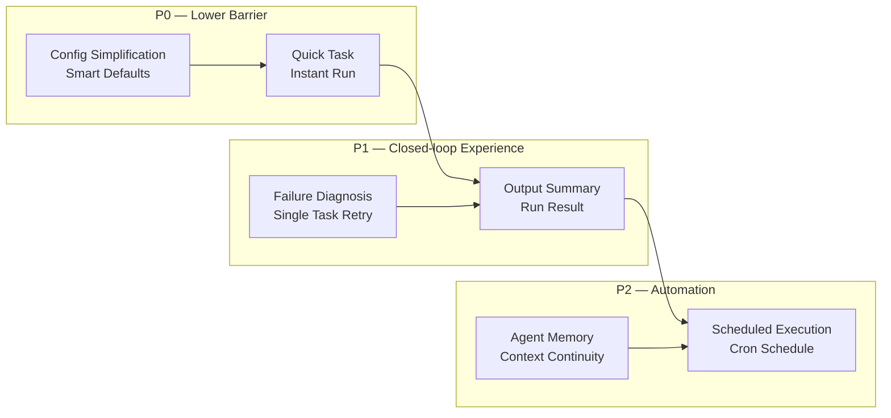
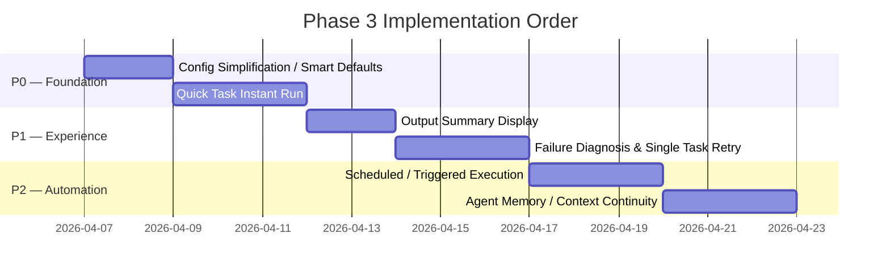

# Phase 3 Feature Plan — Personal Productivity Tool Enhancement

> **Date**: 2026-04-06
> **Positioning**: Personal productivity tool
> **Status**: Planning

---

## Overview

Phase 1 & 2 have completed the core capability chain (Create team → Configure Agent → Run → Closed-loop collaboration → View output). Phase 3 focuses on **lowering the barrier to entry** and **improving the user experience**, transforming Polygents from "usable" to "great to use".



---

## Feature 1: Quick Task — Instant Run (P0)

### Problem
In personal use cases, many tasks only need a single Agent (translation, daily reports, generating reports), but currently you must "create a Workflow" before you can run anything.

### Design

Add a **Quick Task input box** at the top of the homepage (WorkflowListPage):

```
┌──────────────────────────────────────────────────┐
│  Describe your task...                           │
│                                                  │
│  "Translate README.md to English"        [Run ▶] │
└──────────────────────────────────────────────────┘
```

**Behavior**:
- User enters a prompt, clicks Run, and execution starts immediately
- Backend automatically creates a temporary SingleRunner (not persisted in WorkflowStore)
- Frontend displays results inline (no navigation to the Canvas page)
- After execution completes, a **"Save as Workflow"** button is provided to save the current configuration as a reusable Workflow

**Backend**:
- Add `POST /api/quick-task` endpoint
- Accepts `{ prompt, model? }`, everything else uses default values
- Returns SSE streaming results (or WebSocket push)

**Frontend**:
- Add QuickTaskBar component at the top of WorkflowListPage
- Results displayed inline below the input box
- Supports Markdown rendering

---

## Feature 2: Config Simplification / Smart Defaults (P0)

### Problem
When creating a team, each Agent requires filling in 7 fields (id, role, role_type, system_prompt, tools, skills, plugins), which creates excessive cognitive burden.

### Design

**2a. Basic / Advanced Mode**

CreatePage form defaults to Basic mode, exposing only 3 fields:

| Field | Description |
|-------|-------------|
| Role Name | e.g. "Developer" |
| One-line Description | e.g. "Write Python code for backend APIs" |
| Model | Dropdown to select sonnet/opus |

Remaining fields (system_prompt, tools, skills, plugins) are auto-generated with default values based on role_type. Click "Advanced" to expand all fields.

**2b. role_type Smart Presets**

After selecting a role_type, fields are auto-populated:

| role_type | Default tools | system_prompt Template |
|-----------|-----------|-------------------|
| planner | Read, Write, Glob, Grep | "You are a project manager. Analyze requirements and create a sprint plan..." |
| executor | Read, Write, Edit, Bash, Glob, Grep | "You are a senior engineer. Follow the sprint plan and implement tasks..." |
| reviewer | Read, Write, Bash, Glob, Grep | "You are a quality reviewer. Evaluate outputs against acceptance criteria..." |

**2c. Clone Workflow**

Add a "Clone" button to each card on WorkflowListPage, allowing one-click duplication of an existing Workflow — just modify the prompt and it's ready to use.

---

## Feature 3: Output Summary Display (P1)

### Problem
After a Run completes, users have to manually browse workspace/artifacts/ to find files, with no clear view of "what was actually produced".

### Design

When a Run finishes, display a **Run Result panel** on the CanvasPage:

```
┌─────────────────────────────────────────────┐
│  ✅ Run completed — Space News Exploration   │
│─────────────────────────────────────────────│
│  📄 artifacts/news_report.md    [Preview]   │
│  📄 artifacts/summary.txt       [Preview]   │
│                                             │
│  📊 2 files created, 1 modified            │
│  ⏱️ Duration: 2m 34s                        │
│                                             │
│  [Copy All] [Close]                         │
└─────────────────────────────────────────────┘
```

**Implementation Notes**:
- Backend: Snapshot the workspace file list at Run start, diff to identify new/modified files at Run end
- Frontend: RunResultPanel component with Markdown preview and one-click content copy
- HistoryPage can also view output file lists from past Runs
- RunRecord schema adds `output_files: list[dict]` field

---

## Feature 4: Failure Diagnosis and Single Task Retry (P1)

### Problem
When an Agent fails, a toast disappears after 4 seconds, leaving users unaware of what went wrong and unable to retry individual tasks.

### Design

**4a. Persistent Error Display**

When a Run fails, display an **Error Detail panel** on the CanvasPage (not a toast):

```
┌─────────────────────────────────────────────┐
│  ❌ Run failed — Task 3 of 5                │
│─────────────────────────────────────────────│
│  Agent: dev                                 │
│  Task: "Implement login page"               │
│  Error: Agent timed out after 300s          │
│  Retries: 3/3 exhausted                     │
│                                             │
│  [Retry This Task] [View Full Log] [Close]  │
└─────────────────────────────────────────────┘
```

**4b. Single Task Retry**

- After a run failure, only the failed Task can be re-run instead of the entire Workflow
- Backend adds `POST /api/runs/{run_id}/retry-task` endpoint
- Orchestrator resumes execution from the failed task

**4c. Prompt Tuning Suggestions**

When an Agent fails repeatedly, provide simple suggestions:
- "Agent timed out" → "Consider increasing timeout or simplifying the task"
- "No planner role found" → "Your team is missing a planner. Add an agent with role_type: planner"
- "Agent produced empty output" → "The system prompt may be too vague. Try adding specific output instructions"

---

## Feature 5: Scheduled / Triggered Execution (P2)

### Problem
Daily report Workflows (e.g. "Space News") require manual execution every day — they should be able to run automatically.

### Design

Add **Schedule configuration** to WorkflowEditPage:

```
┌─ Schedule ────────────────────────────────┐
│ ☑ Enable scheduled execution              │
│                                            │
│ Frequency: [Every day ▾]                   │
│ Time:      [09:00 ▾]                       │
│                                            │
│ Next run: Tomorrow at 09:00                │
└────────────────────────────────────────────┘
```

**Data Model**:

WorkflowConfig adds new field:

```python
schedule: Optional[dict] = None  # {"cron": "0 9 * * *", "enabled": True}
```

**Backend**:
- Background scheduler thread/coroutine that periodically checks Workflows with a schedule
- Automatically calls `run_workflow(wf_id)` when the time arrives
- Can be implemented with APScheduler or a simple asyncio loop
- Run results are automatically recorded in RunStore

**Frontend**:
- WorkflowEditPage adds ScheduleSection component
- WorkflowListPage cards display "Next run: 09:00 tomorrow"
- HistoryPage marks "(scheduled)" to distinguish between manual and scheduled triggers

---

## Feature 6: Agent Memory / Context Continuity (P2)

### Problem
Currently each execute() call is stateless. When a daily report Workflow runs the next day, it doesn't know what was written yesterday and may produce duplicate content.

### Design

**6a. Persistent Memory Files**

Each Agent has a persistent memory file:

```
workspace/.memory/
├── dev.md           # dev agent's memory
├── manager.md       # manager agent's memory
└── evaluator.md     # evaluator agent's memory
```

**6b. Automatic Injection**

Each time an Agent executes, the memory file content is automatically injected at the end of system_prompt:

```
{original_system_prompt}

## Previous Context
{content of .memory/agent-id.md}
```

**6c. Automatic Updates**

After a Run completes, the Orchestrator extracts key summaries from the execution and appends them to the .memory file. Summaries are generated by the Agent itself as instructed in the system_prompt (e.g. "At the end of the run, write a summary of no more than 200 words to the .memory file").

**WorkflowConfig adds new field**:

```python
enable_memory: bool = False  # Whether to enable Agent memory
```

---

## Implementation Order



---

## Things We Won't Do (YAGNI)

| Direction | Reason |
|-----------|--------|
| Run Cost Visibility | Cost awareness is not a core pain point for personal use |
| Project Directory Integration | High risk, complex security boundaries, current workspace model is sufficient |
| Multi-user / Permissions | Not needed for a personal tool |
| OpenAI Provider | Currently only using Claude, low priority for expansion |
| Template Marketplace | Not enough users yet, focus on core experience first |
