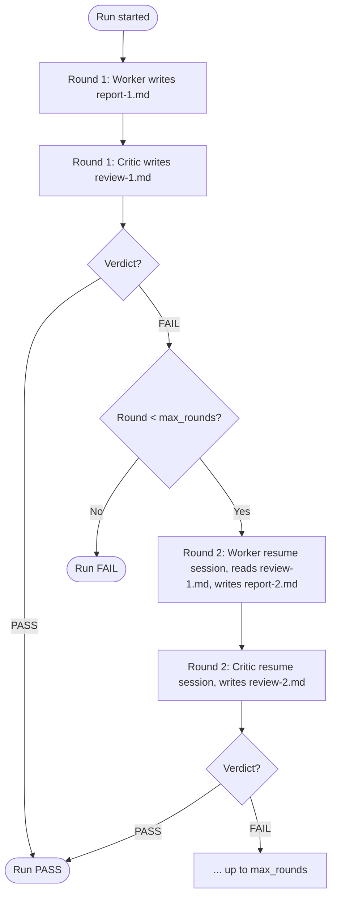
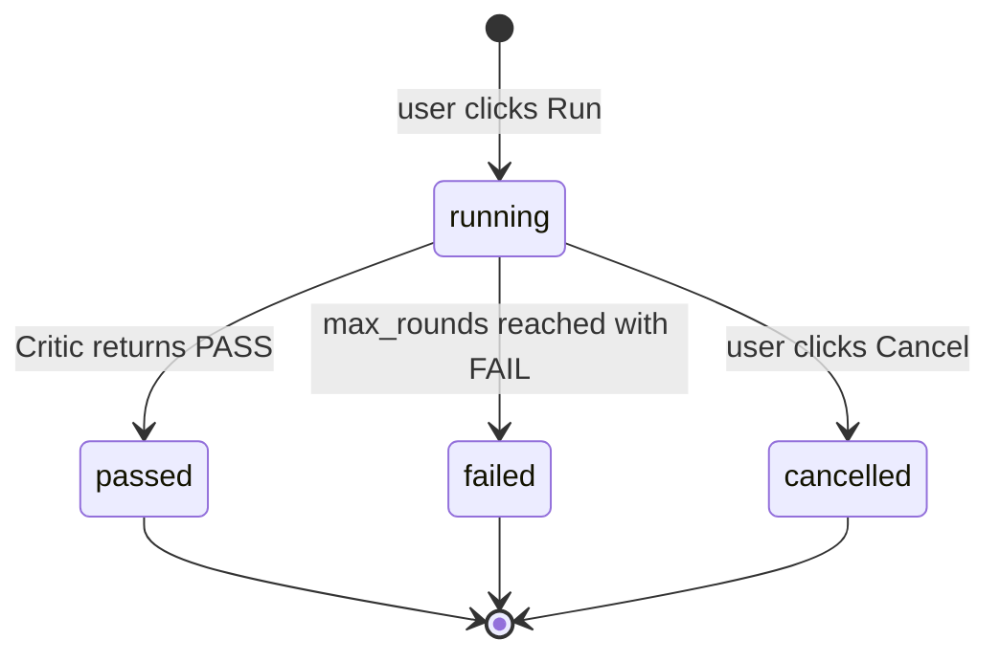
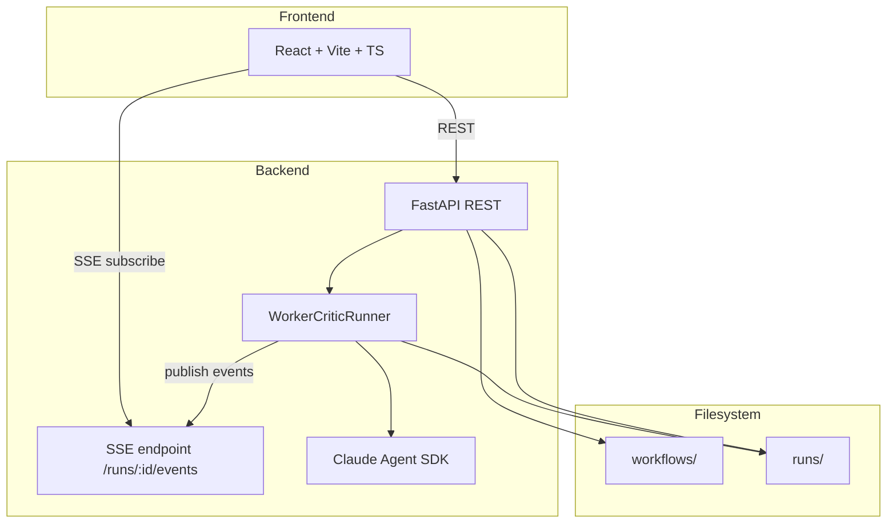

# Polygents Rewrite — Worker + Critic Loop Design

**Date**: 2026-04-25
**Status**: Design finalized, ready for implementation
**Scope**: Complete rewrite. Delete all existing Polygents code.

---

## 1. Motivation

Single AI agents complete tasks at ~70% quality. They miss details — especially output format consistency. Adding a dedicated checking agent with a clear pre-defined acceptance standard should bring quality to ~90%.

Polygents v2 supports **exactly one workflow type**: a Worker + Critic dual-agent loop with file-system communication and a pre-defined checklist as the acceptance standard.

All v1 modes (Sequential / Free / Single Agent), all v1 features (scheduling, agent memory, meta-agent chat, kanban, react flow canvas, team templates, plugins, skills) are removed.

---

## 2. Core Concepts

### 2.1 Roles

| Role | Job | Sees Checklist? |
|------|-----|-----------------|
| **Worker** | Read task, do the work in `workspace/`, write a per-round report | No |
| **Critic** | Read task + checklist + Worker's report, inspect `workspace/`, write a review with PASS/FAIL verdict | Yes |

**Why Worker doesn't see the checklist**: separation of concerns. Worker focuses on doing the right thing; Critic enforces format and details. Hiding the checklist prevents Worker from gaming it mechanically.

### 2.2 Loop



- Worker and Critic each maintain a **single Claude Agent SDK session per run** (resume across rounds, not new instance per round)
- A run terminates when Critic returns `PASS`, or when `max_rounds` is reached (then `FAIL`, no force-accept)

### 2.3 Communication

All inter-agent communication is **file-system-based**. No in-memory message passing. Every message, decision, and artifact is a real file you can read, audit, version-control.

---

## 3. Directory Layout

### 3.1 Workflow definition

```
workflows/{workflow-id}/
├── config.yaml      # name, max_rounds, worker_model, critic_model
├── worker.md        # Worker system prompt (does NOT mention checklist)
├── critic.md        # Critic system prompt (instructs to read checklist.md)
└── checklist.md     # Acceptance criteria, Critic-only
```

Example `config.yaml`:

```yaml
name: "Daily Report Generator"
max_rounds: 3
worker_model: "claude-sonnet-4-6"
critic_model: "claude-opus-4-7"
```

### 3.2 Run instance

```
runs/{run-id}/
├── task.md          # Task description (entered when triggering run)
├── checklist.md     # Copy of workflow's checklist.md (frozen at run-start)
├── status.json      # {state: running|passed|failed|cancelled, current_round, ...}
├── workspace/       # SHARED cwd for Worker and Critic — actual work happens here
├── reports/
│   ├── round-1.md   # Worker's per-round summary
│   └── round-2.md
└── reviews/
    ├── round-1.md   # Critic's per-round verdict + feedback
    └── round-2.md
```

**Single shared `workspace/`** for Worker and Critic. Isolation of "Critic shouldn't write code" is achieved via:
1. Tool permissions (Critic gets read-only tools, see §5.2)
2. Prompt scope (Critic's prompt simply doesn't authorize editing workspace files)

`checklist.md` is **copied** into the run at start so editing the workflow's checklist later doesn't retroactively change historical runs.

---

## 4. Schemas

### 4.1 Worker report (`reports/round-N.md`)

```markdown
# Worker Report Round N

## Goal This Round
What I'm trying to accomplish this round.

## What I Changed
- File / module level changes

## Key Decisions
- Why I made certain tradeoffs

## Known Issues
- Open problems; write "None" if nothing
```

### 4.2 Critic review (`reviews/round-N.md`)

```markdown
# Review Round N

## Verdict
FAIL

## Checklist Results
- [PASS] C1: 输出必须是 Markdown 表格
- [FAIL] C2: 每行必须包含日期字段
  - Observed: 第 3 行缺少日期
  - Expected: 每行都必须包含 YYYY-MM-DD 日期

## Feedback for Worker
请修复 C2：补齐缺失日期字段。不要改动已经通过的表格结构。
```

**Orchestrator parses ONLY the line under `## Verdict`** — must be exactly `PASS` or `FAIL`. The rest is human/Worker consumption.

Critic's feedback tells Worker **WHAT** is wrong (which checklist item, observed vs expected). Worker decides **HOW** to fix.

---

## 5. Agent Configuration

### 5.1 Models

| Role | Default | Configurable in `config.yaml`? |
|------|---------|--------------------------------|
| Worker | `claude-sonnet-4-6` | Yes (`worker_model`) |
| Critic | `claude-opus-4-7` | Yes (`critic_model`) |

Critic gets the stronger model by default — finding flaws is harder than producing output that looks fine at a glance.

### 5.2 Tool permissions (hard-coded, not user-configurable in v1)

| Role | Tools |
|------|-------|
| Worker | Read, Write, Edit, Bash, Glob, Grep |
| Critic | Read, Glob, Grep, Write (restricted to `reviews/` only) |

Critic has no Bash and no Edit. If checklist requires "code must run", Worker is responsible; Critic reads outputs and judges.

### 5.3 cwd

Both agents have `cwd = runs/{run-id}/workspace/`. Reports/reviews are written via relative paths like `../reports/round-N.md`.

### 5.4 Session management

```python
# Round 1: new session
worker_session_id = sdk.start_session(model, system_prompt, cwd, tools)
sdk.run(worker_session_id, prompt_round_1)

# Round 2+: resume
sdk.resume(worker_session_id, prompt_round_n)
```

Same pattern for Critic. Session is killed when run terminates (PASS / FAIL / cancelled).

---

## 6. Run Lifecycle



### User actions on a run

- **Start** — from Workflow Edit page, enter task description, click Run
- **Cancel** — kill both sessions, mark `cancelled`
- **View** — Run Detail page (real-time)

No pause/resume. No mid-run checklist edit. No "force-accept FAIL". A failed run is final — user inspects reviews, edits workflow's prompts/checklist, starts a new run.

### Failed run handling

A failed run is a **design signal**. Three rounds couldn't pass means: checklist too strict, prompts unclear, or task itself ambiguous. Edit the workflow design and run again. Each run is immutable history.

---

## 7. Web UI

Three pages.

### 7.1 Workflow List

- Lists all workflows
- New / Delete / Click-to-edit
- (Run is triggered from inside Workflow Edit)

### 7.2 Workflow Edit

```
┌─────────────────────────────────────────────────┐
│ Config (form):                                  │
│   Name [____________]  Max Rounds [3]           │
│   Worker Model [sonnet ▾]  Critic Model [opus▾] │
├─────────────────────────────────────────────────┤
│ [worker.md] [critic.md] [checklist.md]   ← tabs │
│ ┌─────────────────────────────────────────────┐ │
│ │ Monaco editor for selected file             │ │
│ │                                             │ │
│ └─────────────────────────────────────────────┘ │
├─────────────────────────────────────────────────┤
│ Task: [_____________________________]  [Save]   │
│                                       [Run]     │
└─────────────────────────────────────────────────┘
```

- Top: form for `config.yaml` fields (no raw YAML editing)
- Middle: tabs for the 3 markdown files, each with a Monaco editor
- Bottom: task input + Save / Run buttons
- Sidebar (optional): list of recent runs for this workflow

### 7.3 Run Detail

```
┌─────────────────────────────────────────────────────────┐
│ Status: Round 2 / 3 — Critic in progress    [Cancel]    │
├──────────────────┬──────────────────┬───────────────────┤
│ Worker Reports   │ Critic Reviews   │ Workspace Files   │
│ ┌──────────────┐ │ ┌──────────────┐ │ ┌───────────────┐ │
│ │ Round 1      │ │ │ Round 1 FAIL │ │ │ ▾ src/        │ │
│ │ ✓ done       │ │ │ ✓ done       │ │ │   main.py     │ │
│ ├──────────────┤ │ ├──────────────┤ │ │ ▸ data/       │ │
│ │ Round 2      │ │ │ Round 2 ...  │ │ │   report.md   │ │
│ │ ✓ done       │ │ │ in progress  │ │ │               │ │
│ └──────────────┘ │ └──────────────┘ │ └───────────────┘ │
└──────────────────┴──────────────────┴───────────────────┘
```

- Three columns: Worker reports | Critic reviews | Workspace file tree (live)
- Worker and Critic columns are horizontally aligned per round (R1 Worker ↔ R1 Critic)
- Click any file to view content
- Workspace column is collapsible

---

## 8. Backend Architecture



### 8.1 REST endpoints

| Method | Path | Purpose |
|--------|------|---------|
| GET | `/api/workflows` | List workflows |
| POST | `/api/workflows` | Create workflow |
| GET | `/api/workflows/:id` | Get workflow (config + 3 .md files) |
| PUT | `/api/workflows/:id` | Update workflow |
| DELETE | `/api/workflows/:id` | Delete workflow |
| POST | `/api/workflows/:id/run` | Start a run (body: `{task: "..."}`) → returns `{run_id}` |
| GET | `/api/workflows/:id/runs` | List runs for a workflow |
| GET | `/api/runs/:id` | Get run snapshot (status + reports + reviews) |
| GET | `/api/runs/:id/files/*path` | Read a file inside the run (workspace/reports/reviews) |
| POST | `/api/runs/:id/cancel` | Cancel a running run |

### 8.2 SSE: `/api/runs/:id/events`

Pushes events as the run progresses:

```json
{"type": "round_start", "round": 1, "role": "worker"}
{"type": "report_written", "round": 1}
{"type": "round_start", "round": 1, "role": "critic"}
{"type": "review_written", "round": 1, "verdict": "FAIL"}
{"type": "workspace_changed", "path": "src/main.py"}
{"type": "status_changed", "state": "passed|failed|cancelled"}
```

Frontend uses this to refresh the three columns without polling.

### 8.3 Persistence

**Pure file system. No database.**

- Workflows: `workflows/{id}/` folder
- Runs: `runs/{id}/` folder
- Run state: `runs/{id}/status.json`
- No SQLite, no Postgres. Add later only if file-listing performance becomes a real bottleneck.

---

## 9. Tech Stack

| Layer | Choice |
|-------|--------|
| Backend | Python 3.10+, FastAPI, Uvicorn |
| Agent | Claude Agent SDK (Python) |
| Frontend | React 18, Vite, TypeScript |
| Editor | Monaco |
| Real-time | SSE (Server-Sent Events) |
| Storage | File system (YAML + Markdown + JSON) |

Same stack as v1 — focus the rewrite on architecture, not tools.

---

## 10. Migration / Cleanup

1. Tag the current state: `git tag v1-legacy`
2. Delete `Polygents/backend/` and `Polygents/frontend/`
3. Keep `Polygents/docs/` (selectively — keep design files that explain history; delete obsolete plans)
4. Build new structure from empty directories

```
Polygents/
├── backend/
│   ├── app/
│   │   ├── main.py
│   │   ├── api/             # workflows.py, runs.py, sse.py
│   │   ├── engine/
│   │   │   ├── runner.py    # WorkerCriticRunner
│   │   │   └── sdk_client.py
│   │   └── storage/         # filesystem helpers
│   └── pyproject.toml
├── frontend/
│   ├── src/
│   │   ├── pages/           # WorkflowList, WorkflowEdit, RunDetail
│   │   ├── components/
│   │   └── api/             # REST + SSE clients
│   └── package.json
├── workflows/               # user data (gitignored)
├── runs/                    # user data (gitignored)
└── docs/
```

---

## 11. Implementation Order (suggested)

1. **Backend: storage layer** — read/write workflow folders and run folders
2. **Backend: WorkerCriticRunner** — single end-to-end run via Claude Agent SDK, no UI yet, drive from a script
3. **Backend: REST API + SSE** — wrap runner with HTTP
4. **Frontend: Workflow List + Edit** — Monaco + form
5. **Frontend: Run Detail** — three columns + SSE subscription
6. **Polish** — error states, cancel button, edge cases (run died, file gone, etc.)

Each step is independently testable. Step 2 is the riskiest — verify session resume + verdict parsing + max_rounds termination work end-to-end before building UI.

---

## 12. Open Questions (deferred)

These are intentionally **not** decided in v1; revisit after dogfooding:

- Cost/token tracking per run
- Multi-provider support (non-Claude models)
- Workflow templates / sharing
- Concurrent runs of the same workflow
- Run search across workflows
- Critic auto-loosen heuristic (e.g., if same checklist item fails 3 rounds with same observation, flag as ambiguous criteria)

---

## 13. Summary of Decisions

| # | Decision |
|---|----------|
| 1 | Only one workflow type: Worker + Critic loop |
| 2 | Communication: file system only |
| 3 | Worker sees task only; Critic sees task + checklist |
| 4 | Critic feedback: WHAT is wrong, not HOW to fix |
| 5 | Per round: Worker writes report, Critic writes review |
| 6 | Resume session per role across rounds |
| 7 | Verdict: PASS / FAIL binary, parsed from `## Verdict` line |
| 8 | Workflow = folder of files (config.yaml + 3 .md) |
| 9 | Report/Review use strict Markdown schemas |
| 10 | max_rounds default 3, configurable |
| 11 | Models: Worker=Sonnet, Critic=Opus by default, configurable |
| 12 | Tools: Worker full set, Critic read-only (+ Write to reviews/) |
| 13 | Trigger: Web UI only |
| 14 | Lifecycle: Start / Cancel / View; no pause, no force-accept |
| 15 | Failed run is final; new run for retry |
| 16 | UI: 3 pages — Workflow List / Workflow Edit / Run Detail |
| 17 | Workflow Edit: config form + 3-tab editor |
| 18 | Run Detail: 3 columns (reports / reviews / workspace) |
| 19 | Storage: pure file system |
| 20 | Real-time: SSE |
| 21 | Stack: Python/FastAPI + React/Vite/TS (same as v1) |
| 22 | Old code: fully deleted, tagged in git as `v1-legacy` |
